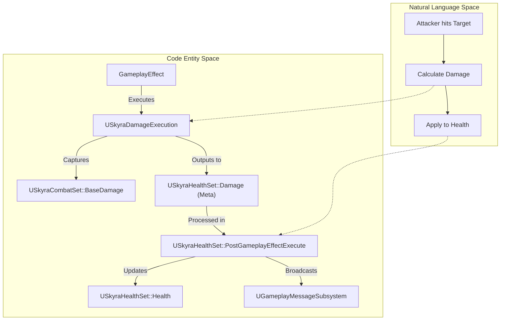
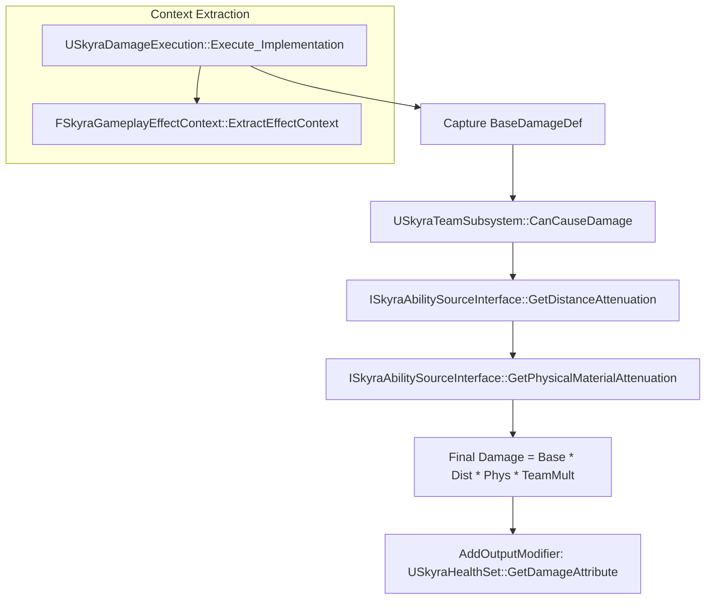

# Attribute Sets and Execution Calculations

Relevant source files

The following files were used as context for generating this wiki page:

- [.gitattributes](.gitattributes)

This page details the implementation of the Gameplay Ability System (GAS) attribute architecture and custom execution logic in SkyraFramework. It covers how data flows from attributes through complex calculations to modify character state.

## Core Attribute Set Hierarchy

SkyraFramework uses a modular attribute set approach, inheriting from a common base to provide utility functions and standardized access to the `USkyraAbilitySystemComponent`.

### USkyraAttributeSet (Base)
The `USkyraAttributeSet` serves as the foundation for all attribute sets in the framework. It provides helper methods to access the world context and the specialized Skyra version of the Ability System Component [Source/SkyraGame/Private/AbilitySystem/Attributes/SkyraAttributeSet.cpp:12-27]().

### USkyraCombatSet
This set contains "Source" attributes used during calculations to determine the magnitude of effects. These are typically not modified directly on the target but are read from the source during an execution [Source/SkyraGame/Private/AbilitySystem/Attributes/SkyraCombatSet.cpp:13-17]().

*   **BaseDamage**: The raw damage value provided by the source [Source/SkyraGame/Private/AbilitySystem/Attributes/SkyraCombatSet.cpp:23]().
*   **BaseHeal**: The raw healing value provided by the source [Source/SkyraGame/Private/AbilitySystem/Attributes/SkyraCombatSet.cpp:24]().

### USkyraHealthSet
The primary set for managing character vitals. It handles the logic for applying damage/healing, clamping values, and broadcasting events like death [Source/SkyraGame/Private/AbilitySystem/Attributes/SkyraHealthSet.cpp:21-28]().

| Attribute | Role | Replication |
| :--- | :--- | :--- |
| `Health` | Current hit points. | `COND_None` [Source/SkyraGame/Private/AbilitySystem/Attributes/SkyraHealthSet.cpp:34]() |
| `MaxHealth` | Maximum capacity for health. | `COND_None` [Source/SkyraGame/Private/AbilitySystem/Attributes/SkyraHealthSet.cpp:35]() |
| `Damage` | Meta-attribute used to receive incoming damage. | N/A (Meta) |
| `Healing` | Meta-attribute used to receive incoming healing. | N/A (Meta) |

**Sources:**
- [Source/SkyraGame/Private/AbilitySystem/Attributes/SkyraAttributeSet.cpp:12-27]()
- [Source/SkyraGame/Private/AbilitySystem/Attributes/SkyraCombatSet.cpp:13-35]()
- [Source/SkyraGame/Private/AbilitySystem/Attributes/SkyraHealthSet.cpp:21-36]()

## Attribute Data Flow and Lifecycle

The framework follows a strict lifecycle for attribute changes, utilizing `PreGameplayEffectExecute` for validation and `PostGameplayEffectExecute` for final state resolution and event broadcasting.

### Damage/Healing Resolution Logic
When a Gameplay Effect (GE) targets `USkyraHealthSet`, the following flow occurs:

1.  **Pre-Execute Validation**: `PreGameplayEffectExecute` checks for tags like `Gameplay.DamageImmunity` or `Cheat.GodMode`. If present, it zeroes out the magnitude [Source/SkyraGame/Private/AbilitySystem/Attributes/SkyraHealthSet.cpp:76-99]().
2.  **Meta-Attribute Conversion**: In `PostGameplayEffectExecute`, if the `Damage` attribute was modified, it is subtracted from `Health`, clamped, and then the `Damage` meta-attribute is reset to 0 [Source/SkyraGame/Private/AbilitySystem/Attributes/SkyraHealthSet.cpp:128-150]().
3.  **Event Broadcasting**: If health reaches zero, the `OnOutOfHealth` delegate is fired [Source/SkyraGame/Private/AbilitySystem/Attributes/SkyraHealthSet.cpp:176-179]().

### Attribute Interaction Diagram
This diagram illustrates how the code entities interact during a damage application.

**Sources:**
- [Source/SkyraGame/Private/AbilitySystem/Attributes/SkyraHealthSet.cpp:68-106]()
- [Source/SkyraGame/Private/AbilitySystem/Attributes/SkyraHealthSet.cpp:108-183]()
- [Source/SkyraGame/Private/AbilitySystem/Executions/SkyraDamageExecution.cpp:130-136]()

## Custom Execution Calculations

SkyraFramework uses `GameplayEffectExecutionCalculation` classes to handle complex logic that cannot be expressed via simple modifiers, such as team checks and distance attenuation.

### SkyraDamageExecution
The `USkyraDamageExecution` class calculates final damage on the server [Source/SkyraGame/Private/AbilitySystem/Executions/SkyraDamageExecution.cpp:35-37]().

*   **Attribute Capture**: It captures `USkyraCombatSet::BaseDamage` from the Source [Source/SkyraGame/Private/AbilitySystem/Executions/SkyraDamageExecution.cpp:19-32]().
*   **Team Filtering**: Uses `USkyraTeamSubsystem::CanCauseDamage` to determine if the interaction is valid (e.g., preventing friendly fire) [Source/SkyraGame/Private/AbilitySystem/Executions/SkyraDamageExecution.cpp:92-97]().
*   **Attenuation**: Queries the `ISkyraAbilitySourceInterface` to apply distance-based falloff and physical material modifiers [Source/SkyraGame/Private/AbilitySystem/Executions/SkyraDamageExecution.cpp:118-127]().
*   **Output**: Adds an additive modifier to the `USkyraHealthSet::Damage` attribute [Source/SkyraGame/Private/AbilitySystem/Executions/SkyraDamageExecution.cpp:135]().

### SkyraHealExecution
A simpler execution that captures `USkyraCombatSet::BaseHeal` and outputs to `USkyraHealthSet::Healing` [Source/SkyraGame/Private/AbilitySystem/Executions/SkyraHealExecution.cpp:27-53]().

### Execution Calculation Logic Flow
This diagram maps the `Execute_Implementation` logic to the specific systems involved.

**Sources:**
- [Source/SkyraGame/Private/AbilitySystem/Executions/SkyraDamageExecution.cpp:13-33]()
- [Source/SkyraGame/Private/AbilitySystem/Executions/SkyraDamageExecution.cpp:35-138]()
- [Source/SkyraGame/Private/AbilitySystem/Executions/SkyraHealExecution.cpp:10-55]()

## Global Gameplay Messages

The `USkyraHealthSet` integrates with the `UGameplayMessageSubsystem` to broadcast damage events globally. This allows decoupled systems (like UI or statistics) to react to combat without direct dependencies on the Ability System.

When damage is evaluated in `PostGameplayEffectExecute`, if the magnitude is greater than zero, a `FSkyraVerbMessage` is populated with:
*   **Verb**: `Skyra.Damage.Message` [Source/SkyraGame/Private/AbilitySystem/Attributes/SkyraHealthSet.cpp:134]()
*   **Instigator/Target**: The actors involved [Source/SkyraGame/Private/AbilitySystem/Attributes/SkyraHealthSet.cpp:135-137]()
*   **Magnitude**: The final damage amount [Source/SkyraGame/Private/AbilitySystem/Attributes/SkyraHealthSet.cpp:141]()

**Sources:**
- [Source/SkyraGame/Private/AbilitySystem/Attributes/SkyraHealthSet.cpp:15-19]()
- [Source/SkyraGame/Private/AbilitySystem/Attributes/SkyraHealthSet.cpp:131-145]()