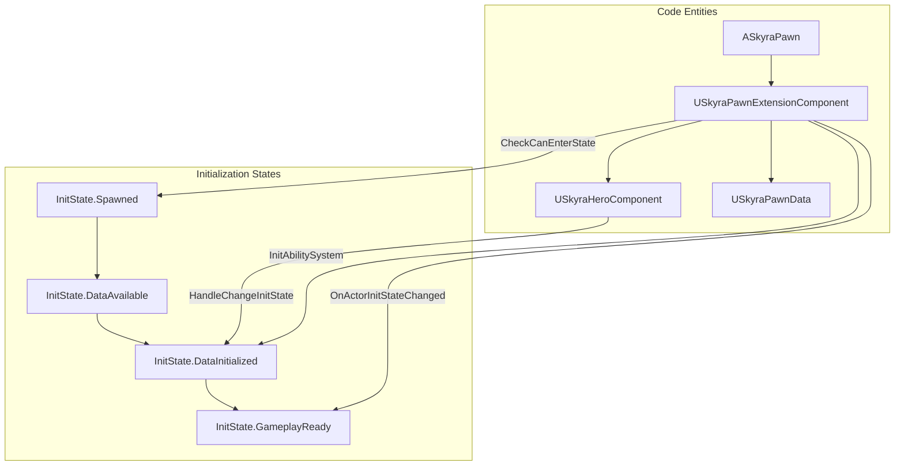
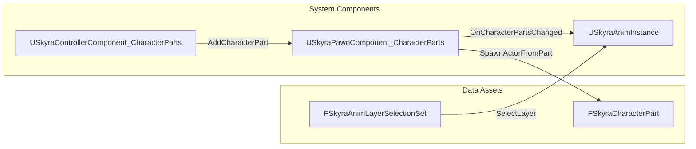

# Character and Pawn System

Relevant source files

The following files were used as context for generating this wiki page:

- [.gitattributes](.gitattributes)

The Character and Pawn system in SkyraFramework provides a modular, component-based architecture for defining and initializing actors. It moves away from monolithic pawn classes by utilizing a state-driven initialization pipeline coordinated by the `GameFrameworkComponentManager`. This allows for a clean separation between base pawn logic, data-driven configuration, and player-specific features like input and camera handling.

### System Architecture Overview

The system is built around several core components that work together to transition a Pawn from a spawned actor to a gameplay-ready entity.

| Component | Role |
| :--- | :--- |
| `ASkyraPawn` | The base class for all pawns, providing team integration via `ISkyraTeamAgentInterface`. [Source/SkyraGame/Private/Character/SkyraPawn.cpp:15-18]() |
| `USkyraPawnData` | A Data Asset defining the pawn's class, input configuration, and default camera modes. [Source/SkyraGame/Private/Character/SkyraPawnData.cpp:7-13]() |
| `USkyraPawnExtensionComponent` | Coordinates the modular initialization of the pawn and manages the Ability System Component (ASC) pairing. [Source/SkyraGame/Private/Character/SkyraPawnExtensionComponent.cpp:22-32]() |
| `USkyraHeroComponent` | Handles player-specific logic such as input binding and camera mode determination. [Source/SkyraGame/Private/Character/SkyraHeroComponent.cpp:41-46]() |
| `USkyraHealthComponent` | Manages the life cycle of the pawn, including health states and death handling. [Source/SkyraGame/Private/Character/SkyraHealthComponent.cpp:20-25]() |

### Component Relationship and Initialization

The framework uses a "Feature State" machine to ensure components are initialized in the correct order across the network. The `USkyraPawnExtensionComponent` acts as the primary coordinator for these states using the `IGameFrameworkInitStateInterface`.

#### Pawn Initialization Flow
The initialization progresses through four primary states defined in `SkyraGameplayTags`: `InitState.Spawned` -> `InitState.DataAvailable` -> `InitState.DataInitialized` -> `InitState.GameplayReady`. [Source/SkyraGame/Private/Character/SkyraPawnExtensionComponent.cpp:218-221]()

"Pawn Initialization Pipeline"

**Sources:** [Source/SkyraGame/Private/Character/SkyraPawnExtensionComponent.cpp:218-240](), [Source/SkyraGame/Private/Character/SkyraHeroComponent.cpp:130-136]()

### Core Components

#### SkyraPawn and PawnData
`ASkyraPawn` is the foundation of the system. It implements `ISkyraTeamAgentInterface` to allow the pawn to belong to a team, which is typically synchronized with the possessing `AController`. [Source/SkyraGame/Private/Character/SkyraPawn.cpp:44-50]()

`USkyraPawnData` is a non-mutable data asset that defines the "identity" of a pawn. It contains:
*   **PawnClass**: The actual actor class to spawn.
*   **AbilitySets**: GAS abilities granted upon spawn via `USkyraAbilitySet`. [Source/SkyraGame/Private/Character/SkyraPawnData.cpp:15-18]()
*   **InputConfig**: Mapping of Input Actions to Gameplay Tags. [Source/SkyraGame/Private/Character/SkyraPawnData.cpp:21-23]()
*   **DefaultCameraMode**: The camera behavior for this pawn. [Source/SkyraGame/Private/Character/SkyraPawnData.cpp:24-26]()

For details on how these assets are applied, see [Pawn Initialization and Extension Component](#4.1).

#### Hero Component
The `USkyraHeroComponent` is specifically for player-controlled pawns. It is responsible for:
*   **Input Binding**: Connecting `USkyraInputComponent` to the actions defined in `USkyraPawnData` during the `DataInitialized` state. [Source/SkyraGame/Private/Character/SkyraHeroComponent.cpp:168-175]()
*   **Camera Control**: Providing the `DetermineCameraMode` delegate to the `USkyraCameraComponent`. [Source/SkyraGame/Private/Character/SkyraHeroComponent.cpp:179-183]()

For details on input and player-specific initialization, see [Hero Component and Health System](#4.2).

#### Health and Life Cycle
The `USkyraHealthComponent` works alongside the GAS `USkyraHealthSet`. It listens for attribute changes (Damage, Healing) and triggers the transition to a "Death" state, which involves activating a `USkyraGameplayAbility_Death`. [Source/SkyraGame/Private/Character/SkyraHealthComponent.cpp:105-112]()

### Cosmetics and Character Parts
SkyraFramework includes a modular cosmetic system that allows attaching "Character Parts" (Skeletal or Static Meshes) to a pawn. This system is driven by `USkyraPawnComponent_CharacterParts` and can influence animation via `FSkyraAnimLayerSelectionSet`.

"Cosmetic System Linkage"

**Sources:** [Source/SkyraGame/Private/Cosmetics/SkyraPawnComponent_CharacterParts.cpp:18-25](), [Source/SkyraGame/Private/Cosmetics/SkyraControllerComponent_CharacterParts.cpp:12-18]()

For details on the cosmetics pipeline, see [Cosmetics and Character Parts](#4.3).

---
**Child Pages:**
*   [Pawn Initialization and Extension Component](#4.1)
*   [Hero Component and Health System](#4.2)
*   [Cosmetics and Character Parts](#4.3)