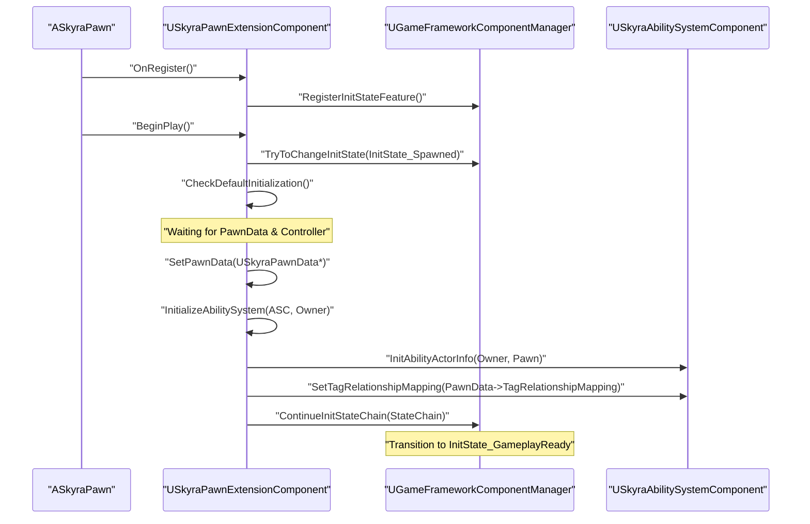

# Pawn Initialization and Extension Component

<details>
<summary>Relevant source files</summary>

The following files were used as context for generating this wiki page:

- [.gitattributes](.gitattributes)

</details>


The Pawn system in SkyraFramework is designed around a modular, data-driven initialization pipeline. Instead of monolithic classes, pawns utilize a "feature-based" initialization flow mediated by the `GameFrameworkComponentManager`. This allows disparate components (Ability System, Input, Camera, Health) to synchronize their setup phases across both the server and clients.

## SkyraPawn

`ASkyraPawn` serves as the base class for all pawns in the framework. Its primary responsibility is managing team identity and providing a foundation for the extension component.

### Team Integration
The pawn implements `ISkyraTeamAgentInterface` to integrate with the framework's team system. It dynamically updates its team ID based on its `AController` during possession events.

*   **Possession**: When possessed, the pawn casts the controller to `ISkyraTeamAgentInterface`, caches the team ID, and binds to `OnTeamChangedDelegate` [Source/SkyraGame/Private/Character/SkyraPawn.cpp:37-50]().
*   **Unpossession**: Upon unpossession, it stops listening to the controller and determines a new team ID (typically reverting to a neutral state) [Source/SkyraGame/Private/Character/SkyraPawn.cpp:52-68]().
*   **Authority**: Team IDs can only be set directly on the pawn if it is unpossessed and the caller has network authority [Source/SkyraGame/Private/Character/SkyraPawn.cpp:70-89]().

### Team Change Flow
| Event | Action |
| :--- | :--- |
| `PossessedBy` | Bind to `ControllerAsTeamProvider->GetTeamChangedDelegateChecked()` |
| `UnPossessed` | Call `RemoveAll(this)` on old controller delegate |
| `OnRep_MyTeamID` | Broadcast `ConditionalBroadcastTeamChanged` to local clients |

**Sources:**
- [Source/SkyraGame/Private/Character/SkyraPawn.cpp:15-111]()

---

## SkyraPawnData

`USkyraPawnData` is a `UDataAsset` that defines the identity and capabilities of a pawn. It acts as the "template" used by the `SkyraPawnExtensionComponent` to configure the actor at runtime.

### Key Properties
*   **PawnClass**: The actual actor class to spawn [Source/SkyraGame/Private/Character/SkyraPawnData.cpp:10-10]().
*   **AbilitySets**: A list of `USkyraAbilitySet` to grant to the pawn (defined in the header).
*   **InputConfig**: The `USkyraInputConfig` used to map Input Actions to Gameplay Tags [Source/SkyraGame/Private/Character/SkyraPawnData.cpp:11-11]().
*   **DefaultCameraMode**: The initial `USkyraCameraMode` to use [Source/SkyraGame/Private/Character/SkyraPawnData.cpp:12-12]().
*   **TagRelationshipMapping**: Defines how gameplay tags block or cancel other tags (applied to the ASC) [Source/SkyraGame/Private/Character/SkyraPawnExtensionComponent.cpp:144-147]().

**Sources:**
- [Source/SkyraGame/Private/Character/SkyraPawnData.cpp:7-13]()
- [Source/SkyraGame/Private/Character/SkyraPawnExtensionComponent.cpp:144-147]()

---

## SkyraPawnExtensionComponent

The `USkyraPawnExtensionComponent` is the "coordinator" of the pawn. It manages the Gameplay Ability System (GAS) initialization and implements the `IGameFrameworkInitStateInterface` to synchronize modular components.

### Initialization State Machine
The component drives the pawn through a series of `InitState` tags defined in `SkyraGameplayTags`. This ensures that components like the `SkyraHeroComponent` or `SkyraHealthComponent` do not initialize until their dependencies (like the PlayerState or PawnData) are ready.

**Pawn Initialization Sequence**
```mermaid
graph TD
    "InitState_Spawned" --> "InitState_DataAvailable"
    "InitState_DataAvailable" --> "InitState_DataInitialized"
    "InitState_DataInitialized" --> "InitState_GameplayReady"

    subgraph "DataAvailable Requirements"
    "HasPawnData"
    "HasController/PlayerState"
    end

    subgraph "DataInitialized Requirements"
    "ASC_Initialized"
    "Input_Bound"
    end
```

### Ability System Lifecycle
The extension component is responsible for connecting the Pawn (the Avatar) to the Ability System Component (the Owner, often located on the `PlayerState`).

*   **InitializeAbilitySystem**: Called when the ASC becomes available. It calls `InitAbilityActorInfo` and applies the `TagRelationshipMapping` from the `PawnData` [Source/SkyraGame/Private/Character/SkyraPawnExtensionComponent.cpp:105-150]().
*   **UninitializeAbilitySystem**: Cleans up the ASC by clearing actor info, removing gameplay cues, and cancelling abilities that do not have the `Ability.Behavior.SurvivesDeath` tag [Source/SkyraGame/Private/Character/SkyraPawnExtensionComponent.cpp:152-183]().

### Integration with Modular Gameplay
The component uses the `GameFrameworkComponentManager` to register itself as a "Feature".

1.  **OnRegister**: Registers the `PawnExtension` feature name [Source/SkyraGame/Private/Character/SkyraPawnExtensionComponent.cpp:41-54]().
2.  **BeginPlay**: Binds to state changes and pushes the initial `InitState_Spawned` state [Source/SkyraGame/Private/Character/SkyraPawnExtensionComponent.cpp:56-66]().
3.  **CheckDefaultInitialization**: A re-entrant function that attempts to progress the `StateChain` (`Spawned` -> `DataAvailable` -> `DataInitialized` -> `GameplayReady`) [Source/SkyraGame/Private/Character/SkyraPawnExtensionComponent.cpp:213-222]().

**Sources:**
- [Source/SkyraGame/Private/Character/SkyraPawnExtensionComponent.cpp:20-32]()
- [Source/SkyraGame/Private/Character/SkyraPawnExtensionComponent.cpp:105-183]()
- [Source/SkyraGame/Private/Character/SkyraPawnExtensionComponent.cpp:213-222]()

---

## Initialization Flow Diagram

This diagram maps the natural language initialization steps to the specific code entities and functions responsible for the transition.

**Code Entity Initialization Flow**


**Sources:**
- [Source/SkyraGame/Private/Character/SkyraPawnExtensionComponent.cpp:41-66]()
- [Source/SkyraGame/Private/Character/SkyraPawnExtensionComponent.cpp:105-150]()
- [Source/SkyraGame/Private/Character/SkyraPawnExtensionComponent.cpp:213-222]()