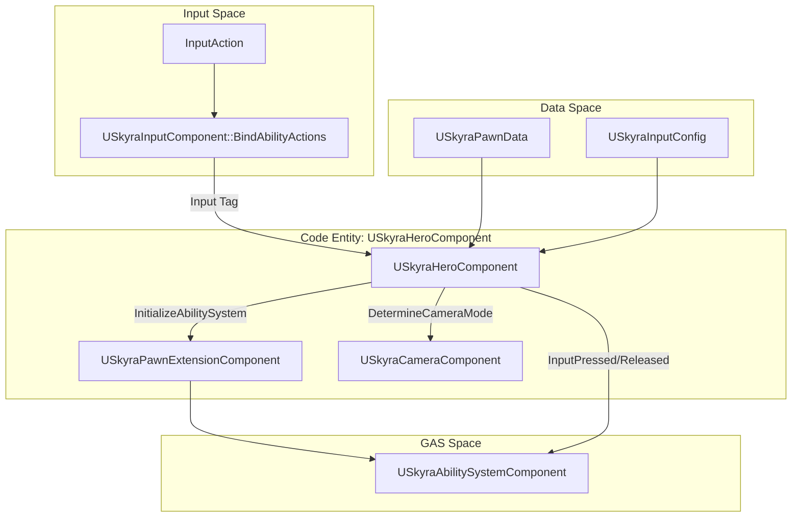
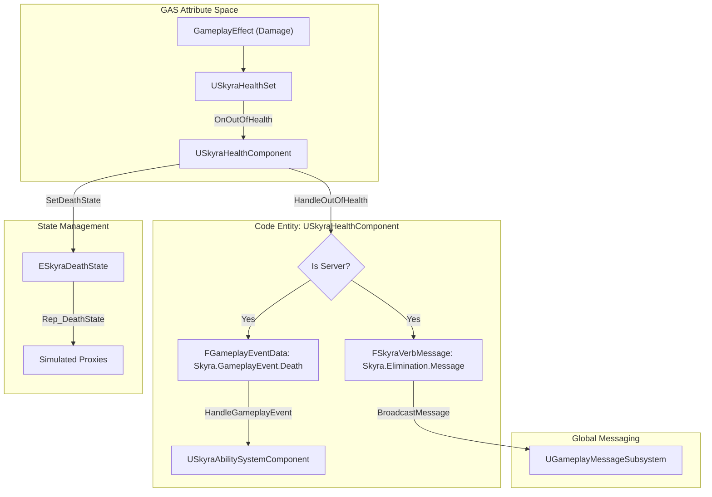

# Hero Component and Health System

Relevant source files

The following files were used as context for generating this wiki page:

- [.gitattributes](.gitattributes)

The Hero Component and Health System provide the bridge between player input, the Gameplay Ability System (GAS), and the physical state of a pawn. While the `USkyraPawnExtensionComponent` handles generic initialization, the `USkyraHeroComponent` is specifically designed for player-controlled characters, managing input bindings and camera integration. Complementing this, the `USkyraHealthComponent` manages the lifecycle of a pawn's health, translating GAS attribute changes into game-world states like death or elimination.

## Hero Component

The `USkyraHeroComponent` is a modular component that must be placed on a `Pawn` [.gitattributes:1-4](). It coordinates the initialization of player-specific systems including the `USkyraInputComponent` and `USkyraCameraComponent`.

### Initialization State Machine
The component participates in the `UGameFrameworkComponentManager` initialization flow, progressing through states to ensure all dependencies (Player State, Input, and Pawn Data) are ready before gameplay begins [.gitattributes:1-4]().

| State | Requirements |
| :--- | :--- |
| `InitState_Spawned` | Valid Pawn owner [.gitattributes:1-4](). |
| `InitState_DataAvailable` | Valid `ASkyraPlayerState`. For local players, requires a valid `ASkyraPlayerController` and `InputComponent` [.gitattributes:1-4](). |
| `InitState_DataInitialized` | `USkyraPawnExtensionComponent` must have reached `DataInitialized`. The Ability System is initialized here [.gitattributes:1-4](). |
| `InitState_GameplayReady` | Final transition state [.gitattributes:1-4](). |

### Input Binding and Camera Mode
The hero component routes input from the `USkyraInputComponent` to the Ability System Component (ASC). It uses `USkyraInputConfig` to map Input Actions to Gameplay Tags, which the ASC then uses to trigger abilities [.gitattributes:1-4]().

Additionally, it provides the `DetermineCameraMode` delegate to the `USkyraCameraComponent`. This allows the hero's current state (or active abilities) to override the default camera mode defined in the `USkyraPawnData` [.gitattributes:1-4]().

### Hero Component Data Flow
The following diagram illustrates how the `USkyraHeroComponent` connects input and camera data to the underlying pawn architecture.

**Hero Component Integration**

Sources: [.gitattributes:1-4]()

## Health System

The `USkyraHealthComponent` acts as a listener for the `USkyraHealthSet` attributes. It manages the transition between living and dead states and broadcasts events to other systems via the `UGameplayMessageSubsystem`.

### Attribute Listening
During initialization via `InitializeWithAbilitySystem`, the component binds to delegates provided by the `USkyraHealthSet` [.gitattributes:1-4]():
* `OnHealthChanged`
* `OnMaxHealthChanged`
* `OnOutOfHealth`

### Death Handling and State Machine
The component maintains a replicated `DeathState` [.gitattributes:1-4](). When health reaches zero, `HandleOutOfHealth` is triggered on the server, which initiates the death sequence:

1.  **Gameplay Event**: Sends `Skyra.GameplayEvent.Death` to the ASC to trigger death-related abilities [.gitattributes:1-4]().
2.  **Verb Message**: Broadcasts a `Skyra.Elimination.Message` (via `TAG_Skyra_Elimination_Message`) to the `UGameplayMessageSubsystem` for UI and scoring systems [.gitattributes:1-4]().
3.  **State Transition**: Moves from `NotDead` to `DeathStarted` and eventually `DeathFinished` [.gitattributes:1-4]().

### Health System Data Flow
The following diagram traces the flow from a Gameplay Effect (Damage) to the eventual death state and message broadcast.

**Health and Death Logic Flow**

Sources: [.gitattributes:1-4]()

### Key Functions and Variables

| Class | Member | Description |
| :--- | :--- | :--- |
| `USkyraHeroComponent` | `InitializePlayerInput` | Binds Input Actions to the ASC using the provided `USkyraInputConfig` [.gitattributes:1-4](). |
| `USkyraHeroComponent` | `DetermineCameraMode` | Returns the `USkyraCameraMode` to use, allowing for ability-based overrides [.gitattributes:1-4](). |
| `USkyraHealthComponent` | `InitializeWithAbilitySystem` | Hooks into `USkyraHealthSet` delegates and resets health to MaxHealth [.gitattributes:1-4](). |
| `USkyraHealthComponent` | `HandleOutOfHealth` | Server-only function that triggers death events and messages [.gitattributes:1-4](). |
| `USkyraHealthComponent` | `DeathState` | Replicated enum tracking `NotDead`, `DeathStarted`, or `DeathFinished` [.gitattributes:1-4](). |

Sources: [.gitattributes:1-4]()