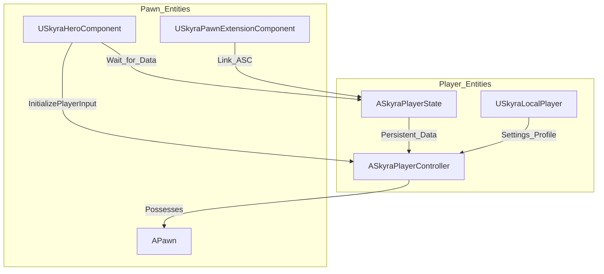
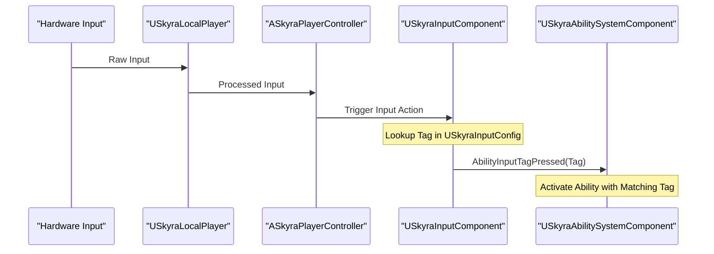

# Player System

Relevant source files

The following files were used as context for generating this wiki page:

- [.gitattributes](.gitattributes)

The **Player System** in SkyraFramework provides the foundational infrastructure for player representation, local state management, and the interface between the human player and the game world. It extends the standard Unreal Engine `PlayerController` and `PlayerState` to integrate with the framework's modular systems, including the Gameplay Ability System (GAS), Teams, and the Experience system.

This system is designed to handle both human players and AI bots through a unified interface, while providing specialized components for input handling and spawning logic.

## Core Player Classes

The framework utilizes a specific hierarchy of player-related classes to manage the lifecycle of a player session.

| Class | Responsibility |
| :--- | :--- |
| `ASkyraPlayerController` | The primary interface for player input and camera management. Handles team assignment and high-level player actions. |
| `ASkyraPlayerState` | Holds persistent data that survives pawn destruction (e.g., Score, Team, GAS components). |
| `USkyraLocalPlayer` | Manages local user settings, input profiles, and platform-specific player data. |
| `USkyraHeroComponent` | A modular component added to Pawns to coordinate initialization between the Controller, PlayerState, and Input. |

### Player Initialization Flow
The initialization of a player-controlled pawn is coordinated by the `USkyraHeroComponent` using the `GameFrameworkComponentManager`. It ensures that the `ASkyraPlayerState` is available and that the `AbilitySystemComponent` is properly linked to the pawn before gameplay begins.

---

## Player Controller, State, and Spawning (#5.1)

This sub-system manages the lifecycle of players in the world, from their initial spawn to their persistence across matches.

*   **ASkyraPlayerController**: Extends the base controller to support the framework's camera assist features, team-based logic via `ISkyraTeamAgentInterface`, and integration with the `SkyraCheatManager`.
*   **ASkyraPlayerState**: Acts as the "hub" for player-specific gameplay data. In SkyraFramework, the `AbilitySystemComponent` and `AttributeSets` live on the PlayerState rather than the Pawn to ensure they persist across respawns.
*   **Spawning Management**: Handled by the `SkyraPlayerSpawningManagerComponent`, which works with `SkyraPlayerStart` actors to find valid locations based on team requirements and experience-specific rules.

For details on controller logic, bot support, and spawning, see [Player Controller, State, and Spawning](#5.1).

---

## Input System (#5.2)

SkyraFramework uses the **Enhanced Input** plugin, wrapped in a data-driven architecture that maps Input Actions to Gameplay Tags.

*   **USkyraInputComponent**: Extends the standard input component to allow binding Gameplay Abilities directly to input tags.
*   **USkyraInputConfig**: A data asset that defines the mapping between `UInputAction` and `FGameplayTag`. This allows designers to change controls without modifying C++ code.
*   **Initialization**: The `USkyraHeroComponent` triggers `InitializePlayerInput` when the pawn is ready, pushing the appropriate `InputMappingContext` to the local player.

For details on mapping, sensitivity settings, and ability input routing, see [Input System](#5.2).

---

## System Interaction Diagram

The following diagram illustrates how the Player System bridges the gap between raw hardware input and the Gameplay Ability System.

---

## Summary of Key Classes

| Class Name | Role |
| :--- | :--- |
| `ASkyraPlayerController` | Local/Remote player authority and camera control. |
| `ASkyraPlayerState` | GAS container and persistent stat storage. |
| `USkyraLocalPlayer` | Per-user settings and local input state. |
| `USkyraHeroComponent` | Orchestrator for Pawn/Controller/Input initialization. |
| `USkyraInputComponent` | Routes input actions to GAS tags. |

**Sources:** [Source/SkyraGame/Private/Character/SkyraHeroComponent.cpp:17-19](), [Source/SkyraGame/Private/Character/SkyraHeroComponent.cpp:77-144](), [Source/SkyraGame/Private/Character/SkyraHeroComponent.cpp:160-174]()