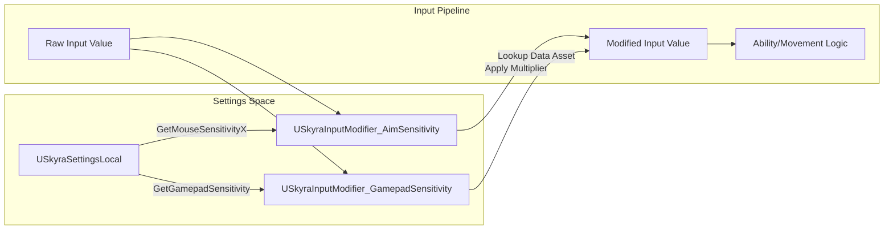

# Input System

Relevant source files

The following files were used as context for generating this wiki page:

- [.gitattributes](.gitattributes)

The SkyraFramework Input System is built upon the **Enhanced Input** plugin, extending it to integrate seamlessly with the Gameplay Ability System (GAS). It provides a data-driven approach to mapping hardware input actions to gameplay-specific tags, managing player-mappable configurations, and handling sensitivity scaling for aiming.

## Core Input Components

### USkyraInputComponent
The `USkyraInputComponent` is the primary interface between the Enhanced Input system and the Skyra Gameplay Ability System. It extends `UEnhancedInputComponent` to support binding Input Actions directly to Gameplay Tags.

*   **Ability Binding**: It allows binding `UInputAction` assets to specific `FGameplayTag` identifiers [Source/SkyraGame/Private/Input/SkyraInputComponent.h:23-25]().
*   **Input Tag Routing**: When an action is triggered, the component routes the input to the `USkyraAbilitySystemComponent`. It handles three states: `Pressed`, `Released`, and `Held` [Source/SkyraGame/Private/Input/SkyraInputComponent.cpp:33-54]().

### USkyraInputConfig
A data asset used to define the mapping between `UInputAction` and `FGameplayTag`.

*   **Native Input Actions**: Maps actions that are handled by native C++ code (e.g., Movement, Looking) [Source/SkyraGame/Private/Input/SkyraInputConfig.h:37-41]().
*   **Ability Input Actions**: Maps actions intended to trigger GAS abilities via input tags [Source/SkyraGame/Private/Input/SkyraInputConfig.h:44-48]().
*   **Find Functions**: Provides utility methods like `FindNativeInputActionForTag` and `FindAbilityInputActionForTag` to retrieve the correct action for a given tag [Source/SkyraGame/Private/Input/SkyraInputConfig.cpp:20-47]().

### USkyraHeroComponent Integration
The `USkyraHeroComponent` coordinates the initialization of input for player-controlled pawns. It listens for the `NAME_BindInputsNow` extension event from the `USkyraPawnExtensionComponent` to trigger the binding process [Source/SkyraGame/Private/Character/SkyraHeroComponent.cpp:161-180]().

**Input Initialization Flow**

```mermaid
graph TD
    subgraph "Initialization Space"
        A["USkyraHeroComponent::InitializePlayerInput"] --> B["USkyraInputComponent::BindAbilityActions"]
        B --> C["USkyraInputConfig::AbilityInputActions"]
    end

    subgraph "Execution Space"
        D["Hardware Input"] --> E["UEnhancedInputComponent"]
        E --> F["USkyraInputComponent::Input_AbilityInputTagPressed"]
        F --> G["USkyraAbilitySystemComponent::AbilityInputTagPressed"]
        G --> H["Activate Ability by Tag"]
    end
```

Sources: [Source/SkyraGame/Private/Input/SkyraInputComponent.cpp:33-54](), [Source/SkyraGame/Private/Character/SkyraHeroComponent.cpp:161-220]()

## Input Configuration and Mapping

### FMappableConfigPair
A struct used to package a `UPlayerMappableInputConfig` with activation metadata. It determines if a configuration should be automatically activated when registered and tracks the loading state of the config [Source/SkyraGame/Private/Input/SkyraMappableConfigPair.h:21-41]().

### Game Feature Actions
Skyra uses `GameFeatureActions` to inject input configurations dynamically based on the active game experience:

| Action Class | Purpose |
| :--- | :--- |
| `UGameFeatureAction_AddInputBinding` | Binds `USkyraInputConfig` sets to the `USkyraHeroComponent` for ability routing [Source/SkyraGame/Private/GameFeatures/GameFeatureAction_AddInputBinding.h:25-28](). |
| `UGameFeatureAction_AddInputConfig` | Registers and adds `FMappableConfigPair` (Enhanced Input Player Mappable Configs) to the local player subsystem [Source/SkyraGame/Private/GameFeatures/GameFeatureAction_AddInputConfig.h:27-30](). |
| `UGameFeatureAction_AddInputContextMapping` | Injects `UInputMappingContext` (IMC) assets with specific priorities directly into the Enhanced Input Subsystem [Source/SkyraGame/Private/GameFeatures/GameFeatureAction_AddInputContextMapping.h:34-37](). |

Sources: [Source/SkyraGame/Private/GameFeatures/GameFeatureAction_AddInputBinding.cpp:122-148](), [Source/SkyraGame/Private/GameFeatures/GameFeatureAction_AddInputConfig.cpp:146-173](), [Source/SkyraGame/Private/GameFeatures/GameFeatureAction_AddInputContextMapping.cpp:98-113]()

## Aim Sensitivity and Modifiers

### SkyraAimSensitivityData
A data asset (`USkyraAimSensitivityData`) that defines a mapping between a sensitivity enum (e.g., Slow, Normal, Fast) and float values [Source/SkyraGame/Private/Input/SkyraAimSensitivityData.h:17-25](). This allows users to select discrete sensitivity levels in settings which translate to precise multipliers in the input pipeline.

### SkyraInputModifiers
Custom Enhanced Input modifiers are used to apply sensitivity and deadzones dynamically based on user settings:

*   **USkyraInputModifier_AimSensitivity**: Multiplies input based on the player's current sensitivity settings retrieved from `USkyraSettingsLocal`. It distinguishes between Mouse and Gamepad [Source/SkyraGame/Private/Input/SkyraInputModifiers.cpp:30-65]().
*   **USkyraInputModifier_GamepadSensitivity**: Specifically scales gamepad look input using the `USkyraAimSensitivityData` asset to map the `ESkyraGamepadSensitivity` enum to a float [Source/SkyraGame/Private/Input/SkyraInputModifiers.cpp:73-100]().

**Sensitivity Data Flow**

Sources: [Source/SkyraGame/Private/Input/SkyraInputModifiers.cpp:30-65](), [Source/SkyraGame/Private/Input/SkyraAimSensitivityData.h:17-25](), [Source/SkyraGame/Private/Settings/SkyraSettingsLocal.h:20-40]()

## User Settings and Persistence

### USkyraInputUserSettings
Skyra leverages `UEnhancedInputUserSettings` to manage per-player keybindings and input preferences. 

*   **Registration**: `UGameFeatureAction_AddInputContextMapping` registers IMCs with the user settings subsystem, making them available for the UI to query and remap [Source/SkyraGame/Private/GameFeatures/GameFeatureAction_AddInputContextMapping.cpp:107-110]().
*   **Mappable Key Profiles**: Uses `USkyraPlayerMappableKeyProfile` to store specific hardware-to-action mappings and platform-specific overrides [Source/SkyraGame/Private/UserSettings/SkyraPlayerMappableKeyProfile.h:16-20]().

### SkyraMappableConfigPair Static Registration
The framework provides static methods to track registered input configs globally via `FMappableConfigPair::RegisterPair` and `UnregisterPair` [Source/SkyraGame/Private/Input/SkyraMappableConfigPair.cpp:11-25](). This ensures that even if a Game Feature is not currently active, its possible keybindings can still be viewed or modified in the settings menu.

Sources: [Source/SkyraGame/Private/Input/SkyraMappableConfigPair.cpp:11-40](), [Source/SkyraGame/Private/GameFeatures/GameFeatureAction_AddInputContextMapping.cpp:88-115](), [Source/SkyraGame/Private/UserSettings/SkyraPlayerMappableKeyProfile.cpp:10-25]()