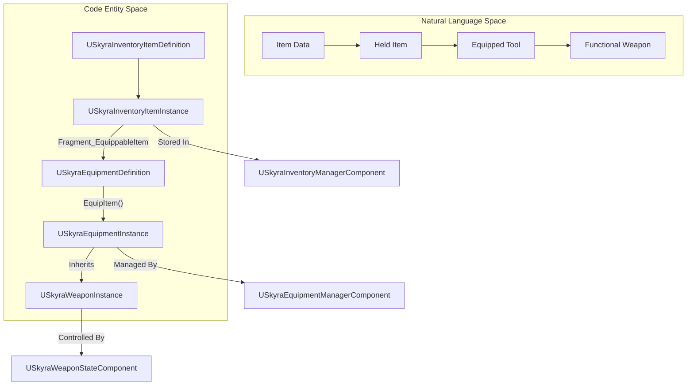
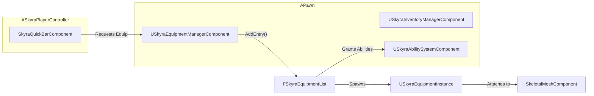

# Equipment, Inventory, and Weapons

Relevant source files

The following files were used as context for generating this wiki page:

- [.gitattributes](.gitattributes)

The SkyraFramework provides a multi-layered system for handling items, ranging from abstract data definitions to physical weapon instances. The lifecycle typically begins with an **Inventory Item**, which can be held in a collection. When that item is moved to a "QuickBar" or used, it creates an **Equipment Instance**, which handles the physical attachment of meshes and the granting of GAS abilities. Finally, if that equipment is a weapon, it leverages the **Weapon System** to handle firing logic, ammunition, and specialized animations.

### System Flow Overview

The following diagram illustrates the transition from a data definition to a functioning weapon in the hands of a pawn.

**Item Lifecycle: Definition to Instance**

---

### Inventory System
The Inventory System is the foundation of the item lifecycle. It uses a "fragment-based" approach where a `USkyraInventoryItemDefinition` is a simple data container holding various `USkyraInventoryItemFragment` objects. This allows items to be highly modular—one item might have a fragment for a UI icon, while another has a fragment defining it as equippable.

- **USkyraInventoryItemInstance**: The transient object representing a specific item in an inventory.
- **USkyraInventoryManagerComponent**: Handles the collection of item instances and replication.
- **Fragments**: Define behavior, such as `UInventoryFragment_EquippableItem`, which links an inventory item to an equipment definition.

For details, see [Inventory System](#6.1).

---

### Equipment System
The Equipment System bridges the gap between a menu item and a physical object in the world. When an item is "equipped" (often via the `SkyraQuickBarComponent`), the `USkyraEquipmentManagerComponent` spawns a `USkyraEquipmentInstance`.

- **USkyraEquipmentDefinition**: Defines what actors to spawn (meshes) and what `USkyraAbilitySet` to grant to the pawn while the item is equipped.
- **USkyraEquipmentInstance**: Manages the lifecycle of spawned actors and receives `OnEquipped` / `OnUnequipped` notifications.
- **SkyraQuickBarComponent**: A specialized manager that tracks a limited set of active slots and triggers the equipment logic when a slot is selected.

For details, see [Equipment System](#6.2).

---

### Weapon System
The Weapon System is an extension of the Equipment System. A weapon is essentially a specialized piece of equipment that adds combat-specific logic, such as fire rates, spread, and animation layer overrides.

- **USkyraWeaponInstance**: Inherits from `USkyraEquipmentInstance` and adds weapon-specific metadata.
- **USkyraGameplayAbility_RangedWeapon**: A GAS ability specifically designed to handle the "Fire" action, interacting with the weapon instance to calculate timing and projectiles.
- **USkyraWeaponStateComponent**: Tracks transient weapon state, such as time since last fire, to ensure synchronization between client and server.

For details, see [Weapon System](#6.3).

---

### Component Relationship Diagram
This diagram shows how the various components interact on a Pawn/Controller to facilitate the equipment flow.

**Code Entity Relationship**

**Sources:**
- [Source/SkyraGame/Private/Equipment/SkyraEquipmentManagerComponent.cpp:61-66]()
- [Source/SkyraGame/Private/Equipment/SkyraEquipmentInstance.cpp:75-81]()
- [Source/SkyraGame/Private/Equipment/SkyraQuickBarComponent.cpp:123-133]()