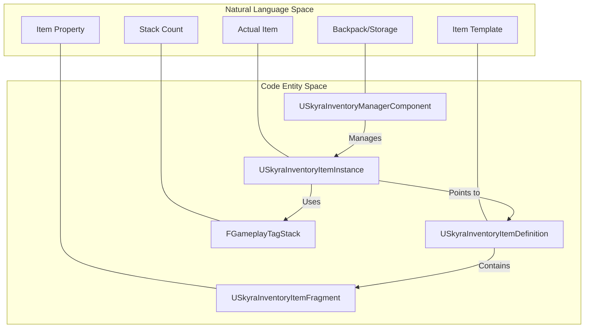
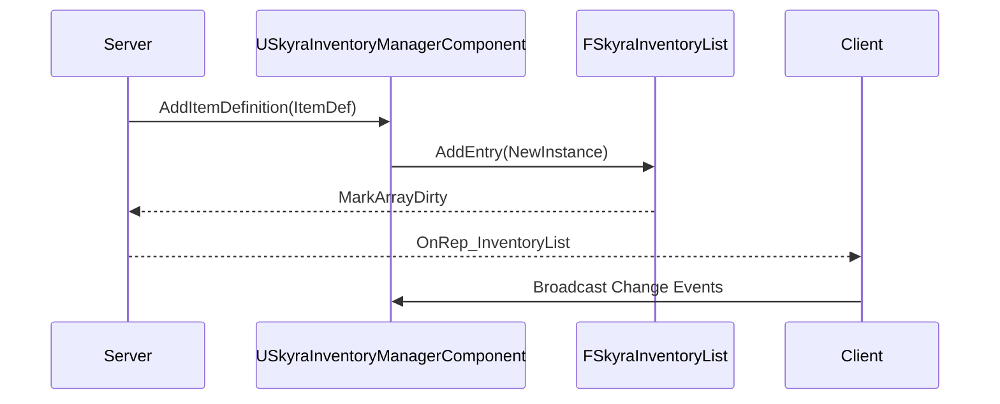

# Inventory System

Relevant source files

The following files were used as context for generating this wiki page:

- [.gitattributes](.gitattributes)

The Inventory System in SkyraFramework provides a data-driven architecture for managing items using a fragment-based approach. It decouples the definition of an item (static data) from its instance (runtime state) and uses a specialized manager component to handle replication and lifecycle across the network.

## Core Architecture

The system is built around three primary pillars:
1.  **Item Definitions**: Static data assets that define what an item is and what "fragments" (logic/data blocks) it contains.
2.  **Item Instances**: Objects created at runtime to represent a specific item in an inventory, tracking stacks and dynamic state.
3.  **Inventory Manager**: An actor component that tracks a collection of item instances and handles networking.

### Natural Language to Code Entity Mapping

The following diagram maps high-level inventory concepts to their corresponding classes and structures in the codebase.

Title: Inventory System Entity Mapping

**Sources:** `USkyraInventoryItemDefinition` is defined in [Source/SkyraGame/Private/Inventory/SkyraInventoryItemDefinition.h:18-35](), `USkyraInventoryItemInstance` in [Source/SkyraGame/Private/Inventory/SkyraInventoryItemInstance.h:20-60](), and `USkyraInventoryManagerComponent` in [Source/SkyraGame/Private/Inventory/SkyraInventoryManagerComponent.h:103-149]().

---

## Data Structures

### USkyraInventoryItemDefinition
This is a `UPrimaryDataAsset` that serves as the "blueprint" for an item [Source/SkyraGame/Private/Inventory/SkyraInventoryItemDefinition.h:18-19](). Instead of using a rigid inheritance hierarchy, it uses a list of `USkyraInventoryItemFragment` objects [Source/SkyraGame/Private/Inventory/SkyraInventoryItemDefinition.h:31-32]().

*   **Fragments**: Each fragment represents a specific feature, such as a mesh for world representation, UI icons, or equipment data.
*   **FindFragmentByClass**: A helper function used to retrieve specific data blocks at runtime [Source/SkyraGame/Private/Inventory/SkyraInventoryItemDefinition.h:23-24]().

**Sources:** [Source/SkyraGame/Private/Inventory/SkyraInventoryItemDefinition.h:18-35]()

### USkyraInventoryItemInstance
A `UObject` that represents an item currently held by a player or container [Source/SkyraGame/Private/Inventory/SkyraInventoryItemInstance.h:20-21]().
*   **Replication**: It is a replicated object, ensuring the client knows what items they possess [Source/SkyraGame/Private/Inventory/SkyraInventoryItemInstance.h:23-24]().
*   **Stat Tags**: Uses `FGameplayTagStackContainer` to store dynamic integer values associated with Gameplay Tags (e.g., ammo count, durability, stack size) [Source/SkyraGame/Private/Inventory/SkyraInventoryItemInstance.h:59-60]().
*   **Functionality**: Provides methods like `AddStatTagStack`, `RemoveStatTagStack`, and `GetStatTagStackCount` to manipulate item state [Source/SkyraGame/Private/Inventory/SkyraInventoryItemInstance.h:34-40]().

**Sources:** [Source/SkyraGame/Private/Inventory/SkyraInventoryItemInstance.h:20-60]()

---

## Inventory Management

### USkyraInventoryManagerComponent
The central authority for an actor's inventory. It manages a list of `FSkyraInventoryEntry` structures within a `FSkyraInventoryList` (a `FFastArraySerializer`) [Source/SkyraGame/Private/Inventory/SkyraInventoryManagerComponent.h:103-110]().

| Function | Description |
| :--- | :--- |
| `AddItemDefinition` | Creates a new `USkyraInventoryItemInstance` based on a definition and adds it to the list [Source/SkyraGame/Private/Inventory/SkyraInventoryManagerComponent.h:114-115](). |
| `RemoveItemInstance` | Removes a specific instance from the inventory [Source/SkyraGame/Private/Inventory/SkyraInventoryManagerComponent.h:117-118](). |
| `GetAllItems` | Returns a list of all current item instances [Source/SkyraGame/Private/Inventory/SkyraInventoryManagerComponent.h:120-121](). |
| `FindFirstItemStackByDefinition` | Searches for the first instance of a specific item type [Source/SkyraGame/Private/Inventory/SkyraInventoryManagerComponent.h:123-124](). |

Title: Inventory Data Flow

**Sources:** [Source/SkyraGame/Private/Inventory/SkyraInventoryManagerComponent.h:50-149]()

---

## Inventory Fragments

Fragments allow the inventory system to remain extensible without modifying the base classes.

| Fragment Class | Purpose |
| :--- | :--- |
| `UInventoryFragment_EquippableItem` | Contains a `TSubclassOf<USkyraEquipmentDefinition>` used by the Equipment System to spawn actors/abilities [Source/SkyraGame/Private/Inventory/InventoryFragment_EquippableItem.h:13-19](). |
| `UInventoryFragment_PickupIcon` | Defines the 3D mesh and visual parameters for the item when dropped in the world [Source/SkyraGame/Private/Inventory/InventoryFragment_PickupIcon.h:13-28](). |
| `UInventoryFragment_QuickBarIcon` | Stores UI textures and display names for the HUD quick-bar [Source/SkyraGame/Private/Inventory/InventoryFragment_QuickBarIcon.h:13-25](). |
| `UInventoryFragment_SetStats` | Initial Gameplay Tags and stack counts to apply to the instance upon creation [Source/SkyraGame/Private/Inventory/InventoryFragment_SetStats.h:13-22](). |

**Sources:** [Source/SkyraGame/Private/Inventory/InventoryFragment_EquippableItem.h:1-21](), [Source/SkyraGame/Private/Inventory/InventoryFragment_PickupIcon.h:1-30](), [Source/SkyraGame/Private/Inventory/InventoryFragment_QuickBarIcon.h:1-27](), [Source/SkyraGame/Private/Inventory/InventoryFragment_SetStats.h:1-24]()

---

## Interaction and Pickups

### IPickupable Interface
Actors that can be added to an inventory must implement the `IPickupable` interface [Source/SkyraGame/Private/Inventory/IPickupable.h:40-41](). This interface provides a standard way for the interaction system to query what items an actor provides.

*   **GetPickupInventory()**: Returns the item definitions and counts contained within the pickup [Source/SkyraGame/Private/Inventory/IPickupable.h:47-48]().

**Sources:** [Source/SkyraGame/Private/Inventory/IPickupable.h:10-54]()

---

## Integration with Gameplay Ability System (GAS)

Inventory items often act as a "cost" for abilities (e.g., consuming a potion or spending ammo).

### USkyraAbilityCost_InventoryItem
A gameplay ability cost that checks if the `USkyraInventoryManagerComponent` has a specific number of items before allowing activation [Source/SkyraGame/Private/AbilitySystem/Abilities/SkyraAbilityCost_InventoryItem.h:20-21]().
*   `CheckCost`: Validates the presence of `ItemDefinition` in the inventory [Source/SkyraGame/Private/AbilitySystem/Abilities/SkyraAbilityCost_InventoryItem.cpp:14-31]().
*   `ApplyCost`: Calls `ConsumeItemsByDefinition` on the inventory component [Source/SkyraGame/Private/AbilitySystem/Abilities/SkyraAbilityCost_InventoryItem.cpp:33-52]().

### USkyraAbilityCost_ItemTagStack
A more granular cost that checks the `FGameplayTagStack` on a specific `USkyraInventoryItemInstance` [Source/SkyraGame/Private/AbilitySystem/Abilities/SkyraAbilityCost_ItemTagStack.h:21-22](). This is typically used for weapons consuming ammo stored as tags on the item itself.
*   `CheckCost`: Verifies the stack count for a specific `Tag` [Source/SkyraGame/Private/AbilitySystem/Abilities/SkyraAbilityCost_ItemTagStack.cpp:19-40]().
*   `ApplyCost`: Removes the specified number of stacks from the item instance [Source/SkyraGame/Private/AbilitySystem/Abilities/SkyraAbilityCost_ItemTagStack.cpp:42-59]().

**Sources:** [Source/SkyraGame/Private/AbilitySystem/Abilities/SkyraAbilityCost_InventoryItem.cpp:1-52](), [Source/SkyraGame/Private/AbilitySystem/Abilities/SkyraAbilityCost_ItemTagStack.cpp:1-59]()