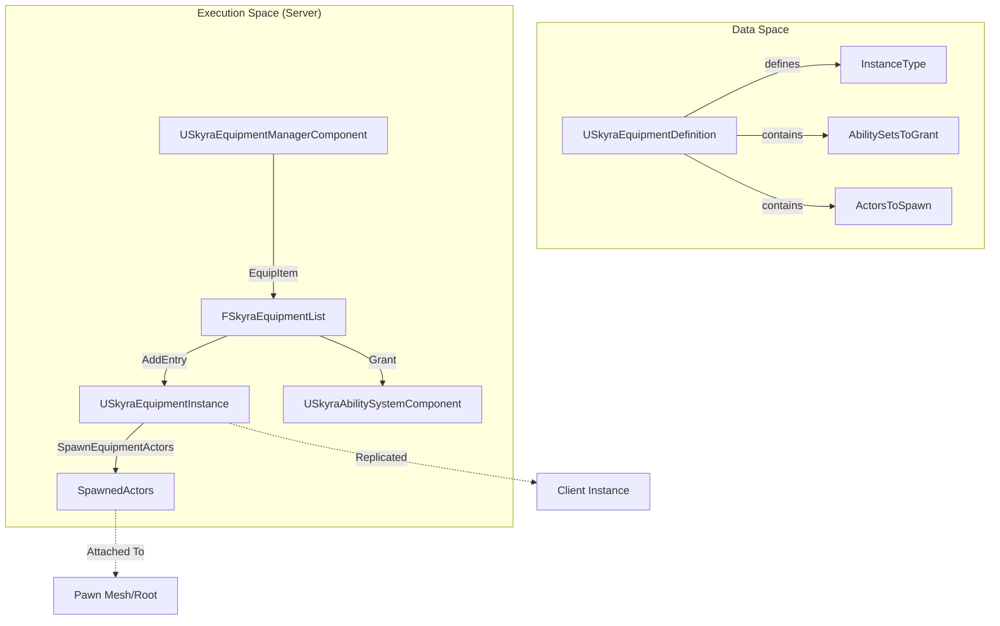
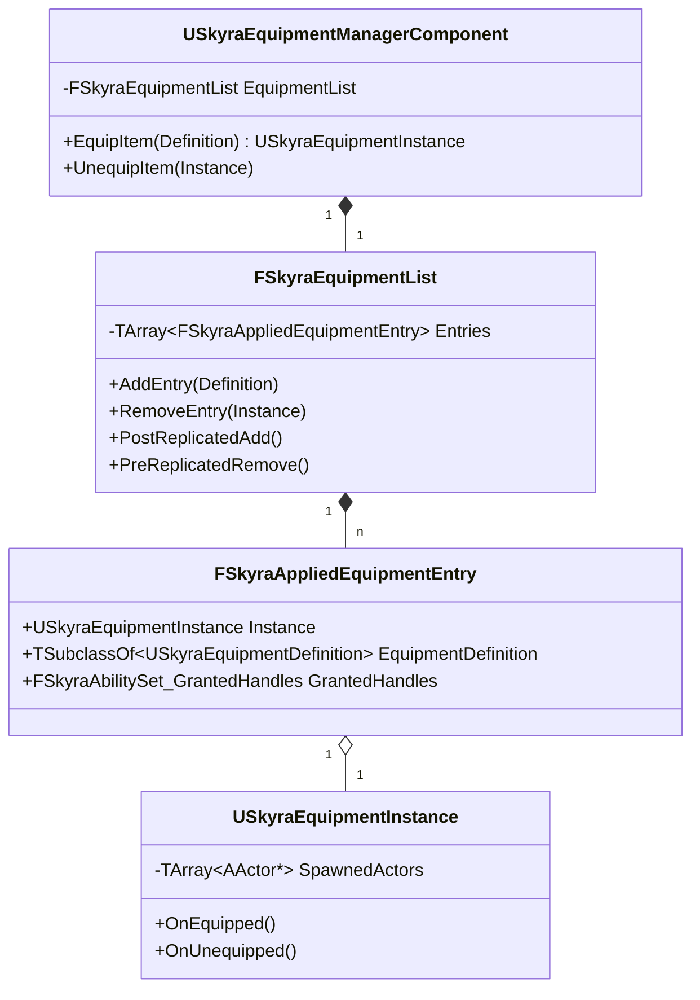

# Equipment System

Relevant source files

The following files were used as context for generating this wiki page:

- [.gitattributes](.gitattributes)

The Equipment System manages the lifecycle of items that can be "worn" or "held" by a pawn. It bridges the gap between abstract inventory items and the physical manifestation of those items in the game world, including spawning actors, granting Gameplay Abilities, and managing replication.

## System Overview

The system is built on a definition-instance pattern. A `USkyraEquipmentDefinition` defines what an item is, while `USkyraEquipmentInstance` represents a specific occurrence of that equipment on a pawn. The `USkyraEquipmentManagerComponent` acts as the authority for adding and removing these instances.

### Equipment Data Flow
The following diagram illustrates how data flows from a static definition to a live instance on a Pawn.

**Equipment Lifecycle Flow**

**Sources:** [Source/SkyraGame/Private/Equipment/SkyraEquipmentDefinition.cpp:8-12](), [Source/SkyraGame/Private/Equipment/SkyraEquipmentManagerComponent.cpp:68-107]()

## Key Classes

### USkyraEquipmentDefinition
A data asset used to describe an equippable item. It specifies:
*   **Instance Class**: The class of `USkyraEquipmentInstance` to create [Source/SkyraGame/Private/Equipment/SkyraEquipmentDefinition.cpp:11]().
*   **Ability Sets**: A list of `USkyraAbilitySet` to grant to the pawn when equipped [Source/SkyraGame/Private/Equipment/SkyraEquipmentManagerComponent.cpp:91-95]().
*   **Actors to Spawn**: A list of actors (meshes, effects) to spawn and attach to the pawn [Source/SkyraGame/Private/Equipment/SkyraEquipmentInstance.cpp:73-93]().

### USkyraEquipmentInstance
A replicated `UObject` that represents the "live" state of an equipped item.
*   **OnEquipped / OnUnequipped**: Blueprint-implementable events for custom logic [Source/SkyraGame/Private/Equipment/SkyraEquipmentInstance.cpp:106-114]().
*   **Actor Management**: Handles spawning and destroying the physical actors associated with the equipment [Source/SkyraGame/Private/Equipment/SkyraEquipmentInstance.cpp:73-104]().
*   **Instigator Tracking**: Tracks the `USkyraInventoryItemInstance` that triggered the equipment [Source/SkyraGame/Private/Equipment/SkyraEquipmentInstance.cpp:41]().

### USkyraEquipmentManagerComponent
A component typically attached to a `Pawn` that manages a list of active equipment.
*   **Replication**: Uses a custom Fast TArray Serializer (`FSkyraEquipmentList`) to efficiently replicate equipment changes to clients [Source/SkyraGame/Private/Equipment/SkyraEquipmentManagerComponent.cpp:141-146]().
*   **Subobject Replication**: Manages the replication of `USkyraEquipmentInstance` objects via `ReplicateSubobjects` [Source/SkyraGame/Private/Equipment/SkyraEquipmentManagerComponent.cpp:181-196]().
*   **Entry Management**: Provides `EquipItem` and `UnequipItem` functions to modify the `EquipmentList` [Source/SkyraGame/Private/Equipment/SkyraEquipmentManagerComponent.cpp:148-179]().

**Sources:** [Source/SkyraGame/Private/Equipment/SkyraEquipmentManagerComponent.cpp:133-139](), [Source/SkyraGame/Private/Equipment/SkyraEquipmentInstance.cpp:20-23]()

## Equipment Abilities

Equipment often grants Gameplay Abilities. These are implemented using `USkyraGameplayAbility_FromEquipment`.

*   **Context Retrieval**: This class provides helper functions to find the `USkyraEquipmentInstance` or the original `USkyraInventoryItemInstance` that granted the ability [Source/SkyraGame/Private/Equipment/SkyraGameplayAbility_FromEquipment.cpp:18-35]().
*   **Validation**: In the editor, it ensures that equipment-based abilities are set to `InstancedPerActor` or `InstancedPerExecution`, as they require instance-specific source object data [Source/SkyraGame/Private/Equipment/SkyraGameplayAbility_FromEquipment.cpp:39-50]().

**Sources:** [Source/SkyraGame/Private/Equipment/SkyraGameplayAbility_FromEquipment.cpp:13-16]()

## SkyraQuickBarComponent

The QuickBar is a specialized component (usually on the `PlayerController`) that manages a fixed set of slots containing `USkyraInventoryItemInstance` objects.

### Slot Management
*   **Active Index**: Tracks which slot is currently active [Source/SkyraGame/Private/Equipment/SkyraQuickBarComponent.cpp:33]().
*   **Cycling**: Provides `CycleActiveSlotForward` and `CycleActiveSlotBackward` to navigate slots [Source/SkyraGame/Private/Equipment/SkyraQuickBarComponent.cpp:46-84]().
*   **Inventory Integration**: When a slot is activated, it searches the item's fragments for a `UInventoryFragment_EquippableItem` and tells the `USkyraEquipmentManagerComponent` to equip it [Source/SkyraGame/Private/Equipment/SkyraQuickBarComponent.cpp:86-109]().

### Communication
The QuickBar uses the `UGameplayMessageSubsystem` to notify the UI and other systems about changes.
*   **TAG_Skyra_QuickBar_Message_SlotsChanged**: Broadcast when items are added/removed from slots [Source/SkyraGame/Private/Equipment/SkyraQuickBarComponent.cpp:205-213]().
*   **TAG_Skyra_QuickBar_Message_ActiveIndexChanged**: Broadcast when the player switches active slots [Source/SkyraGame/Private/Equipment/SkyraQuickBarComponent.cpp:215-223]().

**Sources:** [Source/SkyraGame/Private/Equipment/SkyraQuickBarComponent.cpp:19-21](), [Source/SkyraGame/Private/Equipment/SkyraQuickBarComponent.cpp:135-147]()

## Implementation Details

### Equipment List Replication
The system uses `FSkyraEquipmentList` (a `FFastArraySerializer`) to manage `FSkyraAppliedEquipmentEntry` structures. This ensures that when an item is equipped on the server, the client correctly triggers the lifecycle events.

**Entity Relationship Diagram**

### Initialization and Cleanup
1.  **Equip**: `AddEntry` creates the `USkyraEquipmentInstance`, grants `USkyraAbilitySet`s to the ASC, and calls `SpawnEquipmentActors` [Source/SkyraGame/Private/Equipment/SkyraEquipmentManagerComponent.cpp:84-101]().
2.  **Unequip**: `RemoveEntry` takes back the ability handles and destroys the spawned actors [Source/SkyraGame/Private/Equipment/SkyraEquipmentManagerComponent.cpp:116-122]().
3.  **Teardown**: When the `USkyraEquipmentManagerComponent` is uninitialized, it iterates through all active instances and calls `UnequipItem` to ensure proper cleanup of actors and abilities [Source/SkyraGame/Private/Equipment/SkyraEquipmentManagerComponent.cpp:203-219]().

**Sources:** [Source/SkyraGame/Private/Equipment/SkyraEquipmentManagerComponent.cpp:18-38](), [Source/SkyraGame/Private/Equipment/SkyraEquipmentManagerComponent.cpp:109-128]()