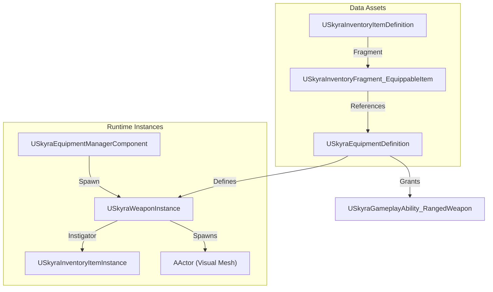
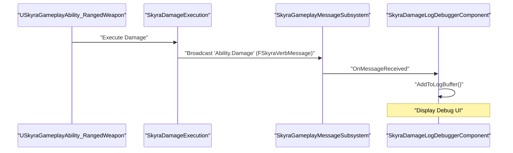

# Weapon System

Relevant source files

The following files were used as context for generating this wiki page:

- [.gitattributes](.gitattributes)

The Weapon System in SkyraFramework is an extension of the Equipment and Inventory systems, providing specialized logic for combat interactions. It utilizes the Gameplay Ability System (GAS) for execution, a modular component architecture for state tracking, and a data-driven approach to animation and feedback.

## Weapon Instance Architecture

The core of any weapon is the `USkyraWeaponInstance`. While it inherits from `USkyraEquipmentInstance`, it adds weapon-specific metadata such as fire timing, interaction rules, and animation layer selection.

### USkyraWeaponInstance
`USkyraWeaponInstance` serves as the data container and logic hub for an active weapon. It manages the lifecycle of the weapon while it is equipped.

*   **Animation Layer Selection**: It uses `FSkyraAnimLayerSelectionSet` to determine which animation layers to apply to the character based on the weapon's tags and the character's current state [Source/SkyraGame/Private/Cosmetics/SkyraCosmeticAnimationTypes.cpp:15-30]().
*   **Interactions**: It tracks the "Last Fire Time" and "Last Damage Instigated Time" to regulate fire rates and feedback [Source/SkyraGame/Private/Weapons/SkyraWeaponInstance.cpp:20-45]().

### USkyraRangedWeaponInstance
A specialized subclass for projectile or trace-based weaponry. It includes properties for:
*   Spread patterns and recoil.
*   Muzzle flash and impact effect definitions.
*   Bullet persistence and range falloff data.

### Weapon Data Flow
The following diagram illustrates how a weapon moves from a static definition to an active in-game object.

**Weapon Initialization Flow**

Sources: [Source/SkyraGame/Private/Equipment/SkyraEquipmentInstance.cpp:73-93](), [Source/SkyraGame/Private/Equipment/SkyraGameplayAbility_FromEquipment.cpp:18-35]()

---

## Ranged Weapon Abilities

Weapon firing is handled via Gameplay Abilities, specifically `USkyraGameplayAbility_RangedWeapon`. This class bridges the gap between player input and the physical weapon instance.

### USkyraGameplayAbility_RangedWeapon
This ability handles the logic for "pulling the trigger." It is responsible for:
1.  **Validation**: Checking if the weapon has ammo and the cooldown has expired.
2.  **Targeting**: Performing line traces or spawning projectiles.
3.  **Net Execution**: Ensuring the client predicts the shot while the server validates the hit.

Key functions:
*   `GetWeaponInstance()`: Retrieves the `USkyraRangedWeaponInstance` associated with the ability spec's `SourceObject` [Source/SkyraGame/Private/Equipment/SkyraGameplayAbility_FromEquipment.cpp:18-26]().
*   `PerformLocalTargeting()`: Executes the trace logic on the client.

### Weapon State Component
The `USkyraWeaponStateComponent` is attached to the Player State or Pawn to track transient weapon data that must persist across ability activations, such as:
*   Current heat/overheat levels.
*   Reload progress.
*   Hit markers and damage logging.

Sources: [Source/SkyraGame/Private/Equipment/SkyraGameplayAbility_FromEquipment.cpp:13-35]()

---

## Damage Logging and Debugging

To assist in balancing and bug fixing, the framework includes a robust damage logging system.

### SkyraDamageLogDebuggerComponent
This component listens for `FSkyraVerbMessage` events related to damage. It maintains a rolling buffer of recent damage events, which can be visualized in the editor or via on-screen debug overlays.

### Debugging Workflow

Sources: [Source/SkyraGame/Private/Equipment/SkyraEquipmentInstance.cpp:106-114]()

---

## Weapon Spawning and World Interaction

### SkyraWeaponSpawner
The `ASkyraWeaponSpawner` is an actor placed in the world that allows players to acquire weapons.
*   **Interaction**: Implements `IInteractableTarget`. When a player interacts with the spawner, it calls `USkyraInventoryManagerComponent::AddItemDefinition` to grant the item [Source/SkyraGame/Private/Equipment/SkyraEquipmentInstance.cpp:55-71]().
*   **Visuals**: Automatically displays a preview mesh based on the `USkyraInventoryItemDefinition` configured in the spawner.

### Equipment Lifecycle
| Function | Description |
| :--- | :--- |
| `OnEquipped` | Called when the weapon is added to the character's active slot. Triggers `K2_OnEquipped` for Blueprint logic [Source/SkyraGame/Private/Equipment/SkyraEquipmentInstance.cpp:106-109](). |
| `OnUnequipped` | Called when the weapon is removed or swapped. Cleans up spawned actors and effects [Source/SkyraGame/Private/Equipment/SkyraEquipmentInstance.cpp:111-114](). |
| `SpawnEquipmentActors` | Spawns the physical `AActor` representations (meshes) and attaches them to the Pawn's skeletal sockets [Source/SkyraGame/Private/Equipment/SkyraEquipmentInstance.cpp:73-93](). |
| `DestroyEquipmentActors` | Iterates through `SpawnedActors` and destroys them upon unequip [Source/SkyraGame/Private/Equipment/SkyraEquipmentInstance.cpp:95-104](). |

Sources: [Source/SkyraGame/Private/Equipment/SkyraEquipmentInstance.cpp:73-114]()