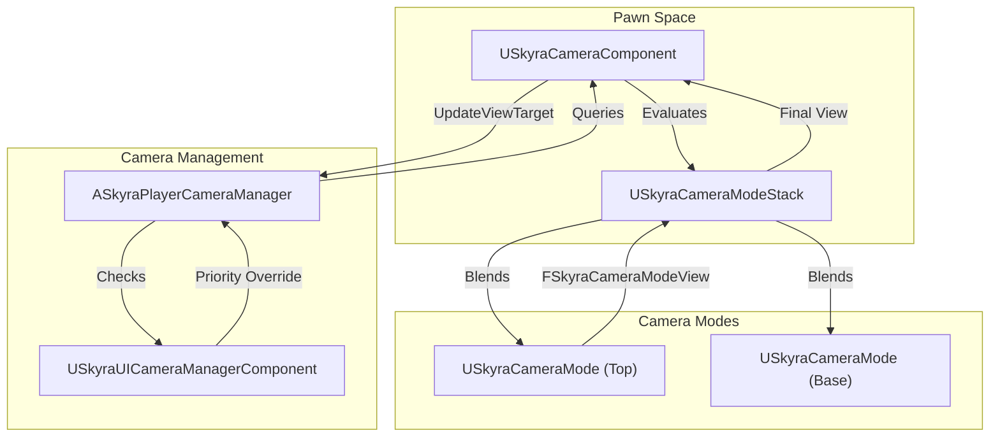

# Camera System

Relevant source files

The following files were used as context for generating this wiki page:

- [.gitattributes](.gitattributes)

The Skyra Camera System is a modular, stack-based architecture designed to handle complex camera behaviors, blending, and transitions. It moves away from the traditional "one camera per pawn" model in favor of a **Camera Mode Stack** that can dynamically respond to gameplay states (e.g., aiming, sprinting, or interacting).

### System Overview

The system is built around four primary pillars:
1.  **SkyraCameraComponent**: The central hub attached to pawns that manages the mode stack.
2.  **SkyraCameraMode**: Individual data-driven behaviors (e.g., Third Person, Orbit) that define FOV, offsets, and constraints.
3.  **SkyraPlayerCameraManager**: The engine-level manager that bridges the component's output to the viewport.
4.  **SkyraUICameraManagerComponent**: A specialized component for handling camera overrides during UI interactions (e.g., inventory menus).

### Architecture Diagram: Camera Flow

This diagram illustrates how the `SkyraCameraComponent` evaluates its stack and provides the final view to the `SkyraPlayerCameraManager`.

**Camera Evaluation Pipeline**

**Sources:** [Source/SkyraGame/Private/Camera/SkyraCameraComponent.cpp:32-48](), [Source/SkyraGame/Private/Camera/SkyraPlayerCameraManager.cpp:34-45]()

---

### Camera Modes and Component
The `USkyraCameraComponent` is responsible for calculating the final camera parameters (Location, Rotation, FOV) by evaluating a stack of `USkyraCameraMode` objects [Source/SkyraGame/Private/Camera/SkyraCameraComponent.cpp:32-40](). 

*   **Mode Stack**: Supports multiple active modes. The top-most mode typically has the highest weight, but the system allows for smooth blending between layers (e.g., transitioning from a "Default" mode to an "ADS" mode) [Source/SkyraGame/Private/Camera/SkyraCameraMode.cpp:229-245]().
*   **Third Person Logic**: The `USkyraCameraMode_ThirdPerson` implementation includes sophisticated **Penetration Avoidance** using "Feelers" (line/sweep checks) to prevent the camera from clipping through geometry [Source/SkyraGame/Private/Camera/SkyraCameraMode_ThirdPerson.cpp:26-33]().
*   **Camera Assist**: Interfaces like `ISkyraCameraAssistInterface` allow the camera to communicate with the player controller or pawn to handle "feel" adjustments, such as auto-rotation or reporting when the camera is too close to the target [Source/SkyraGame/Private/Camera/SkyraCameraMode_ThirdPerson.cpp:159-169]().

For details on mode evaluation and collision avoidance, see **[Camera Modes and Component](#7.1)**.

**Sources:** [Source/SkyraGame/Private/Camera/SkyraCameraComponent.cpp:85-99](), [Source/SkyraGame/Private/Camera/SkyraCameraMode_ThirdPerson.cpp:111-130]()

---

### Player Camera Manager and UI Camera
The `ASkyraPlayerCameraManager` acts as the final arbiter of the camera view. It overrides the standard `UpdateViewTarget` to first check if the `USkyraUICameraManagerComponent` has an active override [Source/SkyraGame/Private/Camera/SkyraPlayerCameraManager.cpp:34-45]().

*   **UI Integration**: When a player opens a menu (e.g., the Hero customization screen), the `SkyraUICameraManagerComponent` can take control of the camera to focus on specific actors or locations, bypassing the pawn's standard camera component [Source/SkyraGame/Private/Camera/SkyraUICameraManagerComponent.cpp:46-52]().
*   **View Synchronization**: The manager ensures that the `APlayerController`'s control rotation remains in sync with the camera's evaluated view, especially during complex blending operations [Source/SkyraGame/Private/Camera/SkyraCameraComponent.cpp:42-48]().

For details on UI overrides and the manager lifecycle, see **[Player Camera Manager and UI Camera](#7.2)**.

**Sources:** [Source/SkyraGame/Private/Camera/SkyraPlayerCameraManager.cpp:19-27](), [Source/SkyraGame/Private/Camera/SkyraUICameraManagerComponent.cpp:14-25]()

---

### Key Code Entities

| Entity | Role | File |
| :--- | :--- | :--- |
| `USkyraCameraComponent` | Main pawn component; evaluates the mode stack. | [Source/SkyraGame/Private/Camera/SkyraCameraComponent.cpp]() |
| `USkyraCameraMode` | Base class for camera behaviors (FOV, Blending). | [Source/SkyraGame/Private/Camera/SkyraCameraMode.cpp]() |
| `USkyraCameraModeStack` | Manages the list of active modes and their weights. | [Source/SkyraGame/Private/Camera/SkyraCameraMode.cpp:229-232]() |
| `ASkyraPlayerCameraManager` | Integrates with `UpdateViewTarget` and UI overrides. | [Source/SkyraGame/Private/Camera/SkyraPlayerCameraManager.cpp]() |
| `USkyraUICameraManagerComponent` | Handles menu-specific camera targets. | [Source/SkyraGame/Private/Camera/SkyraUICameraManagerComponent.cpp]() |
| `FSkyraCameraModeView` | Struct containing the result of a camera evaluation. | [Source/SkyraGame/Private/Camera/SkyraCameraMode.cpp:17-23]() |

**Sources:** [Source/SkyraGame/Private/Camera/SkyraCameraComponent.h](), [Source/SkyraGame/Private/Camera/SkyraCameraMode.h](), [Source/SkyraGame/Private/Camera/SkyraPlayerCameraManager.h]()