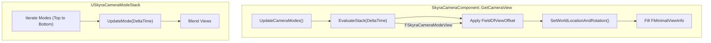
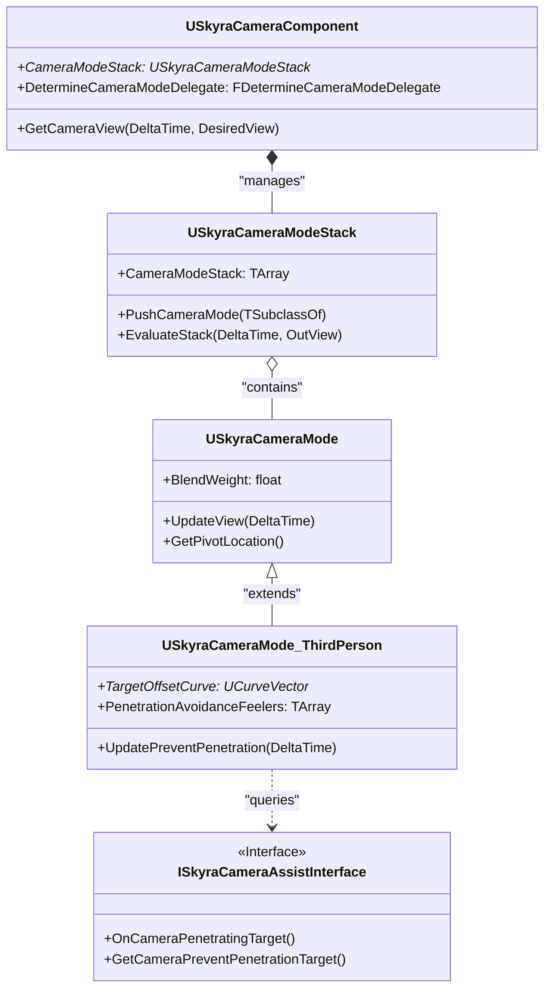

# Camera Modes and Component

Relevant source files

The following files were used as context for generating this wiki page:

- [.gitattributes](.gitattributes)

The Skyra camera system is a stack-based architecture designed for modularity and smooth transitions between different gameplay perspectives. It decouples the camera's physical position and properties from the pawn's logic, allowing for complex blending between modes like third-person, ADS (Aim Down Sights), and cinematic overrides.

## SkyraCameraComponent

`USkyraCameraComponent` is the central hub for camera management on an actor. It manages a `USkyraCameraModeStack` and is responsible for feeding the final calculated view parameters to the renderer and the `APlayerController`.

### Mode Stack and Evaluation
The component does not calculate the camera position itself. Instead, it delegates this to a stack of camera modes. During `GetCameraView`, it calls `UpdateCameraModes()` to determine if a new mode should be pushed via the `DetermineCameraModeDelegate`, then evaluates the stack to get the final `FSkyraCameraModeView` [Source/SkyraGame/Private/Camera/SkyraCameraComponent.cpp:32-39]().

### Key Responsibilities
*   **Stack Management**: Automatically creates a `USkyraCameraModeStack` on registration [Source/SkyraGame/Private/Camera/SkyraCameraComponent.cpp:21-30]().
*   **Controller Synchronization**: Updates the `APlayerController`'s control rotation to match the camera's evaluated rotation [Source/SkyraGame/Private/Camera/SkyraCameraComponent.cpp:42-48]().
*   **Field of View Offsets**: Supports temporary FOV offsets (e.g., for recoil or speed effects) that are added to the mode's base FOV and reset every frame [Source/SkyraGame/Private/Camera/SkyraCameraComponent.cpp:51-52]().

### Data Flow: Component to View
The following diagram illustrates how the `USkyraCameraComponent` coordinates with the stack to produce the final view.

**Camera View Calculation Flow**

**Sources:** [Source/SkyraGame/Private/Camera/SkyraCameraComponent.cpp:32-83](), [Source/SkyraGame/Private/Camera/SkyraCameraMode.cpp:227-260]()

---

## USkyraCameraMode

`USkyraCameraMode` is the abstract base class for all camera behaviors. It defines how a camera should position itself relative to a target and how it blends with other modes.

### View and Blending Parameters
Each mode contains an `FSkyraCameraModeView` structure which holds `Location`, `Rotation`, `ControlRotation`, and `FieldOfView` [Source/SkyraGame/Private/Camera/SkyraCameraMode.cpp:17-23]().
Modes support several blending functions via `ESkyraCameraModeBlendFunction`:
*   **Linear**: Constant rate of change.
*   **EaseIn / EaseOut**: Smooth acceleration or deceleration using a `BlendExponent` [Source/SkyraGame/Private/Camera/SkyraCameraMode.cpp:159-169]().
*   **EaseInOut**: Smooth transition at both ends.

### Pivot Calculation
The base class provides logic to determine the "Pivot" (the point the camera looks at). For characters, it automatically adjusts the pivot height to account for crouching by comparing the current capsule half-height against the default half-height [Source/SkyraGame/Private/Camera/SkyraCameraMode.cpp:82-106]().

**Sources:** [Source/SkyraGame/Private/Camera/SkyraCameraMode.cpp:52-63](), [Source/SkyraGame/Private/Camera/SkyraCameraMode.cpp:177-213]()

---

## SkyraCameraMode_ThirdPerson

`USkyraCameraMode_ThirdPerson` extends the base mode to provide common third-person features, specifically offset curves and penetration avoidance.

### Target Offsets
Instead of a static distance, this mode uses curves (either `UCurveVector` or runtime float curves) to define the camera's offset based on the current **Pitch**. This allows the camera to move closer or further away as the player looks up or down [Source/SkyraGame/Private/Camera/SkyraCameraMode_ThirdPerson.cpp:50-68]().

### Penetration Avoidance
The mode uses "Feelers" (`FSkyraPenetrationAvoidanceFeeler`) to detect geometry between the camera and the target.
*   **Feelers**: A collection of traces (defined by rotation offsets and extents) that "feel" for collisions [Source/SkyraGame/Private/Camera/SkyraCameraMode_ThirdPerson.cpp:26-33]().
*   **Safe Location**: The mode calculates a "Safe Location" (usually inside the character's capsule) and performs traces from there to the desired camera position [Source/SkyraGame/Private/Camera/SkyraCameraMode_ThirdPerson.cpp:136-155]().
*   **Predictive Avoidance**: Can perform multiple ray checks to prevent the camera from clipping into walls during rapid rotation.

**Sources:** [Source/SkyraGame/Private/Camera/SkyraCameraMode_ThirdPerson.cpp:35-72](), [Source/SkyraGame/Private/Camera/SkyraCameraMode_ThirdPerson.cpp:111-171]()

---

## SkyraCameraAssistInterface

The `ISkyraCameraAssistInterface` allows Actors or Controllers to influence or react to camera behavior without being tightly coupled to the camera component.

### Integration with Third Person Mode
In `UpdatePreventPenetration`, the camera mode checks if the `TargetActor` or `TargetController` implements this interface [Source/SkyraGame/Private/Camera/SkyraCameraMode_ThirdPerson.cpp:121-128]().
*   **OnCameraPenetratingTarget()**: Called when the camera is forced too close to the target due to collisions [Source/SkyraGame/Private/Camera/SkyraCameraMode_ThirdPerson.cpp:166-168]().
*   **GetCameraPreventPenetrationTarget()**: Allows an actor to specify a different actor (e.g., a vehicle the player is riding) to use as the base for penetration calculations [Source/SkyraGame/Private/Camera/SkyraCameraMode_ThirdPerson.cpp:126-127]().

### System Mapping: Code to Logic
This diagram bridges the high-level camera concepts to the specific classes and functions in the SkyraFramework.

**Entity Mapping Diagram**

**Sources:** [Source/SkyraGame/Private/Camera/SkyraCameraComponent.cpp:14-19](), [Source/SkyraGame/Private/Camera/SkyraCameraMode.cpp:229-232](), [Source/SkyraGame/Private/Camera/SkyraCameraMode_ThirdPerson.cpp:22-33]()