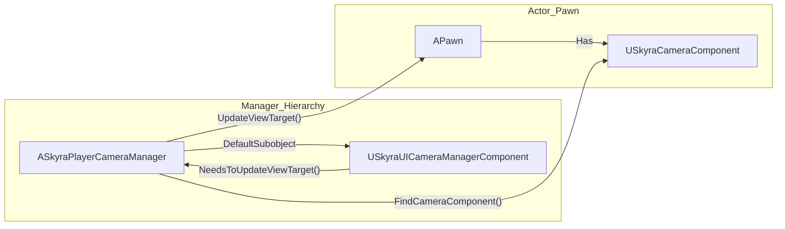

# Player Camera Manager and UI Camera

<details>
<summary>Relevant source files</summary>

The following files were used as context for generating this wiki page:

- [.gitattributes](.gitattributes)

</details>


This page details the specialized camera management classes in SkyraFramework. While the `USkyraCameraComponent` handles the logic for camera modes and blending, `ASkyraPlayerCameraManager` and `USkyraUICameraManagerComponent` manage the high-level viewport overrides, particularly for transitions between gameplay and UI-focused states (such as menus or photo mode).

## SkyraPlayerCameraManager

`ASkyraPlayerCameraManager` is the central authority for the player's camera during a gameplay session. It extends the standard `APlayerCameraManager` to provide integration with the custom `USkyraCameraComponent` and provides a hook for UI-driven camera overrides.

### Implementation Details
The manager initializes default field-of-view and pitch constraints during construction:
*   **Default FOV**: Set to `SKYRA_CAMERA_DEFAULT_FOV`.
*   **Pitch Constraints**: Min/Max values are defined by `SKYRA_CAMERA_DEFAULT_PITCH_MIN` and `SKYRA_CAMERA_DEFAULT_PITCH_MAX`.

The class also creates a `USkyraUICameraManagerComponent` as a default subobject to handle UI-specific camera logic.

### View Target Flow
The `UpdateViewTarget` function is overridden to allow the UI Camera to take priority over standard gameplay camera logic. If the UI component indicates it needs to control the view, it intercepts the update process.

| Step | Function | Description |
| :--- | :--- | :--- |
| 1 | `UICamera->NeedsToUpdateViewTarget()` | Checks if a UI-driven override is active. |
| 2 | `Super::UpdateViewTarget()` | Performs standard camera updates. |
| 3 | `UICamera->UpdateViewTarget()` | Applies UI-specific adjustments to the `FTViewTarget`. |

**Sources:**
* `ASkyraPlayerCameraManager` definition: `ASkyraPlayerCameraManager` is the primary manager for player view logic.
* View Target logic: Overrides `UpdateViewTarget` to prioritize UI overrides.

---

## UI Camera Manager Component

`USkyraUICameraManagerComponent` provides a mechanism for UI widgets (often via CommonUI) to influence the camera. This is typically used when opening a menu that requires the camera to point at a specific 3D actor (e.g., a character customization screen or a quest NPC).

### System Integration
The component registers with the HUD's debug system during initialization to support on-screen camera debugging.

### Key Functions
*   **GetComponent**: A static helper to retrieve the UI camera component from an `APlayerController` by casting its `PlayerCameraManager` to `ASkyraPlayerCameraManager`.
*   **SetViewTarget**: Forces the player camera to focus on a specific actor with transition parameters. It uses a `TGuardValue` to manage the `bUpdatingViewTarget` state during the transition.

### Entity Mapping: Camera Management
The following diagram illustrates how the code entities interact to manage the transition from gameplay to UI-controlled views.

**Camera Control Flow**
```mermaid
graph TD
    subgraph "Natural_Language_Space"
        ["Player View"]
        ["UI Menu Override"]
    end

    subgraph "Code_Entity_Space"
        PC["APlayerController"]
        PCM["ASkyraPlayerCameraManager"]
        UIC["USkyraUICameraManagerComponent"]
        CC["USkyraCameraComponent"]
        
        PC -- "Owns" --> PCM
        PCM -- "Contains" --> UIC
        PCM -- "Calls" --> UIC
        
        UIC -- "SetViewTarget()" --> PCM
        PCM -- "UpdateViewTarget()" --> CC
    end

    ["Player View"] -.-> CC
    ["UI Menu Override"] -.-> UIC
```
**Sources:**
* Component retrieval: `USkyraUICameraManagerComponent::GetComponent` static helper.
* View target override: `USkyraUICameraManagerComponent::SetViewTarget` logic.

---

## Debugging and Diagnostics

The camera system integrates with Unreal's `showdebug` command. When debugging is active:
1.  `ASkyraPlayerCameraManager::DisplayDebug` draws basic manager info.
2.  It locates the `USkyraCameraComponent` on the currently possessed Pawn via `USkyraCameraComponent::FindCameraComponent`.
3.  It delegates detailed camera mode stack debugging to `CameraComponent->DrawDebug(Canvas)`.

### Camera System Architecture
This diagram shows the relationship between the manager, the component, and the actor being viewed.

**Camera Architecture Bridge**


**Sources:**
* Debug display logic: `ASkyraPlayerCameraManager::DisplayDebug` implementation.
* UICamera registration: Component lifecycle within `ASkyraPlayerCameraManager`.