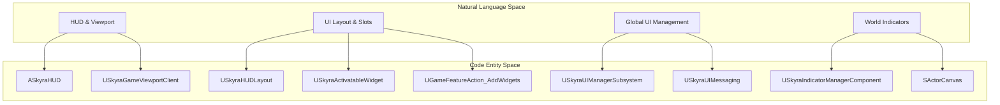
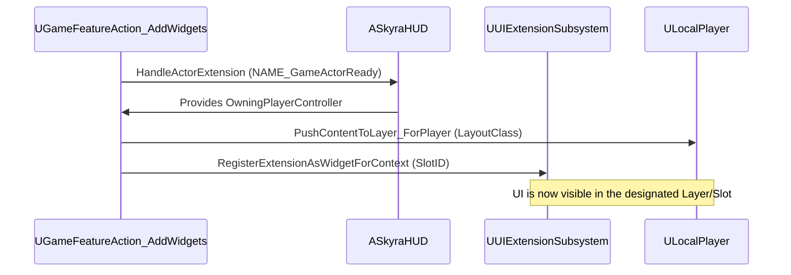

# UI Framework

Relevant source files

The following files were used as context for generating this wiki page:

- [.gitattributes](.gitattributes)

The SkyraFramework UI layer is built upon Epic's **CommonUI** plugin, providing a robust, cross-platform foundation for complex HUDs, menus, and world-space indicators. It utilizes a decoupled, data-driven approach where UI elements are injected into the viewport via the Game Feature system or managed through specialized subsystems.

### Architecture Overview

The framework separates UI into three primary layers:
1.  **Permanent Infrastructure**: The `ASkyraHUD` and `SkyraUIManagerSubsystem` manage the lifecycle and stack of UI layers.
2.  **Dynamic Layouts**: `SkyraHUDLayout` and `SkyraActivatableWidget` define the visual structure, often pushed to specific layers (e.g., Game, Menu, Modal) based on gameplay state.
3.  **World-Space Feedback**: The Indicator System handles "head-up" information attached to actors in the 3D world.

#### UI Entity Mapping
The following diagram illustrates how high-level UI concepts map to specific classes within the `SkyraGame` module.

**Sources:** `Source/SkyraGame/Private/UI/SkyraHUD.cpp`, `Source/SkyraGame/Private/UI/Subsystem/SkyraUIManagerSubsystem.cpp`, `Source/SkyraGame/Private/GameFeatures/GameFeatureAction_AddWidget.cpp`

---

### HUD and UI Infrastructure
The `ASkyraHUD` serves as the primary entry point for the player's UI. Unlike traditional HUDs that perform heavy drawing, `ASkyraHUD` acts as a manager for `UCommonActivatableWidget` instances. 

A key feature of Skyra is the ability to inject UI elements dynamically using **Game Feature Actions**. The `UGameFeatureAction_AddWidgets` class allows developers to define HUD layouts and widget extensions that are automatically added to the player's screen when a specific Game Feature is activated.

*   **HUD Layouts**: Define the primary "canvas" for a gameplay mode.
*   **Widget Extensions**: Allow modular pieces (like a mini-map or health bar) to be plugged into predefined "slots" on the HUD layout using the `UUIExtensionSubsystem`.

For details on the HUD lifecycle and base widget classes, see [HUD, Widgets, and UI Subsystem](#8.1).

**Sources:** `Source/SkyraGame/Private/UI/SkyraHUDLayout.cpp`, `Source/SkyraGame/Private/GameFeatures/GameFeatureAction_AddWidget.cpp`

---

### Indicator System
Skyra includes a high-performance system for rendering world-space indicators (e.g., objective markers, enemy pings). This system bypasses standard `UUserWidget` overhead for hundreds of points by using `SActorCanvas`, a specialized Slate widget that manages the projection of 3D coordinates to 2D screen space.

The system is managed by the `USkyraIndicatorManagerComponent`, which tracks `UIndicatorDescriptor` objects. These descriptors define what should be drawn, which actor it follows, and which `UIndicatorLayer` it belongs to.

For details on the rendering pipeline and indicator descriptors, see [Indicator System](#8.2).

**Sources:** `Source/SkyraGame/Private/UI/IndicatorSystem/SkyraIndicatorManagerComponent.cpp`, `Source/SkyraGame/Private/UI/IndicatorSystem/SActorCanvas.cpp`

---

### Frontend and Settings
The framework provides a standardized flow for game menus and settings. This includes:
*   **Frontend State**: Managed by `SkyraFrontendStateComponent`, which handles the transition between the initial loading screen, the main menu, and the lobby.
*   **Settings Registry**: A data-driven system for game settings (Video, Audio, Gameplay, etc.) that integrates with `CommonUI` to provide a consistent navigation experience across Mouse/Keyboard and Gamepads.

For details on the settings hierarchy and frontend flow, see [Frontend and Settings UI](#8.3).

**Sources:** `Source/SkyraGame/Private/UI/Frontend/SkyraFrontendStateComponent.cpp`, `Source/SkyraGame/Private/Settings/SkyraGameSettingRegistry.cpp`

---

### UI Integration Flow
The following diagram shows how a Game Feature adds UI to the player's HUD.

**Sources:** `Source/SkyraGame/Private/GameFeatures/GameFeatureAction_AddWidget.cpp`