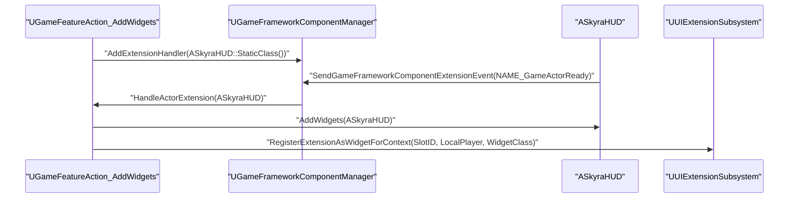
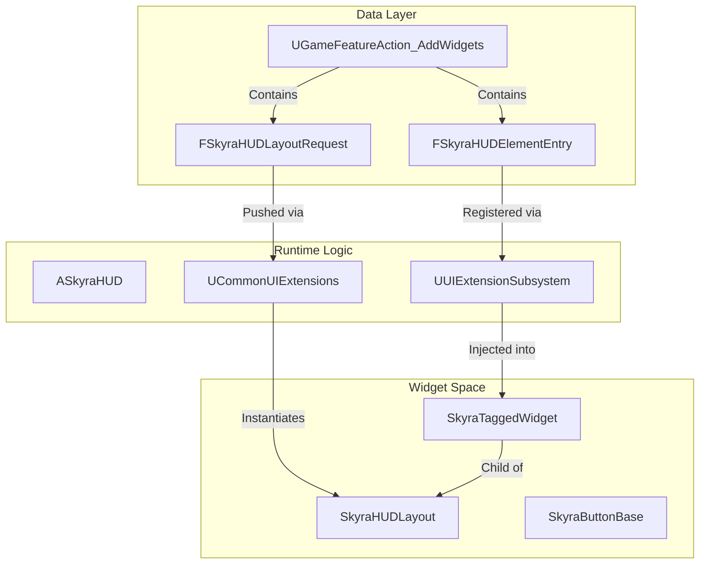
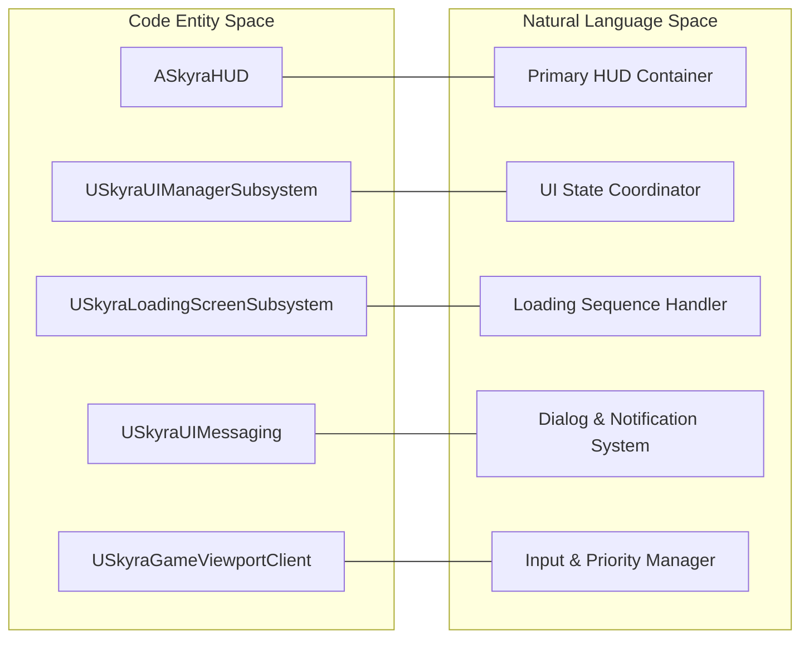

# HUD, Widgets, and UI Subsystem

Relevant source files

The following files were used as context for generating this wiki page:

- [.gitattributes](.gitattributes)

The SkyraFramework UI architecture is built upon Epic's **CommonUI** plugin, extending it to support data-driven HUD layouts, tagged widget slots, and a robust messaging system. The system decouples UI definitions from game logic using the `UUIExtensionSubsystem` and `GameFeatureActions`.

## Core HUD Architecture

The HUD system revolves around `ASkyraHUD`, which acts as the primary container for the player's interface. Unlike traditional HUDs that manage drawing logic, `ASkyraHUD` serves as a manager for `SkyraHUDLayout` widgets.

### ASkyraHUD
`ASkyraHUD` is the base HUD class. It is designed to be extended via `UGameFeatureAction_AddWidgets`, which injects layouts and widgets based on the active game experience [Source/SkyraGame/Private/GameFeatures/GameFeatureAction_AddWidget.cpp:101-108]().

### SkyraHUDLayout
This is the top-level `UCommonActivatableWidget` that defines the visual structure of the HUD (e.g., where the minimap, health bars, and inventory slots are located). Layouts are pushed to specific UI layers (such as `UI.Layer.Game`) using `UCommonUIExtensions` [Source/SkyraGame/Private/GameFeatures/GameFeatureAction_AddWidget.cpp:151-157]().

### SkyraActivatableWidget
The base class for most Skyra UI elements. It inherits from `UCommonActivatableWidget`, providing support for input handling, back-button actions, and activation/deactivation lifecycles.

### SkyraTaggedWidget
A specialized widget used for the "Slot" system. It allows the UI to define a "Named Slot" via a `GameplayTag`. Other systems can then inject widgets into these slots dynamically using the `UUIExtensionSubsystem` [Source/SkyraGame/Private/GameFeatures/GameFeatureAction_AddWidget.cpp:160-163]().

**HUD Initialization Flow**
The following diagram illustrates how a Game Feature adds UI to the player's HUD.

| Entity | Role |
| :--- | :--- |
| `UGameFeatureAction_AddWidgets` | The data asset action that defines which widgets to add [Source/SkyraGame/Private/GameFeatures/GameFeatureAction_AddWidget.cpp:36-40](). |
| `UGameFrameworkComponentManager` | Tracks `ASkyraHUD` actors and notifies the action when they are ready [Source/SkyraGame/Private/GameFeatures/GameFeatureAction_AddWidget.cpp:91-108](). |
| `UUIExtensionSubsystem` | Handles the registration of widgets into tagged slots [Source/SkyraGame/Private/GameFeatures/GameFeatureAction_AddWidget.cpp:159-163](). |
| `UCommonUIExtensions` | Manages the stack of activatable widgets on different layers [Source/SkyraGame/Private/GameFeatures/GameFeatureAction_AddWidget.cpp:151-157](). |

**HUD Setup Sequence**

*Sources: [Source/SkyraGame/Private/GameFeatures/GameFeatureAction_AddWidget.cpp:91-108](), [Source/SkyraGame/Private/GameFeatures/GameFeatureAction_AddWidget.cpp:125-136](), [Source/SkyraGame/Private/GameFeatures/GameFeatureAction_AddWidget.cpp:159-163]()*

---

## UI Management and Messaging

Skyra utilizes several subsystems to manage the global state of the UI and communication between game logic and widgets.

### SkyraUIManagerSubsystem
This subsystem coordinates global UI state transitions, such as moving from the Frontend (Main Menu) to the Game HUD. It interacts with the `SkyraGameViewportClient` to manage input routing and focus.

### SkyraUIMessaging
A specialized system for displaying asynchronous notifications, confirmation dialogs, and error messages. It utilizes `SkyraConfirmationScreen` to present modal popups to the player.

### SkyraLoadingScreenSubsystem
Manages the visibility and state of loading screens during experience transitions or level streaming. It ensures that the loading UI remains responsive while the engine is busy loading assets.

### SkyraGameViewportClient
An extension of `UCommonGameViewportClient` that handles high-level input events and ensures that UI input is correctly prioritized over gameplay input when modal widgets are active.

---

## Foundation Widgets

Skyra provides a set of "Foundation" widgets that serve as the building blocks for all game UI. These widgets are pre-integrated with CommonUI's styling and input systems.

| Class | Description |
| :--- | :--- |
| `SkyraButtonBase` | The standard button class. Supports rich text, dynamic icons, and CommonUI's `CommonButtonStyle` for consistent look-and-feel. |
| `SkyraActionWidget` | A widget that displays a specific input action (e.g., "Press [E] to Interact"). It automatically updates its icon based on the player's current input device (Gamepad vs. KBM). |
| `SkyraConfirmationScreen` | A modal dialog widget used by `SkyraUIMessaging` to show "Yes/No" or "OK" prompts. |

---

## Data-Driven UI Injection

The `UGameFeatureAction_AddWidgets` class is the primary mechanism for injecting UI into a running game without modifying the base HUD classes.

### Layout vs. Widgets
The action distinguishes between two types of UI additions:
1.  **Layouts**: Large-scale containers (e.g., the HUD itself) pushed to a layer via `FSkyraHUDLayoutRequest` [Source/SkyraGame/Private/GameFeatures/GameFeatureAction_AddWidget.cpp:50-65]().
2.  **Widgets**: Individual elements (e.g., a specific ability icon) injected into existing slots via `FSkyraHUDElementEntry` [Source/SkyraGame/Private/GameFeatures/GameFeatureAction_AddWidget.cpp:69-85]().

### Data Validation
The system includes strict editor-side validation to ensure that all layout classes and layer/slot tags are valid before the game runs [Source/SkyraGame/Private/GameFeatures/GameFeatureAction_AddWidget.cpp:44-88]().

**UI Entity Relationship**

*Sources: [Source/SkyraGame/Private/GameFeatures/GameFeatureAction_AddWidget.cpp:36-40](), [Source/SkyraGame/Private/GameFeatures/GameFeatureAction_AddWidget.cpp:151-163]()*

---

## Implementation Details

### Cleanup and Deactivation
When a Game Feature is deactivated, the `UGameFeatureAction_AddWidgets` ensures that all spawned layouts are deactivated and all UI extensions are unregistered to prevent memory leaks or orphaned widgets [Source/SkyraGame/Private/GameFeatures/GameFeatureAction_AddWidget.cpp:111-123]().

- `LayoutsAdded` are deactivated via `DeactivateWidget()` [Source/SkyraGame/Private/GameFeatures/GameFeatureAction_AddWidget.cpp:176-182]().
- `ExtensionHandles` are removed via `Handle.Unregister()` [Source/SkyraGame/Private/GameFeatures/GameFeatureAction_AddWidget.cpp:184-187]().

### Context-Aware Extensions
The `UUIExtensionSubsystem` uses the `LocalPlayer` as a context, ensuring that in split-screen scenarios, UI elements are only added to the viewport of the player who owns the specific Game Feature or Experience [Source/SkyraGame/Private/GameFeatures/GameFeatureAction_AddWidget.cpp:147-164]().

**System Code Association**

*Sources: [Source/SkyraGame/Private/GameFeatures/GameFeatureAction_AddWidget.cpp:1-193]()*