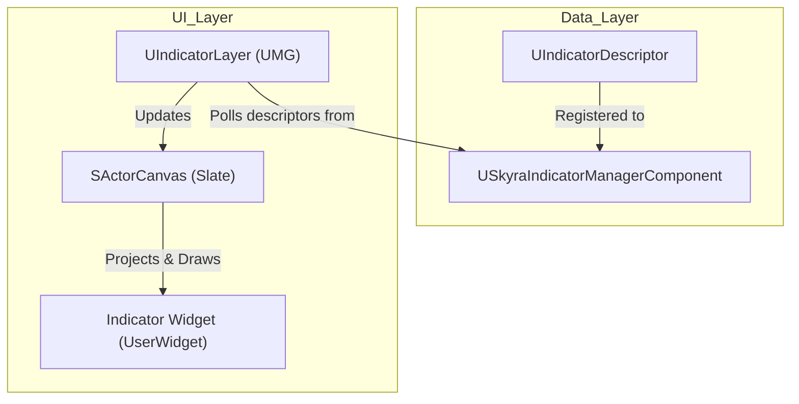
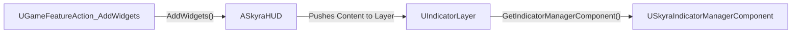

# Indicator System

Relevant source files

The following files were used as context for generating this wiki page:

- [.gitattributes](.gitattributes)

The Indicator System in SkyraFramework provides a high-performance pipeline for rendering world-space UI elements (such as health bars, objective markers, or nameplates) onto the 2D screen space. It utilizes a dedicated manager component and a custom Slate widget (`SActorCanvas`) to handle the projection and lifecycle of these visual cues.

## System Architecture

The system is built around the `USkyraIndicatorManagerComponent`, which acts as a centralized registry for all active indicators. Indicators are defined by `UIndicatorDescriptor` objects, which contain the data necessary to track an actor or location and determine how it should be displayed.

### Core Components and Flow

| Class | Responsibility |
| :--- | :--- |
| `UIndicatorDescriptor` | Data container defining what to track (Actor/Component/Socket) and how to display it (Widget Class). |
| `USkyraIndicatorManagerComponent` | A per-player component that manages the list of active `UIndicatorDescriptor` instances. |
| `UIndicatorLayer` | A UMG widget that acts as a container for the `SActorCanvas`, typically added to the HUD. |
| `SActorCanvas` | The underlying Slate widget responsible for the heavy lifting: projecting 3D coordinates to 2D and managing widget slots. |
| `UIndicatorLibrary` | Static utility class for creating and managing indicator descriptors. |

### Indicator Pipeline Diagram

This diagram illustrates the relationship between the data descriptors and the rendering widgets.

**Indicator Rendering Pipeline**

Sources: [Source/SkyraGame/UI/IndicatorSystem/IndicatorDescriptor.h:12-20](), [Source/SkyraGame/UI/IndicatorSystem/SkyraIndicatorManagerComponent.h:18-25](), [Source/SkyraGame/UI/IndicatorSystem/SActorCanvas.h:15-30]()

## Indicator Descriptors

`UIndicatorDescriptor` is the primary configuration object for any world-space marker. It allows developers to specify:
*   **Targeting**: Which `AActor` or `USceneComponent` to follow.
*   **Content**: The `UUserWidget` class to instantiate for the indicator.
*   **Screen Behavior**: Whether the indicator should "clamp" to the screen edges when the target is off-screen.
*   **Visuals**: Depth sorting priorities and projection offsets.

The `UIndicatorLibrary` provides helper functions to simplify the creation of these descriptors, ensuring they are correctly initialized before being passed to the manager.

Sources: [Source/SkyraGame/UI/IndicatorSystem/IndicatorDescriptor.h:15-85](), [Source/SkyraGame/UI/IndicatorSystem/IndicatorLibrary.h:11-30]()

## Manager and Layer Integration

The `USkyraIndicatorManagerComponent` is usually attached to the `ASkyraPlayerController` or a related player-state component to track indicators relevant to that specific user.

### Adding Indicators via Game Features
Indicators are often added dynamically through the Game Feature system. The `UGameFeatureAction_AddWidgets` class can be used to inject a `UIndicatorLayer` into a specific HUD slot defined in the `ASkyraHUD`.

**Code Entity Mapping: Widget Injection**

Sources: [Source/SkyraGame/Private/GameFeatures/GameFeatureAction_AddWidget.cpp:138-165](), [Source/SkyraGame/Private/GameFeatures/GameFeatureAction_AddWidget.cpp:91-109]()

### Key Functions
*   `USkyraIndicatorManagerComponent::AddIndicator(UIndicatorDescriptor* Descriptor)`: Registers a new indicator to be rendered.
*   `UIndicatorLayer::NativeTick`: Continuously synchronizes the list of descriptors from the manager to the `SActorCanvas`.
*   `SActorCanvas::OnPaint`: The core Slate rendering function that performs the 3D-to-2D projection for every active indicator slot.

## SActorCanvas Implementation

`SActorCanvas` is a high-performance Slate widget designed to handle many indicators simultaneously. Unlike standard UMG canvases, it is optimized for:
1.  **Coordinate Projection**: Converting `FVector` world positions to `FVector2D` screen positions using the local player's view projection matrix.
2.  **Clamping Logic**: Calculating edge-of-screen positions for indicators that must remain visible even when the target is behind the camera.
3.  **Depth Sorting**: Ensuring that indicators closer to the camera are rendered on top of those further away.

Sources: [Source/SkyraGame/UI/IndicatorSystem/SActorCanvas.h:20-120](), [Source/SkyraGame/UI/IndicatorSystem/IndicatorLayer.h:12-45]()