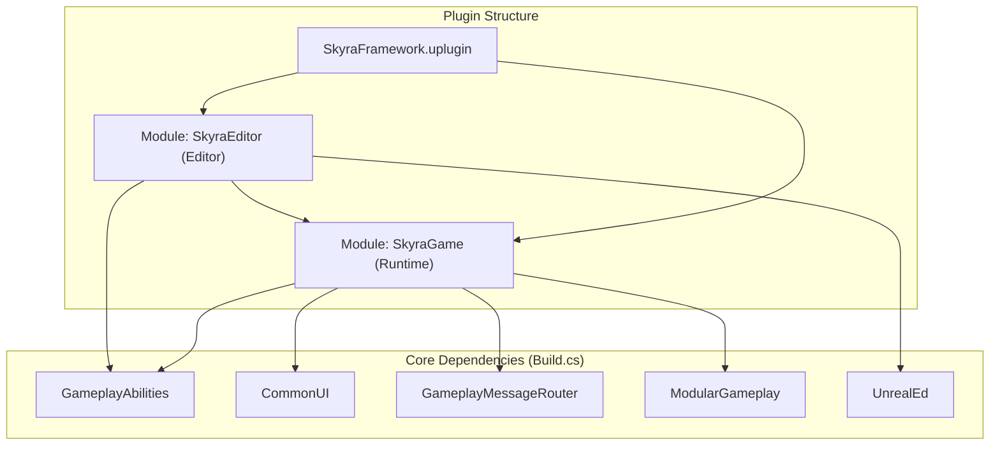
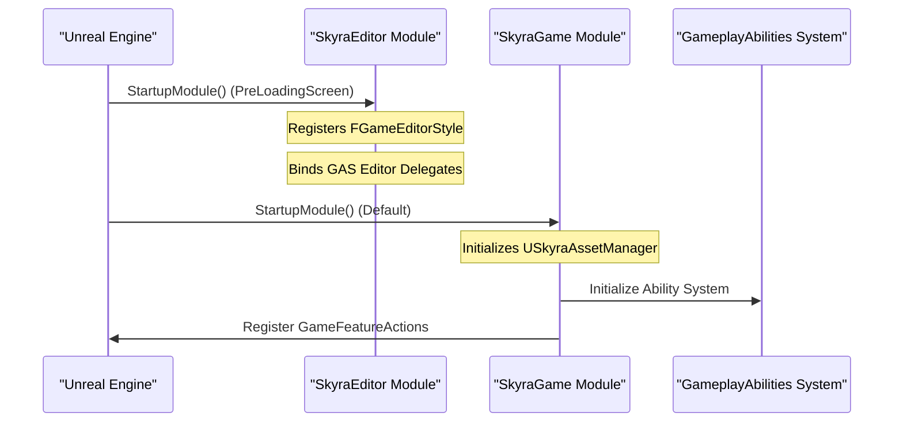

# Plugin Architecture and Module Structure

Relevant source files

The following files were used as context for generating this wiki page:

- [.gitattributes](.gitattributes)
- [.gitignore](.gitignore)

The SkyraFramework is organized as a robust, multi-module Unreal Engine plugin designed to facilitate modular gameplay development. It separates core runtime logic from editor-specific tooling and validation, ensuring that the final game executable remains lean while providing extensive support for developers within the Unreal Editor environment.

## Plugin Configuration

The plugin is defined via `SkyraFramework.uplugin`, which specifies the metadata, module loading strategy, and an extensive list of dependencies required for the framework's advanced features (GAS, CommonUI, Game Features, etc.).

### Module Definitions
The framework splits its code into two distinct modules:

| Module Name | Type | Loading Phase | Purpose |
| :--- | :--- | :--- | :--- |
| `SkyraGame` | `Runtime` | `Default` | Contains all gameplay systems, GAS implementation, and character logic. |
| `SkyraEditor` | `Editor` | `PreLoadingScreen` | Contains editor extensions, asset validators, and custom Slate styles. |

Sources: `SkyraFramework.uplugin:17-28`

### Plugin Dependencies
SkyraFramework leverages a wide array of Epic-provided plugins to implement its data-driven architecture. Key dependencies include:

*   **Gameplay Mechanics**: `GameplayAbilities`, `ModularGameplay`, `ModularGameplayActors`, and `GameFeatures`.
*   **UI & Interaction**: `CommonUI`, `CommonGame`, `CommonUser`, and `UIExtension`.
*   **Systems & Infrastructure**: `EnhancedInput`, `GameplayMessageRouter`, `AsyncMixin`, and `SignificanceManager`.
*   **Animation & Audio**: `ControlRig`, `Niagara`, and `AudioModulation`.

Sources: `SkyraFramework.uplugin:29-138`

## Module Hierarchy and Dependencies

The following diagram illustrates the relationship between the plugin modules and the primary engine dependencies they utilize.

### Dependency Graph: Natural Language to Code Entity Space

Sources: `SkyraFramework.uplugin:17-28`, `Source/SkyraEditor/SkyraEditor.Build.cs:46-50`

## The SkyraGame Module

The `SkyraGame` module serves as the primary runtime container. It is responsible for the initialization of the Gameplay Ability System (GAS), the Experience system, and the modular pawn architecture. It is loaded during the `Default` phase to ensure all engine systems are ready before gameplay logic begins.

### Build Configuration
The runtime module's `Build.cs` links against the core gameplay plugins listed in the `.uplugin` file. It establishes the foundational API for the framework.

## The SkyraEditor Module

The `SkyraEditor` module provides the necessary tooling to manage the complexity of the framework. It is loaded in the `PreLoadingScreen` phase, allowing it to register custom styles and editor extensions before the main editor UI is fully rendered.

### SkyraEditor.Build.cs Implementation
The editor module explicitly depends on the runtime module (`SkyraGame`) and several editor-only frameworks.

*   **Public Dependencies**: Includes `EditorFramework`, `UnrealEd`, `GameplayTagsEditor`, and `GameplayAbilitiesEditor`. [Source/SkyraEditor/SkyraEditor.Build.cs:41-50]()
*   **Private Dependencies**: Includes `AssetTools`, `Blutility` (for Editor Utility Blueprints), `Slate`, `SlateCore`, and `DataValidation`. [Source/SkyraEditor/SkyraEditor.Build.cs:53-71]()

### Directory Structure and Includes
The editor module organizes its headers into specific subdirectories to manage validation and factory logic:
*   `Public/AssetType`: Custom asset definitions.
*   `Public/Factory`: Factories for creating framework-specific assets.
*   `Public/Validation`: The asset validation framework logic.
*   `Public/Style`: Slate style sets for editor icons.

Sources: `Source/SkyraEditor/SkyraEditor.Build.cs:11-34`

## System Loading Flow

The initialization sequence ensures that editor tools are available to validate assets as they are loaded by the runtime module.

### Initialization Sequence: Code Entity Space

Sources: `SkyraFramework.uplugin:17-28`, `Source/SkyraEditor/SkyraEditor.Build.cs:41-50`