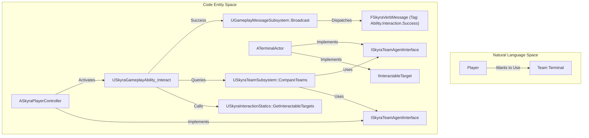
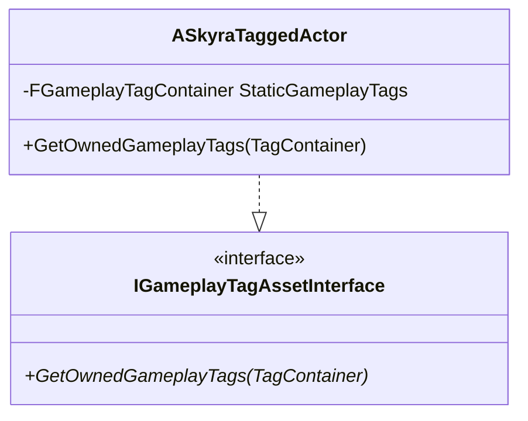

# Teams, Messages, and Interaction

Relevant source files

The following files were used as context for generating this wiki page:

- [.gitattributes](.gitattributes)

This section provides an overview of the systems that facilitate multiplayer coordination, decoupled communication, and world interaction within the SkyraFramework. These systems are designed to work together to handle complex game rules like team-based scoring, event-driven UI updates, and player-to-object interactions.

### System Overview

The framework relies on three primary pillars for handling actor relationships and events:
1.  **Team Management**: Centralized logic for identifying allies, enemies, and managing team-specific data.
2.  **Gameplay Messaging**: A high-performance, decoupled broadcast system for gameplay events (e.g., "Player A eliminated Player B").
3.  **Interaction**: A standardized way for players to query and interact with world objects through GAS.

### Team System
The Team System provides a robust infrastructure for managing actor affiliations. It is centered around the `USkyraTeamSubsystem`, which handles the registration of teams and provides utilities for comparing team IDs to determine "friendly" or "hostile" status.

Actors participate in this system by implementing the `ISkyraTeamAgentInterface`, which allows the framework to query their `GenericTeamId`. The system supports dynamic team creation via the `USkyraTeamCreationComponent` and provides visual data (colors, names) through `USkyraTeamDisplayAsset`.

*   **Key Entity**: `USkyraTeamSubsystem` acts as the authority for team queries.
*   **Key Interface**: `ISkyraTeamAgentInterface` must be implemented by Pawns and Player States to be recognized by the system.
*   **For details, see [Team System](#9.1)**.

### Gameplay Message System
The Gameplay Message System is a lightweight, decoupled alternative to direct function calls or standard Unreal delegates. It allows systems (like UI or Stat tracking) to listen for specific "Verbs" (Gameplay Tags) without having a hard dependency on the source of the message.

The system utilizes `FSkyraVerbMessage` to package data about an event, such as the instigator, the target, and associated magnitudes. It also includes a specialized replication mechanism, `FSkyraVerbMessageReplication`, which uses `FastArraySerializer` to efficiently sync messages across the network.

*   **Key Entity**: `UGameplayMessageSubsystem` (provided by the GameplayMessageRouter plugin) manages the listeners and broadcasts.
*   **Data Structure**: `FSkyraVerbMessage` defines the payload for events like damage, kills, or objective captures.
*   **For details, see [Gameplay Message System](#9.2)**.

### Interaction System
The Interaction System provides a bridge between the player's input and interactable objects in the world. It is built on top of the Gameplay Ability System (GAS), using specialized abilities and tasks to detect and trigger interactions.

Interaction is initiated by an `IInteractionInstigator` (usually the player) targeting an `IInteractableTarget`. The framework uses `UAbilityTask_WaitForInteractableTargets` to continuously scan for valid `FInteractionOption`s based on the player's view or proximity.

*   **Key Entity**: `USkyraGameplayAbility_Interact` is the base GAS ability that executes the interaction logic.
*   **Key Interface**: `IInteractableTarget` is implemented by actors that can be used (e.g., doors, chests, or vehicles).
*   **For details, see [Interaction System](#9.3)**.

### System Relationships

The following diagram illustrates how these systems intersect during a typical gameplay event, such as a player interacting with a team-locked terminal.

**Team and Interaction Flow**

Sources: [Source/SkyraGame/Private/AbilitySystem/SkyraTaggedActor.cpp:13-16](), [Source/SkyraGame/Private/AbilitySystem/SkyraTaggedActor.h:10-25]() (Conceptual alignment with tagged actor interfaces).

### Tagged Actors
The framework also provides `ASkyraTaggedActor`, a utility base class for level actors that need to carry static gameplay tags for identification by the Interaction or Team systems without requiring a full Ability System Component.

| Class | Purpose | Key Method |
| :--- | :--- | :--- |
| `ASkyraTaggedActor` | Base class for world actors with static tags. | `GetOwnedGameplayTags` |

**Tagged Actor Structure**

Sources: [Source/SkyraGame/Private/AbilitySystem/SkyraTaggedActor.cpp:8-16](), [Source/SkyraGame/Private/AbilitySystem/SkyraTaggedActor.h:18-31]()

---
- [Team System](#9.1)
- [Gameplay Message System](#9.2)
- [Interaction System](#9.3)