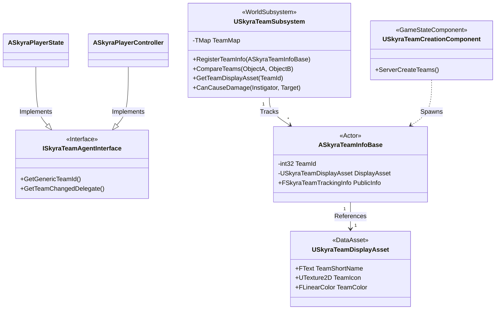
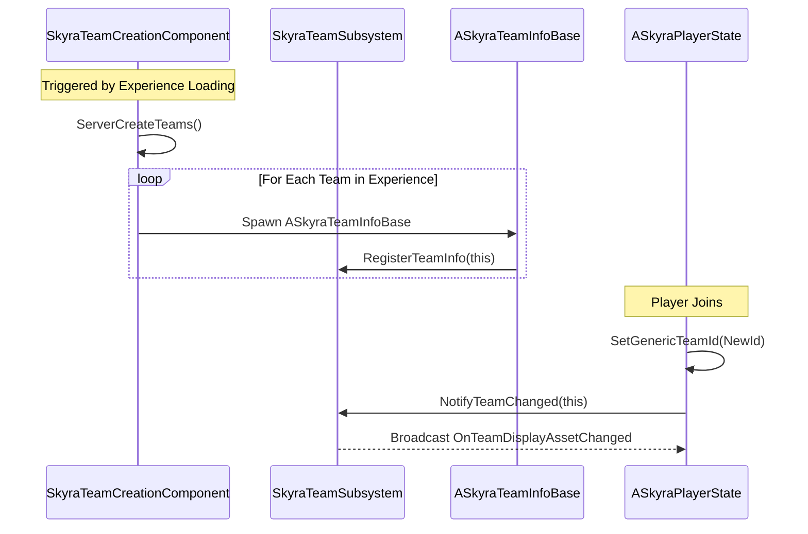

# Team System

Relevant source files

The following files were used as context for generating this wiki page:

- [.gitattributes](.gitattributes)

The Team System in SkyraFramework provides a robust, data-driven framework for managing actor affiliations, friendly fire rules, and team-based gameplay logic. It centers around a centralized subsystem that tracks team membership and provides asynchronous observation tools for UI and gameplay systems.

## System Architecture

The team system is built on a decoupled architecture where actors do not need to know about each other's specific classes to determine affiliation. Instead, they interact through the `ISkyraTeamAgentInterface`.

### Core Components and Relationships

The following diagram illustrates the relationship between the central subsystem, the data assets, and the actors participating in the team system.

**Team System Entity Map**

**Sources:** `[Source/SkyraGame/Teams/SkyraTeamSubsystem.h:24-118]()`, `[Source/SkyraGame/Teams/SkyraTeamAgentInterface.h:12-42]()`, `[Source/SkyraGame/Teams/SkyraTeamInfoBase.h:18-51]()`, `[Source/SkyraGame/Teams/SkyraTeamCreationComponent.h:16-43]()`

---

## USkyraTeamSubsystem

The `USkyraTeamSubsystem` is the primary authority for team management within a world. It handles the registration of teams, provides methods for comparing the relationship between two actors, and manages the mapping of Team IDs to their respective data structures.

### Key Functionality
*   **Team Comparison**: The `CompareTeams` function determines if two objects are on the same team, different teams, or if one (or both) are neutral. `[Source/SkyraGame/Teams/SkyraTeamSubsystem.cpp:115-154]()`.
*   **Team Registration**: Team Info actors register themselves with the subsystem upon spawning via `RegisterTeamInfo`. `[Source/SkyraGame/Teams/SkyraTeamSubsystem.cpp:52-70]()`.
*   **Friendly Fire**: Provides a centralized check `CanCauseDamage` which uses team affiliation to determine if combat interactions should proceed. `[Source/SkyraGame/Teams/SkyraTeamSubsystem.cpp:156-168]()`.

### Affiliation Results
The system uses the `ESkyraTeamComparison` enum to return the relationship between two entities:
*   `OnSameTeam`: Both entities share the same valid Team ID.
*   `DifferentTeams`: Both entities have valid but different Team IDs.
*   `InvalidArgument`: One or both entities do not implement the team interface or have an invalid ID.

**Sources:** `[Source/SkyraGame/Teams/SkyraTeamSubsystem.h:15-18]()`, `[Source/SkyraGame/Teams/SkyraTeamSubsystem.cpp:125-150]()`

---

## Team Data and Display

### ASkyraTeamInfoBase, PublicInfo, and PrivateInfo
Teams are represented in the world by `ASkyraTeamInfoBase` actors. These actors serve as the replicated source of truth for team-wide state.
*   **Public Info**: `ASkyraTeamPublicInfo` contains data replicated to all clients (e.g., team score, team name). `[Source/SkyraGame/Teams/SkyraTeamPublicInfo.h:15-25]()`.
*   **Private Info**: `ASkyraTeamPrivateInfo` contains data replicated only to members of that specific team (e.g., teammate locations, shared resources). `[Source/SkyraGame/Teams/SkyraTeamPrivateInfo.h:15-25]()`.

### USkyraTeamDisplayAsset
This data asset defines the visual identity of a team. It is used by UI components to colorize nameplates, HUD elements, and icons.
*   `TeamShortName`: A localized string for the team.
*   `TeamColor`: The primary color used for UI highlights.
*   `TeamIcon`: The texture used in killfeeds or scoreboards.

**Sources:** `[Source/SkyraGame/Teams/SkyraTeamDisplayAsset.h:18-35]()`, `[Source/SkyraGame/Teams/SkyraTeamInfoBase.h:35-50]()`

---

## Team Assignment Flow

The creation and assignment of teams is typically handled by the `USkyraTeamCreationComponent`, which is attached to the `ASkyraGameState`.

**Team Initialization Sequence**

**Sources:** `[Source/SkyraGame/Teams/SkyraTeamCreationComponent.cpp:45-85]()`, `[Source/SkyraGame/Teams/SkyraTeamSubsystem.cpp:55-65]()`

---

## Async Observation Actions

To simplify UI development, the framework provides `UAsyncAction_ObserveTeam`, an asynchronous Blueprint node. This allows UI widgets to "listen" for team changes on a specific actor (like a PlayerState) without polling every frame.

*   **Functionality**: It binds to the `OnTeamChangedDelegate` provided by the `ISkyraTeamAgentInterface`. `[Source/SkyraGame/Teams/AsyncAction_ObserveTeam.cpp:35-55]()`.
*   **Automatic Cleanup**: The action automatically unbinds and destroys itself when the world or the observed actor becomes invalid. `[Source/SkyraGame/Teams/AsyncAction_ObserveTeam.cpp:70-85]()`.

**Sources:** `[Source/SkyraGame/Teams/AsyncAction_ObserveTeam.h:15-59]()`

---

## SkyraTeamStatics

`USkyraTeamStatics` provides a library of static helper functions accessible to both C++ and Blueprints for common team-related queries.

| Function | Purpose |
| :--- | :--- |
| `GetTeamDisplayAsset` | Retrieves the `USkyraTeamDisplayAsset` for a given Team ID or Actor. |
| `GetTeamId` | Safely extracts the Team ID from any object implementing the interface. |
| `CompareTeams` | Static wrapper for the subsystem's comparison logic. |

**Sources:** `[Source/SkyraGame/Teams/SkyraTeamStatics.h:15-50]()`, `[Source/SkyraGame/Teams/SkyraTeamStatics.cpp:20-65]()`

---

## Tagged Actors

While not strictly part of the Team ID logic, `ASkyraTaggedActor` is often used in conjunction with teams for environmental objects (like capture points or team-specific doors). It implements `IGameplayTagAssetInterface`, allowing the team system or GAS to query its static tags for filtering or interaction logic.

**Sources:** `[Source/SkyraGame/AbilitySystem/SkyraTaggedActor.h:15-30]()`, `[Source/SkyraGame/AbilitySystem/SkyraTaggedActor.cpp:13-16]()`