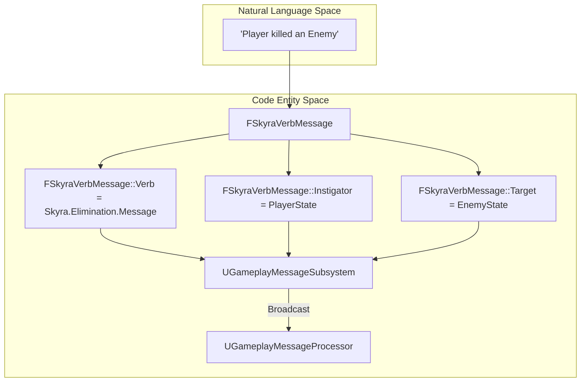
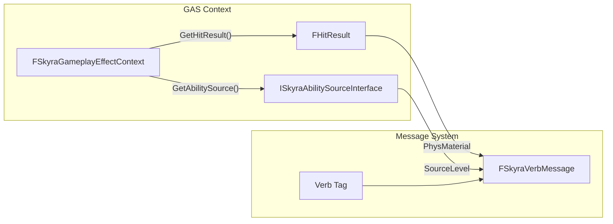

# Gameplay Message System

Relevant source files

The following files were used as context for generating this wiki page:

- [.gitattributes](.gitattributes)

The Gameplay Message System provides a decoupled, tag-driven communication layer for broadcasting events across the framework. It allows systems to interact without direct hard references by utilizing the `UGameplayMessageSubsystem` and specialized message structures tailored for "verbs" (actions) and UI notifications.

### Message Structures and Data Flow

The system centers around `FSkyraVerbMessage`, a standardized structure for communicating that an "action" has occurred. This is commonly used for combat events, objective completions, and achievement tracking.

#### FSkyraVerbMessage
Defined in `Source/SkyraGame/Messages/SkyraVerbMessage.h`, this structure encapsulates the "Who, What, and Where" of a gameplay event.

| Field | Type | Description |
| :--- | :--- | :--- |
| `Verb` | `FGameplayTag` | The specific action (e.g., `Ability.Type.Death`). |
| `Instigator` | `UObject*` | The entity that performed the action. |
| `Target` | `UObject*` | The entity receiving the action. |
| `InstigatorTags` | `FGameplayTagContainer` | Tags associated with the instigator at the time of the event. |
| `TargetTags` | `FGameplayTagContainer` | Tags associated with the target at the time of the event. |
| `ContextHitResult` | `FHitResult` | Optional physics data for the event. |
| `Magnitude` | `double` | A numerical value associated with the verb (e.g., Damage amount). |

**Sources:** [Source/SkyraGame/Messages/SkyraVerbMessage.h:1-30]()

#### Natural Language to Code Entity Space: Message Routing
The following diagram illustrates how a conceptual "Player Killed Enemy" event translates into code entities and flows through the messaging system.

**Sources:** [Source/SkyraGame/Messages/SkyraVerbMessage.h:14-35](), [Source/SkyraGame/Messages/GameplayMessageProcessor.h:17-25]()

---

### Network Replication and Fast Serialization

To efficiently sync gameplay messages across the network, the framework utilizes `FSkyraVerbMessageReplication`. This uses the `FFastArraySerializer` to minimize bandwidth while ensuring clients receive critical gameplay events.

#### FSkyraVerbMessageReplicationEntry
This is a single entry in the replication array. It wraps an `FSkyraVerbMessage` for transport.
- **File:** [Source/SkyraGame/Messages/SkyraVerbMessageReplication.h:14-30]()

#### FSkyraVerbMessageReplication
The manager for the replicated array. It handles the `PostReplicatedAdd` logic to trigger local events when a message arrives from the server.

*   **Key Function: `PostReplicatedAdd`**: When a new message is received on a client, this function extracts the message and broadcasts it locally via the `UGameplayMessageSubsystem` [Source/SkyraGame/Messages/SkyraVerbMessageReplication.h:48-60]().

**Sources:** [Source/SkyraGame/Messages/SkyraVerbMessageReplication.h:1-70]()

---

### Gameplay Message Processor

The `UGameplayMessageProcessor` is a base class designed for persistent listeners that need to observe and react to specific message tags throughout the lifecycle of a game.

*   **`BeginPlay()`**: Processors typically use this to start listening for specific tags via `UGameplayMessageSubsystem::RegisterListener` [Source/SkyraGame/Messages/GameplayMessageProcessor.h:25-30]().
*   **`EndPlay()`**: Ensures listeners are cleaned up to prevent memory leaks [Source/SkyraGame/Messages/GameplayMessageProcessor.h:32-35]().

**Sources:** [Source/SkyraGame/Messages/GameplayMessageProcessor.h:1-40]()

---

### Helper Utilities and UI Notifications

#### SkyraVerbMessageHelpers
A static utility class used to extract actors from message payloads.
*   **`GetPlayerStateFromObject`**: Attempts to resolve an `APlayerState` from a `UObject`, handling cases for `AActor`, `AController`, and `APawn` [Source/SkyraGame/Messages/SkyraVerbMessageHelpers.h:18-25]().
*   **`GetPlayerControllerFromObject`**: Similar to the above, but resolves the `APlayerController` [Source/SkyraGame/Messages/SkyraVerbMessageHelpers.h:27-30]().

#### SkyraNotificationMessage
A specialized message structure for UI-bound notifications.
*   **`TargetPlayer`**: Allows targeting a specific player for a notification.
*   **`PayloadTag`**: Uses a `FGameplayTag` to define the type of UI notification to trigger.

**Sources:** [Source/SkyraGame/Messages/SkyraVerbMessageHelpers.h:1-35](), [Source/SkyraGame/Messages/SkyraNotificationMessage.h:1-25]()

---

### Context Integration: Effect Contexts

The messaging system often works in tandem with the Gameplay Ability System (GAS). `FSkyraGameplayEffectContext` extends the standard GAS context to provide additional metadata during message broadcasting.

#### FSkyraGameplayEffectContext
This class stores the source of an ability and physical material information, which can be packed into a `FSkyraVerbMessage` magnitude or context field.

| Function | Description |
| :--- | :--- |
| `GetAbilitySource()` | Returns the `ISkyraAbilitySourceInterface` associated with the effect [Source/SkyraGame/Private/AbilitySystem/SkyraGameplayEffectContext.cpp:54-57](). |
| `GetPhysicalMaterial()` | Extracts the `UPhysicalMaterial` from the hit result stored in the context [Source/SkyraGame/Private/AbilitySystem/SkyraGameplayEffectContext.cpp:59-66](). |
| `NetSerialize()` | Handles the serialization of the custom context for network transmission [Source/SkyraGame/Private/AbilitySystem/SkyraGameplayEffectContext.cpp:29-37](). |

#### System Interaction: From Effect to Message
The following diagram shows how a Gameplay Effect Context provides data for a Gameplay Message.

**Sources:** [Source/SkyraGame/Private/AbilitySystem/SkyraGameplayEffectContext.cpp:48-66](), [Source/SkyraGame/Messages/SkyraVerbMessage.h:14-30]()