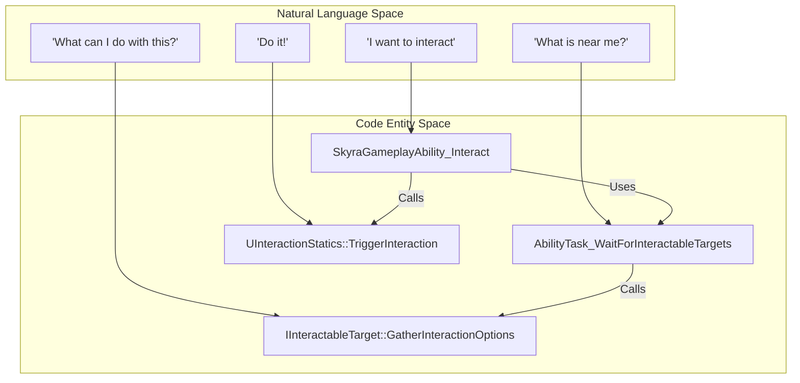
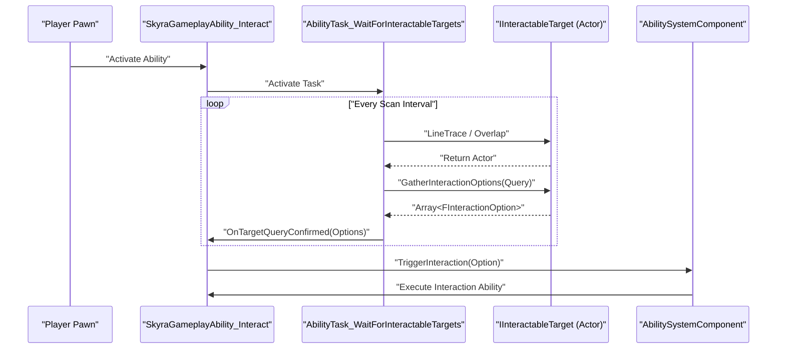

# Interaction System

Relevant source files

The following files were used as context for generating this wiki page:

- [.gitattributes](.gitattributes)

The Interaction System in SkyraFramework provides a modular, GAS-integrated framework for handling world-space interactions. It decouples the logic of "finding" an interactable object from the "execution" of the interaction itself, using a request-response pattern mediated by Gameplay Abilities and specialized Ability Tasks.

## Core Architecture and Data Flow

The system is built around three primary concepts:
1.  **Instigator**: The entity initiating the interaction (typically a Player Pawn).
2.  **Target**: The object being interacted with (e.g., a chest, a door, or a vehicle).
3.  **Option**: A data structure defining *how* the interaction occurs (text, duration, and the Gameplay Ability to trigger).

### Interaction Data Structures

The system uses `FInteractionQuery` to define the context of a search and `FInteractionOption` to define the result.

*   **`FInteractionQuery`**: Contains the `Instigator` and an optional `OptionalInventoryItemContext`. It is passed to potential targets to see if they can be interacted with. [Source/SkyraGame/Interaction/InteractionQuery.h:12-25]()
*   **`FInteractionOption`**: Represents a single "verb" or action available on a target. It includes:
    *   `InteractableTarget`: The interface pointer to the target. [Source/SkyraGame/Interaction/InteractionOption.h:20-21]()
    *   `Text`: The display string for the UI (e.g., "Open"). [Source/SkyraGame/Interaction/InteractionOption.h:24-25]()
    *   `SubText`: Additional UI information. [Source/SkyraGame/Interaction/InteractionOption.h:28-29]()
    *   `InteractionAbilityToGrant`: The GAS ability class that will be granted and activated to perform the interaction logic. [Source/SkyraGame/Interaction/InteractionOption.h:32-33]()

### System Entity Map
The following diagram maps the logical interaction flow to specific code entities.

**Interaction Logic Flow**

Sources: [Source/SkyraGame/Interaction/Abilities/SkyraGameplayAbility_Interact.cpp:1-50](), [Source/SkyraGame/Interaction/Tasks/AbilityTask_WaitForInteractableTargets.h:18-25](), [Source/SkyraGame/Interaction/IInteractableTarget.h:34-35](), [Source/SkyraGame/Interaction/InteractionStatics.h:22-23]()

## Interfaces

### IInteractableTarget
Any Actor or Component that can be interacted with must implement this interface.
*   **`GatherInteractionOptions`**: Populates an array of `FInteractionOption` based on the provided `FInteractionQuery`. [Source/SkyraGame/Interaction/IInteractableTarget.h:34-35]()
*   **`CustomizeInteractionEventData`**: Allows the target to modify the `FGameplayEventData` before the interaction ability is triggered, enabling the passing of custom payloads (like chest contents). [Source/SkyraGame/Interaction/IInteractableTarget.h:38-39]()

### IInteractionInstigator
Implemented by the entity initiating the interaction (usually the Pawn). It provides a hook for the system to identify who is performing the action. [Source/SkyraGame/Interaction/IInteractionInstigator.h:16-24]()

## Interaction Abilities and Tasks

### SkyraGameplayAbility_Interact
This is the "master" ability that manages the interaction lifecycle. It is usually active in the background or triggered by an input tag.
*   It utilizes `AbilityTask_WaitForInteractableTargets` to scan the environment. [Source/SkyraGame/Interaction/Abilities/SkyraGameplayAbility_Interact.cpp:38-45]()
*   When a target is confirmed, it calls `UInteractionStatics::TriggerInteraction`. [Source/SkyraGame/Interaction/Abilities/SkyraGameplayAbility_Interact.cpp:60-70]()

### AbilityTask_WaitForInteractableTargets
A specialized `UAbilityTask` that performs periodic traces or overlaps to find actors implementing `IInteractableTarget`.
*   It supports different "Interaction Scan Rates" to optimize performance. [Source/SkyraGame/Interaction/Tasks/AbilityTask_WaitForInteractableTargets.h:40-41]()
*   When targets are found, it executes `UpdateInteractableOptions`, which queries the targets for their available `FInteractionOption`s. [Source/SkyraGame/Interaction/Tasks/AbilityTask_WaitForInteractableTargets.cpp:80-100]()

### AbilityTask_GrantNearbyInteraction
Used to dynamically grant interaction capabilities to a player when they enter a specific volume or proximity.
*   It monitors a radius around the avatar. [Source/SkyraGame/Interaction/Tasks/AbilityTask_GrantNearbyInteraction.h:25-30]()
*   It manages the granting and removal of `FInteractionOption` abilities to ensure the player's `AbilitySystemComponent` stays clean. [Source/SkyraGame/Interaction/Tasks/AbilityTask_GrantNearbyInteraction.cpp:45-65]()

## Static Utilities and Targeting

### InteractionStatics
A blueprint library providing helper functions to bridge the gap between the world and the GAS interaction flow.
*   **`GetTargetActorFromHandle`**: Resolves an interaction handle back to an Actor. [Source/SkyraGame/Interaction/InteractionStatics.h:19-20]()
*   **`TriggerInteraction`**: The core execution function. It takes an `FInteractionOption`, prepares the `FGameplayEventData`, and sends a Gameplay Event to the instigator's ASC to trigger the specific interaction ability. [Source/SkyraGame/Interaction/InteractionStatics.cpp:35-55]()

### GameplayAbilityTargetActor_Interact
The `AGameplayAbilityTargetActor` implementation used by the interaction system to visualize or confirm the target.
*   It performs the actual line trace or collision check to determine what the player is looking at. [Source/SkyraGame/Interaction/Abilities/GameplayAbilityTargetActor_Interact.cpp:25-45]()
*   It integrates with `FWorldReticleParameters` to provide visual feedback (reticles) when hovering over interactable objects. [Source/SkyraGame/Interaction/Abilities/GameplayAbilityTargetActor_Interact.h:30-35]()

## Implementation Sequence

The following diagram illustrates the interaction sequence from trace to execution.

**Interaction Execution Sequence**

Sources: [Source/SkyraGame/Interaction/Abilities/SkyraGameplayAbility_Interact.cpp:35-75](), [Source/SkyraGame/Interaction/Tasks/AbilityTask_WaitForInteractableTargets.cpp:50-110](), [Source/SkyraGame/Interaction/InteractionStatics.cpp:35-60]()

## Key Classes Summary

| Class / Interface | Role |
| :--- | :--- |
| `IInteractableTarget` | Interface for Actors that can be interacted with. [Source/SkyraGame/Interaction/IInteractableTarget.h:18]() |
| `UInteractionStatics` | Utility for triggering interaction GAS events. [Source/SkyraGame/Interaction/InteractionStatics.h:14]() |
| `USkyraGameplayAbility_Interact` | Base ability for the interaction loop. [Source/SkyraGame/Interaction/Abilities/SkyraGameplayAbility_Interact.h:19]() |
| `UAbilityTask_WaitForInteractableTargets` | Task that finds targets in the world. [Source/SkyraGame/Interaction/Tasks/AbilityTask_WaitForInteractableTargets.h:25]() |
| `FInteractionOption` | Data struct describing an available action. [Source/SkyraGame/Interaction/InteractionOption.h:14]() |

Sources: [Source/SkyraGame/Interaction/IInteractableTarget.h:1-40](), [Source/SkyraGame/Interaction/InteractionStatics.h:1-30](), [Source/SkyraGame/Interaction/Abilities/SkyraGameplayAbility_Interact.h:1-50](), [Source/SkyraGame/Interaction/Tasks/AbilityTask_WaitForInteractableTargets.h:1-120](), [Source/SkyraGame/Interaction/InteractionOption.h:1-40]()