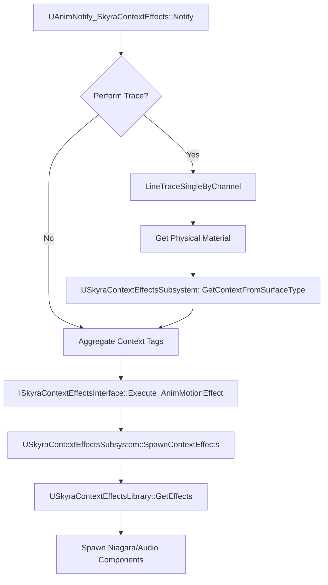
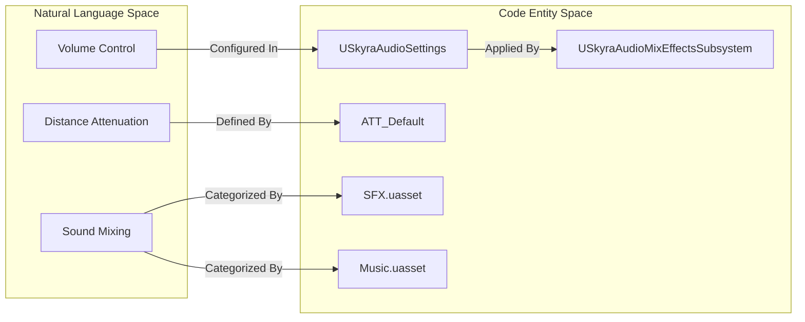
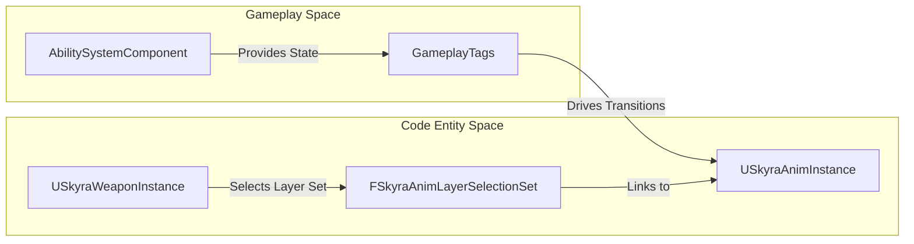

# Feedback, Audio, and Animation

Relevant source files

The following files were used as context for generating this wiki page:

- [Content/Assets/Audio/AttenuationPresets/ATT_Amb_Pad.uasset](Content/Assets/Audio/AttenuationPresets/ATT_Amb_Pad.uasset)
- [Content/Assets/Audio/AttenuationPresets/ATT_Default.uasset](Content/Assets/Audio/AttenuationPresets/ATT_Default.uasset)
- [Content/Assets/Audio/Classes/Music.uasset](Content/Assets/Audio/Classes/Music.uasset)
- [Content/Assets/Audio/Classes/Overall.uasset](Content/Assets/Audio/Classes/Overall.uasset)
- [Content/Assets/Audio/Classes/SFX.uasset](Content/Assets/Audio/Classes/SFX.uasset)

The feedback systems in SkyraFramework provide the sensory layer of the gameplay experience, bridging gameplay mechanics (like movement or combat) with visual and auditory responses. This system is designed to be data-driven, allowing designers to map abstract gameplay events to specific assets based on the current environment or character state.

## Context Effects System

The Context Effects system is a data-driven framework for triggering visual effects (VFX) and sound effects (SFX) based on "Contexts" (Gameplay Tags) and "Surfaces" (Physical Materials). Instead of hard-coding footstep sounds for every surface, an animation notifies the system of a "Footstep" effect; the system then checks the actor's current surface and state tags to select the correct asset from a `USkyraContextEffectsLibrary`.

### System Architecture

The system relies on a central subsystem to manage the mapping between actors and their available effect libraries.

| Entity | Role |
| :--- | :--- |
| `USkyraContextEffectsSubsystem` | Manages active libraries for actors and handles the spawning of Niagara and Audio components [Source/SkyraGame/Private/Feedback/ContextEffects/SkyraContextEffectsSubsystem.cpp:20-33](). |
| `USkyraContextEffectsLibrary` | A data asset containing mappings of `EffectTag` + `ContextContainer` to specific `USoundBase` and `UNiagaraSystem` assets [Source/SkyraGame/Private/Feedback/ContextEffects/SkyraContextEffectsLibrary.cpp:11-31](). |
| `USkyraContextEffectComponent` | An actor component that implements `ISkyraContextEffectsInterface` to listen for effect requests and forward them to the subsystem [Source/SkyraGame/Private/Feedback/ContextEffects/SkyraContextEffectComponent.cpp:61-65](). |
| `UAnimNotify_SkyraContextEffects` | An animation notify used to trigger effects directly from sequences, supporting line traces for surface detection [Source/SkyraGame/Private/Feedback/ContextEffects/AnimNotify_SkyraContextEffects.cpp:45-48](). |

### Context Effect Flow

The following diagram illustrates how an animation event is transformed into a world-space effect.

**Context Effect Resolution Diagram**

**Sources:** [Source/SkyraGame/Private/Feedback/ContextEffects/AnimNotify_SkyraContextEffects.cpp:45-120](), [Source/SkyraGame/Private/Feedback/ContextEffects/SkyraContextEffectsSubsystem.cpp:20-89](), [Source/SkyraGame/Private/Feedback/ContextEffects/SkyraContextEffectsLibrary.cpp:11-31]()

For a deep dive into library setup and surface mapping, see **[Context Effects System](#10.1)**.

---

## Number Pops and Audio

SkyraFramework includes specialized systems for providing immediate feedback for combat actions and managing the global audio mix.

### Number Pops
The "Number Pop" system handles the visualization of damage and healing values in the world. It supports different styles via `SkyraDamagePopStyle` and can utilize either `MeshText` (3D meshes for numbers) or `NiagaraText` (particle-based numbers) to ensure high-performance rendering of many simultaneous hits. The `SkyraNumberPopComponent` is responsible for receiving these requests from the Gameplay Ability System (GAS) and managing the lifecycle of the visual indicators.

### Audio Mix and Settings
The audio infrastructure is built around the `SkyraAudioMixEffectsSubsystem`. This system allows the game to dynamically adjust audio mixes (e.g., ducking sounds during dialogue or emphasizing footsteps in combat) based on the game state. It integrates with `SkyraAudioSettings` to provide user-facing controls for volume and quality. The framework utilizes standardized assets for attenuation (`ATT_Default` [Content/Assets/Audio/AttenuationPresets/ATT_Default.uasset:1-3]()) and sound classes like `Overall`, `SFX`, and `Music` [Content/Assets/Audio/Classes/Music.uasset:1-3]() to maintain a consistent mix hierarchy.

**Audio Infrastructure Mapping**

**Sources:** [Content/Assets/Audio/AttenuationPresets/ATT_Default.uasset:1-3](), [Content/Assets/Audio/Classes/Music.uasset:1-3](), [Content/Assets/Audio/Classes/SFX.uasset:1-3](), [Content/Assets/Audio/Classes/Overall.uasset:1-3]()

For details on combat feedback and audio management, see **[Number Pops and Audio](#10.2)**.

---

## Animation

The animation system in SkyraFramework is designed to be highly modular and aware of the Gameplay Ability System (GAS).

### GAS-Aware Animation
The `USkyraAnimInstance` serves as the base for character animations. It is designed to automatically pull state information from the `AbilitySystemComponent`, allowing animation Blueprints to transition states based on Gameplay Tags (e.g., `Status.IsCrouching` or `Ability.IsFiring`).

### Cosmetic Anim Layers
To support various weapon types and character parts on a single base skeleton, Skyra uses `FSkyraAnimLayerSelectionSet`. This allows the framework to dynamically link and unlink animation layers (using Unreal's Linked Anim Layer feature) based on cosmetic tags. For example, equipping a rifle will swap the character's locomotion and idle layers to rifle-specific versions without changing the underlying AnimBP logic.

**Animation System Mapping**

**Sources:** [Source/SkyraGame/Private/Feedback/ContextEffects/SkyraContextEffectComponent.cpp:61-64](), [Source/SkyraGame/Private/Feedback/ContextEffects/AnimNotify_SkyraContextEffects.cpp:113-118]()

For details on AnimInstance implementation and dynamic layer selection, see **[Animation](#10.3)**.

---

## Child Pages
*   **[Context Effects System](#10.1)**: Surface-to-effect mappings and the `USkyraContextEffectsSubsystem`.
*   **[Number Pops and Audio](#10.2)**: Damage/Heal indicators and the audio mix subsystem.
*   **[Animation](#10.3)**: GAS-aware `USkyraAnimInstance` and cosmetic anim layer selection.