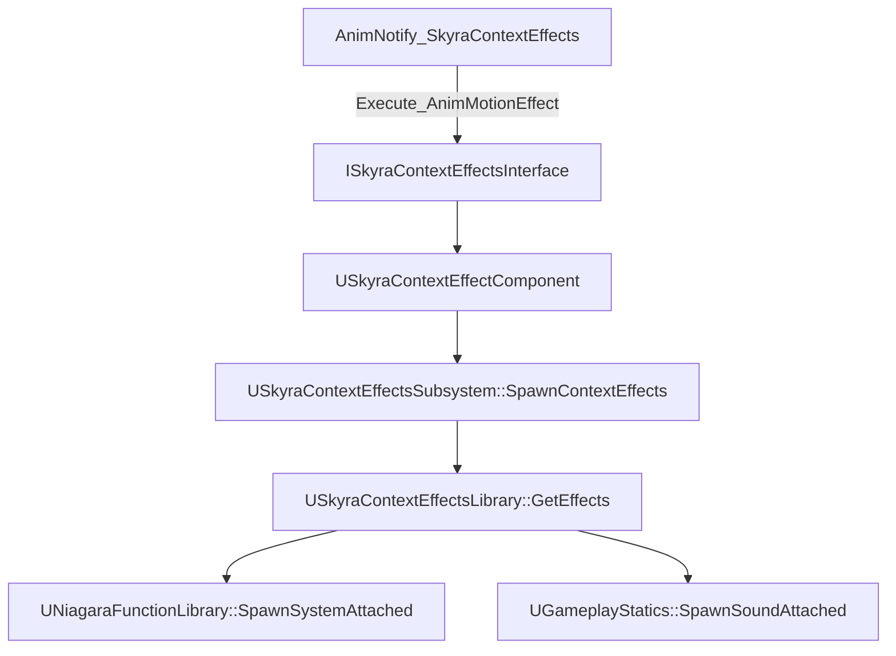
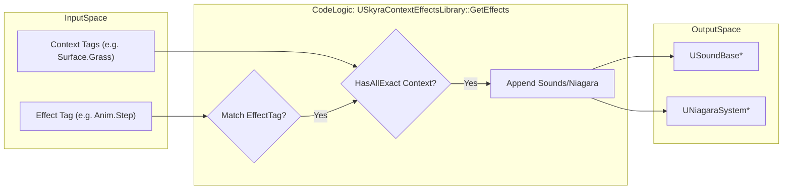

# Context Effects System

<details>
<summary>Relevant source files</summary>

The following files were used as context for generating this wiki page:

- [Content/Assets/Audio/AttenuationPresets/ATT_FX_BulletImpact.uasset](Content/Assets/Audio/AttenuationPresets/ATT_FX_BulletImpact.uasset)
- [Content/Assets/Audio/AttenuationPresets/ATT_FX_GrenadeBounce.uasset](Content/Assets/Audio/AttenuationPresets/ATT_FX_GrenadeBounce.uasset)
- [Content/Assets/Audio/AttenuationPresets/ATT_Foley.uasset](Content/Assets/Audio/AttenuationPresets/ATT_Foley.uasset)

</details>


The Context Effects System is a data-driven framework designed to trigger visual (Niagara) and auditory (Sound) feedback based on gameplay "Contexts" (e.g., surface types, weather conditions, or character states). It decouples the request for an effect (e.g., "Play Footstep") from the specific asset used, allowing for dynamic response to the environment.

## System Architecture

The system relies on a central subsystem that manages mappings between actors and their available effect libraries. Effects are triggered through a specialized interface, allowing both components and actors to respond to animation notifies or gameplay events.

### Data Flow: Animation to Feedback
The following diagram illustrates how an animation notify propagates through the system to spawn an effect.

**Context Effect Trigger Flow**

Sources: [Source/SkyraGame/Private/Feedback/ContextEffects/AnimNotify_SkyraContextEffects.cpp:113-118](), [Source/SkyraGame/Private/Feedback/ContextEffects/SkyraContextEffectComponent.cpp:131-133](), [Source/SkyraGame/Private/Feedback/ContextEffects/SkyraContextEffectsSubsystem.cpp:72-83]()

## Key Components

### USkyraContextEffectsLibrary
This data asset defines the mapping between a `FGameplayTag` (the effect type), a `FGameplayTagContainer` (the required contexts), and the actual assets (Sounds and Niagara Systems).

*   **Load State**: Libraries use an internal state machine (`EContextEffectsLibraryLoadState`) to manage the transition from `Unloaded` to `Loaded` [Source/SkyraGame/Private/Feedback/ContextEffects/SkyraContextEffectsLibrary.cpp:49-53]().
*   **Matching Logic**: When `GetEffects` is called, the library performs an exact tag match on the `EffectTag` and ensures the provided `Context` container has all tags required by the entry [Source/SkyraGame/Private/Feedback/ContextEffects/SkyraContextEffectsLibrary.cpp:21-24]().

### USkyraContextEffectsSubsystem
A world subsystem that acts as the central registry for active context effects.

*   **Library Management**: It maintains an `ActiveActorEffectsMap` associating `AActor` pointers with `USkyraContextEffectsSet` objects [Source/SkyraGame/Private/Feedback/ContextEffects/SkyraContextEffectsSubsystem.cpp:35-36]().
*   **Surface Mapping**: It provides utility functions to convert `EPhysicalSurface` types into `FGameplayTag` contexts using project settings [Source/SkyraGame/Private/Feedback/ContextEffects/SkyraContextEffectsSubsystem.cpp:91-106]().
*   **Spawning**: The `SpawnContextEffects` function aggregates sounds and emitters from all libraries registered to the actor and spawns them attached to a specified component/socket [Source/SkyraGame/Private/Feedback/ContextEffects/SkyraContextEffectsSubsystem.cpp:45-87]().

### USkyraContextEffectComponent
A component that implements `ISkyraContextEffectsInterface` to provide a standard way for actors to handle context effects.

*   **Automatic Registration**: On `BeginPlay`, it automatically registers its `DefaultContextEffectsLibraries` with the subsystem [Source/SkyraGame/Private/Feedback/ContextEffects/SkyraContextEffectComponent.cpp:28-44]().
*   **Context Aggregation**: It combines local `CurrentContexts` with transient contexts passed during an effect request (e.g., surface types from a trace) [Source/SkyraGame/Private/Feedback/ContextEffects/SkyraContextEffectComponent.cpp:70-75]().

Sources: [Source/SkyraGame/Private/Feedback/ContextEffects/SkyraContextEffectsLibrary.cpp:11-31](), [Source/SkyraGame/Private/Feedback/ContextEffects/SkyraContextEffectsSubsystem.cpp:20-33](), [Source/SkyraGame/Private/Feedback/ContextEffects/SkyraContextEffectComponent.cpp:61-65]()

## Animation Integration

The `UAnimNotify_SkyraContextEffects` class allows designers to trigger effects directly from the animation timeline.

### Trace and Context Logic
The notify can perform a line trace to detect physical materials, which are then converted to context tags.

| Feature | Implementation Detail |
| :--- | :--- |
| **Line Trace** | Uses `TraceProperties` to determine start/end and channel. Returns `bReturnPhysicalMaterial = true` [Source/SkyraGame/Private/Feedback/ContextEffects/AnimNotify_SkyraContextEffects.cpp:65-79](). |
| **Interface Execution** | Searches the Owning Actor and its components for any object implementing `ISkyraContextEffectsInterface` and calls `Execute_AnimMotionEffect` [Source/SkyraGame/Private/Feedback/ContextEffects/AnimNotify_SkyraContextEffects.cpp:88-119](). |
| **Editor Preview** | Includes logic to load libraries and spawn effects within the Anim Editor preview world [Source/SkyraGame/Private/Feedback/ContextEffects/AnimNotify_SkyraContextEffects.cpp:123-189](). |

Sources: [Source/SkyraGame/Private/Feedback/ContextEffects/AnimNotify_SkyraContextEffects.cpp:45-120]()

## Code Entity Mapping

The following diagrams bridge the conceptual "Natural Language" requirements to the specific C++ classes and functions in the codebase.

**System Entity Relationship**
```mermaid
classDiagram
    class "USkyraContextEffectsSubsystem" {
        +ActiveActorEffectsMap
        +SpawnContextEffects()
        +LoadAndAddContextEffectsLibraries()
    }
    class "USkyraContextEffectsLibrary" {
        +ContextEffects : TArray<FSkyraContextEffects>
        +LoadEffects()
        +GetEffects()
    }
    class "USkyraContextEffectComponent" {
        +CurrentContexts : FGameplayTagContainer
        +AnimMotionEffect_Implementation()
    }
    class "ISkyraContextEffectsInterface" {
        <<interface>>
        +AnimMotionEffect()
    }

    USkyraContextEffectComponent ..|> ISkyraContextEffectsInterface
    USkyraContextEffectComponent --> USkyraContextEffectsSubsystem : "Requests Spawn"
    USkyraContextEffectsSubsystem --> USkyraContextEffectsLibrary : "Queries Assets"
```
Sources: [Source/SkyraGame/Private/Feedback/ContextEffects/SkyraContextEffectsSubsystem.cpp:35-36](), [Source/SkyraGame/Private/Feedback/ContextEffects/SkyraContextEffectsLibrary.cpp:11-13](), [Source/SkyraGame/Private/Feedback/ContextEffects/SkyraContextEffectComponent.cpp:61-65]()

**Asset Resolution Logic**

Sources: [Source/SkyraGame/Private/Feedback/ContextEffects/SkyraContextEffectsLibrary.cpp:11-31]()

## Implementation Details

### Library Loading
The `USkyraContextEffectsLibrary` performs synchronous loading of soft-referenced assets when `LoadEffectsInternal` is called. It iterates through the `ContextEffects` array and attempts to load `USoundBase` and `UNiagaraSystem` objects [Source/SkyraGame/Private/Feedback/ContextEffects/SkyraContextEffectsLibrary.cpp:55-98](). Once complete, it calls `SkyraContextEffectLibraryLoadingComplete` to transition the load state to `Loaded` [Source/SkyraGame/Private/Feedback/ContextEffects/SkyraContextEffectsLibrary.cpp:110-118]().

### Subsystem Registration
Actors register their specific libraries via the subsystem's `LoadAndAddContextEffectsLibraries` function. This creates a `USkyraContextEffectsSet` and populates it with loaded library references, ensuring that the subsystem knows which libraries to query when that specific actor triggers an effect [Source/SkyraGame/Private/Feedback/ContextEffects/SkyraContextEffectsSubsystem.cpp:108-137]().

### Physical Material to Context Mapping
The framework supports mapping physical materials to gameplay tags for environment-aware effects. For example, bullet impacts use specific attenuation presets such as `ATT_FX_BulletImpact.uasset` to handle spatialization based on the detected surface context.

| Asset Type | File Reference |
| :--- | :--- |
| **Bullet Impact Attenuation** | [Content/Assets/Audio/AttenuationPresets/ATT_FX_BulletImpact.uasset]() |
| **Grenade Bounce Attenuation** | [Content/Assets/Audio/AttenuationPresets/ATT_FX_GrenadeBounce.uasset]() |
| **Foley Attenuation** | [Content/Assets/Audio/AttenuationPresets/ATT_Foley.uasset]() |

Sources: [Source/SkyraGame/Private/Feedback/ContextEffects/SkyraContextEffectsLibrary.cpp:33-118](), [Source/SkyraGame/Private/Feedback/ContextEffects/SkyraContextEffectsSubsystem.cpp:108-150]()