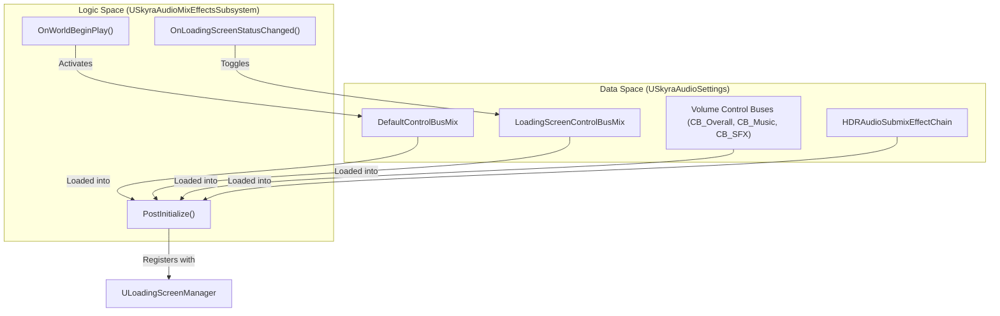
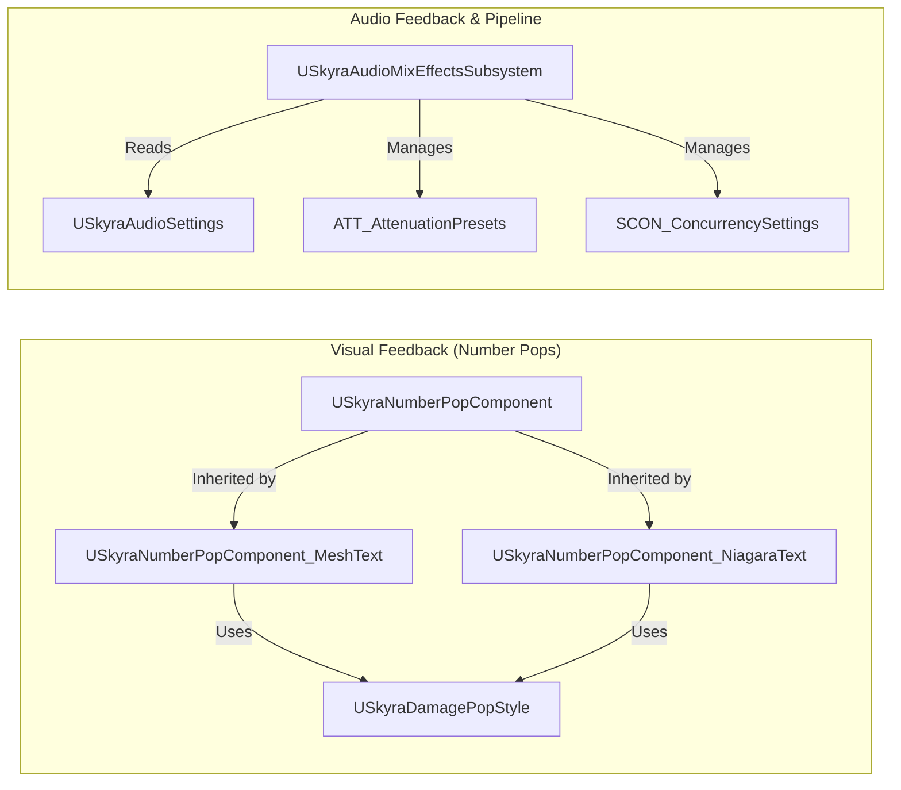

# Number Pops and Audio

Relevant source files

The following files were used as context for generating this wiki page:

- [Content/Assets/Audio/AttenuationPresets/ATT_Amb_Pad.uasset](Content/Assets/Audio/AttenuationPresets/ATT_Amb_Pad.uasset)
- [Content/Assets/Audio/AttenuationPresets/ATT_Default.uasset](Content/Assets/Audio/AttenuationPresets/ATT_Default.uasset)
- [Content/Assets/Audio/AttenuationPresets/ATT_FX_BulletImpact.uasset](Content/Assets/Audio/AttenuationPresets/ATT_FX_BulletImpact.uasset)
- [Content/Assets/Audio/AttenuationPresets/ATT_FX_Dash.uasset](Content/Assets/Audio/AttenuationPresets/ATT_FX_Dash.uasset)
- [Content/Assets/Audio/AttenuationPresets/ATT_FX_GrenadeBounce.uasset](Content/Assets/Audio/AttenuationPresets/ATT_FX_GrenadeBounce.uasset)
- [Content/Assets/Audio/AttenuationPresets/ATT_FX_Pad.uasset](Content/Assets/Audio/AttenuationPresets/ATT_FX_Pad.uasset)
- [Content/Assets/Audio/AttenuationPresets/ATT_Foley.uasset](Content/Assets/Audio/AttenuationPresets/ATT_Foley.uasset)
- [Content/Assets/Audio/AttenuationPresets/ATT_Footstep_NPC.uasset](Content/Assets/Audio/AttenuationPresets/ATT_Footstep_NPC.uasset)
- [Content/Assets/Audio/AttenuationPresets/ATT_Footstep_PC.uasset](Content/Assets/Audio/AttenuationPresets/ATT_Footstep_PC.uasset)
- [Content/Assets/Audio/AttenuationPresets/ATT_Grenade.uasset](Content/Assets/Audio/AttenuationPresets/ATT_Grenade.uasset)
- [Content/Assets/Audio/AttenuationPresets/ATT_Melee.uasset](Content/Assets/Audio/AttenuationPresets/ATT_Melee.uasset)
- [Content/Assets/Audio/AttenuationPresets/ATT_Pistol.uasset](Content/Assets/Audio/AttenuationPresets/ATT_Pistol.uasset)
- [Content/Assets/Audio/AttenuationPresets/ATT_Projectile.uasset](Content/Assets/Audio/AttenuationPresets/ATT_Projectile.uasset)
- [Content/Assets/Audio/AttenuationPresets/ATT_Rifle.uasset](Content/Assets/Audio/AttenuationPresets/ATT_Rifle.uasset)
- [Content/Assets/Audio/AttenuationPresets/ATT_Shotgun.uasset](Content/Assets/Audio/AttenuationPresets/ATT_Shotgun.uasset)
- [Content/Assets/Audio/AttenuationPresets/ATT_WhizBy.uasset](Content/Assets/Audio/AttenuationPresets/ATT_WhizBy.uasset)
- [Content/Assets/Audio/Blueprints/B_WindSystem.uasset](Content/Assets/Audio/Blueprints/B_WindSystem.uasset)
- [Content/Assets/Audio/Classes/Application_Focused.uasset](Content/Assets/Audio/Classes/Application_Focused.uasset)
- [Content/Assets/Audio/Classes/Music.uasset](Content/Assets/Audio/Classes/Music.uasset)
- [Content/Assets/Audio/Classes/Overall.uasset](Content/Assets/Audio/Classes/Overall.uasset)
- [Content/Assets/Audio/Classes/RenderedCinematics.uasset](Content/Assets/Audio/Classes/RenderedCinematics.uasset)
- [Content/Assets/Audio/Classes/SFX.uasset](Content/Assets/Audio/Classes/SFX.uasset)
- [Content/Assets/Audio/Classes/UI.uasset](Content/Assets/Audio/Classes/UI.uasset)
- [Content/Assets/Audio/Classes/VoiceChat.uasset](Content/Assets/Audio/Classes/VoiceChat.uasset)
- [Content/Assets/Audio/Concurrency/SCON_Footsteps.uasset](Content/Assets/Audio/Concurrency/SCON_Footsteps.uasset)
- [Content/Assets/Audio/Concurrency/SCON_Guns_LimitToOwner.uasset](Content/Assets/Audio/Concurrency/SCON_Guns_LimitToOwner.uasset)
- [Content/Assets/Audio/Concurrency/SCON_Guns_StopFarthest.uasset](Content/Assets/Audio/Concurrency/SCON_Guns_StopFarthest.uasset)
- [Content/Assets/Audio/Concurrency/SCON_Impacts.uasset](Content/Assets/Audio/Concurrency/SCON_Impacts.uasset)
- [Content/Assets/Audio/Concurrency/SCON_PlayerDamage.uasset](Content/Assets/Audio/Concurrency/SCON_PlayerDamage.uasset)
- [Content/Assets/Audio/Concurrency/SCON_WhizBys.uasset](Content/Assets/Audio/Concurrency/SCON_WhizBys.uasset)
- [Content/Assets/Audio/Concurrency/SCon_Default.uasset](Content/Assets/Audio/Concurrency/SCon_Default.uasset)
- [Content/Assets/Audio/DYN_LowMultibandDynamics.uasset](Content/Assets/Audio/DYN_LowMultibandDynamics.uasset)
- [Content/Assets/Audio/Effects/SubmixEffects/CREV_1978_LargeRoom.uasset](Content/Assets/Audio/Effects/SubmixEffects/CREV_1978_LargeRoom.uasset)
- [Content/Assets/Audio/Effects/SubmixEffects/CREV_BaseMain.uasset](Content/Assets/Audio/Effects/SubmixEffects/CREV_BaseMain.uasset)
- [Content/Assets/Audio/Effects/SubmixEffects/CREV_BaseMain_Tunnel.uasset](Content/Assets/Audio/Effects/SubmixEffects/CREV_BaseMain_Tunnel.uasset)
- [Content/Assets/Audio/Effects/SubmixEffects/CREV_BaseWing.uasset](Content/Assets/Audio/Effects/SubmixEffects/CREV_BaseWing.uasset)
- [Content/Assets/Audio/Effects/SubmixEffects/CREV_CenterCylinder.uasset](Content/Assets/Audio/Effects/SubmixEffects/CREV_CenterCylinder.uasset)
- [Content/Assets/Audio/Effects/SubmixEffects/CREV_ControlPoint.uasset](Content/Assets/Audio/Effects/SubmixEffects/CREV_ControlPoint.uasset)
- [Content/Assets/Audio/Effects/SubmixEffects/CREV_Exterior.uasset](Content/Assets/Audio/Effects/SubmixEffects/CREV_Exterior.uasset)
- [Content/Assets/Audio/Effects/SubmixEffects/DYN_LowDynamics.uasset](Content/Assets/Audio/Effects/SubmixEffects/DYN_LowDynamics.uasset)
- [Content/Assets/Audio/Effects/SubmixEffects/DYN_MainDynamics.uasset](Content/Assets/Audio/Effects/SubmixEffects/DYN_MainDynamics.uasset)
- [Content/Assets/Audio/Effects/SubmixEffects/FLT_EarlyReflections.uasset](Content/Assets/Audio/Effects/SubmixEffects/FLT_EarlyReflections.uasset)
- [Content/Assets/Audio/Effects/SubmixEffects/FLT_EarlyReflectionsHPF.uasset](Content/Assets/Audio/Effects/SubmixEffects/FLT_EarlyReflectionsHPF.uasset)
- [Content/Assets/Audio/Effects/SubmixEffects/TAP_EarlyReflections.uasset](Content/Assets/Audio/Effects/SubmixEffects/TAP_EarlyReflections.uasset)
- [Content/Assets/Audio/Impulses/1978_LargeRoom.uasset](Content/Assets/Audio/Impulses/1978_LargeRoom.uasset)
- [Content/Assets/Audio/Impulses/1978_LargeRoom_IR.uasset](Content/Assets/Audio/Impulses/1978_LargeRoom_IR.uasset)
- [Content/Assets/Audio/Impulses/IR_Reverb_Exterior_01.uasset](Content/Assets/Audio/Impulses/IR_Reverb_Exterior_01.uasset)
- [Content/Assets/Audio/Impulses/IR_Reverb_Exterior_01_IR.uasset](Content/Assets/Audio/Impulses/IR_Reverb_Exterior_01_IR.uasset)
- [Content/Assets/Audio/Impulses/IR_Reverb_Hall_01_bright.uasset](Content/Assets/Audio/Impulses/IR_Reverb_Hall_01_bright.uasset)
- [Content/Assets/Audio/Impulses/IR_Reverb_Hall_01_bright_IR.uasset](Content/Assets/Audio/Impulses/IR_Reverb_Hall_01_bright_IR.uasset)
- [Content/Assets/Audio/Impulses/IR_Reverb_Hall_01_dark.uasset](Content/Assets/Audio/Impulses/IR_Reverb_Hall_01_dark.uasset)
- [Content/Assets/Audio/Impulses/IR_Reverb_Hall_01_dark_IR.uasset](Content/Assets/Audio/Impulses/IR_Reverb_Hall_01_dark_IR.uasset)
- [Content/Assets/Audio/Impulses/IR_Reverb_Hall_02.uasset](Content/Assets/Audio/Impulses/IR_Reverb_Hall_02.uasset)
- [Content/Assets/Audio/Impulses/IR_Reverb_Hall_02_IR.uasset](Content/Assets/Audio/Impulses/IR_Reverb_Hall_02_IR.uasset)
- [Content/Assets/Audio/Impulses/IR_Reverb_Hall_03.uasset](Content/Assets/Audio/Impulses/IR_Reverb_Hall_03.uasset)
- [Content/Assets/Audio/Impulses/IR_Reverb_Hall_03_IR.uasset](Content/Assets/Audio/Impulses/IR_Reverb_Hall_03_IR.uasset)
- [Content/Assets/Audio/Impulses/IR_Reverb_Room_01.uasset](Content/Assets/Audio/Impulses/IR_Reverb_Room_01.uasset)
- [Content/Assets/Audio/Impulses/IR_Reverb_Room_01_IR.uasset](Content/Assets/Audio/Impulses/IR_Reverb_Room_01_IR.uasset)
- [Content/Assets/Audio/Impulses/IR_Reverb_Room_02.uasset](Content/Assets/Audio/Impulses/IR_Reverb_Room_02.uasset)
- [Content/Assets/Audio/Impulses/IR_Reverb_Room_02_IR.uasset](Content/Assets/Audio/Impulses/IR_Reverb_Room_02_IR.uasset)
- [Content/Assets/Audio/Impulses/IR_Reverb_Room_03.uasset](Content/Assets/Audio/Impulses/IR_Reverb_Room_03.uasset)
- [Content/Assets/Audio/Impulses/IR_Reverb_Room_03_IR.uasset](Content/Assets/Audio/Impulses/IR_Reverb_Room_03_IR.uasset)
- [Content/Assets/Audio/Impulses/IR_Reverb_Room_04.uasset](Content/Assets/Audio/Impulses/IR_Reverb_Room_04.uasset)
- [Content/Assets/Audio/Impulses/IR_Reverb_Room_04_IR.uasset](Content/Assets/Audio/Impulses/IR_Reverb_Room_04_IR.uasset)
- [Content/Assets/Audio/Impulses/IR_Reverb_Room_05.uasset](Content/Assets/Audio/Impulses/IR_Reverb_Room_05.uasset)
- [Content/Assets/Audio/Impulses/IR_Reverb_Room_05_IR.uasset](Content/Assets/Audio/Impulses/IR_Reverb_Room_05_IR.uasset)
- [Content/Assets/Audio/Impulses/IR_Reverb_Room_06.uasset](Content/Assets/Audio/Impulses/IR_Reverb_Room_06.uasset)
- [Content/Assets/Audio/Impulses/IR_Reverb_Room_06_IR.uasset](Content/Assets/Audio/Impulses/IR_Reverb_Room_06_IR.uasset)
- [Content/Assets/Audio/Impulses/IR_Reverb_Room_07.uasset](Content/Assets/Audio/Impulses/IR_Reverb_Room_07.uasset)
- [Content/Assets/Audio/Impulses/IR_Reverb_Room_07_IR.uasset](Content/Assets/Audio/Impulses/IR_Reverb_Room_07_IR.uasset)
- [Content/Assets/Audio/MetaSounds/MS_Graph_RandomPitch_Stereo.uasset](Content/Assets/Audio/MetaSounds/MS_Graph_RandomPitch_Stereo.uasset)
- [Content/Assets/Audio/MetaSounds/MS_Graph_TriggerDelayPitchShift_Mono.uasset](Content/Assets/Audio/MetaSounds/MS_Graph_TriggerDelayPitchShift_Mono.uasset)
- [Content/Assets/Audio/MetaSounds/lib_DovetailClip.uasset](Content/Assets/Audio/MetaSounds/lib_DovetailClip.uasset)
- [Content/Assets/Audio/MetaSounds/lib_DovetailClipFromArray.uasset](Content/Assets/Audio/MetaSounds/lib_DovetailClipFromArray.uasset)
- [Content/Assets/Audio/MetaSounds/lib_RandInterpTo.uasset](Content/Assets/Audio/MetaSounds/lib_RandInterpTo.uasset)
- [Content/Assets/Audio/MetaSounds/lib_RandPanStereo.uasset](Content/Assets/Audio/MetaSounds/lib_RandPanStereo.uasset)
- [Content/Assets/Audio/MetaSounds/lib_StereoBalance.uasset](Content/Assets/Audio/MetaSounds/lib_StereoBalance.uasset)
- [Content/Assets/Audio/MetaSounds/lib_TriggerAfter.uasset](Content/Assets/Audio/MetaSounds/lib_TriggerAfter.uasset)
- [Content/Assets/Audio/MetaSounds/lib_TriggerEvery.uasset](Content/Assets/Audio/MetaSounds/lib_TriggerEvery.uasset)
- [Content/Assets/Audio/MetaSounds/lib_TriggerModulo.uasset](Content/Assets/Audio/MetaSounds/lib_TriggerModulo.uasset)
- [Content/Assets/Audio/MetaSounds/lib_TriggerStopAfter.uasset](Content/Assets/Audio/MetaSounds/lib_TriggerStopAfter.uasset)
- [Content/Assets/Audio/MetaSounds/lib_WhizBy.uasset](Content/Assets/Audio/MetaSounds/lib_WhizBy.uasset)
- [Content/Assets/Audio/MetaSounds/mx_PlayAmbientChord.uasset](Content/Assets/Audio/MetaSounds/mx_PlayAmbientChord.uasset)
- [Content/Assets/Audio/MetaSounds/mx_PlayAmbientElement.uasset](Content/Assets/Audio/MetaSounds/mx_PlayAmbientElement.uasset)
- [Content/Assets/Audio/MetaSounds/mx_Stingers.uasset](Content/Assets/Audio/MetaSounds/mx_Stingers.uasset)
- [Content/Assets/Audio/MetaSounds/mx_System.uasset](Content/Assets/Audio/MetaSounds/mx_System.uasset)
- [Content/Assets/Audio/MetaSounds/sfx_Amb_Teleport_lp_meta.uasset](Content/Assets/Audio/MetaSounds/sfx_Amb_Teleport_lp_meta.uasset)
- [Content/Assets/Audio/MetaSounds/sfx_Amb_WeaponPad_lp_meta.uasset](Content/Assets/Audio/MetaSounds/sfx_Amb_WeaponPad_lp_meta.uasset)
- [Content/Assets/Audio/MetaSounds/sfx_Amb_Wind_lp_meta.uasset](Content/Assets/Audio/MetaSounds/sfx_Amb_Wind_lp_meta.uasset)
- [Content/Assets/Audio/MetaSounds/sfx_BaseLayer_Interactable_Pad_nl_meta.uasset](Content/Assets/Audio/MetaSounds/sfx_BaseLayer_Interactable_Pad_nl_meta.uasset)
- [Content/Assets/Audio/MetaSounds/sfx_CapturePoint_Progress_meta.uasset](Content/Assets/Audio/MetaSounds/sfx_CapturePoint_Progress_meta.uasset)
- [Content/Assets/Audio/MetaSounds/sfx_Character_DamageGivenKill_nl_meta.uasset](Content/Assets/Audio/MetaSounds/sfx_Character_DamageGivenKill_nl_meta.uasset)
- [Content/Assets/Audio/MetaSounds/sfx_Character_DamageGivenWeakSpot_nl_meta.uasset](Content/Assets/Audio/MetaSounds/sfx_Character_DamageGivenWeakSpot_nl_meta.uasset)
- [Content/Assets/Audio/MetaSounds/sfx_Character_DamageGiven_nl_meta.uasset](Content/Assets/Audio/MetaSounds/sfx_Character_DamageGiven_nl_meta.uasset)
- [Content/Assets/Audio/MetaSounds/sfx_Character_DamageTakenWeakSpot_nl_meta.uasset](Content/Assets/Audio/MetaSounds/sfx_Character_DamageTakenWeakSpot_nl_meta.uasset)
- [Content/Assets/Audio/MetaSounds/sfx_Character_DamageTaken_nl_meta.uasset](Content/Assets/Audio/MetaSounds/sfx_Character_DamageTaken_nl_meta.uasset)
- [Content/Assets/Audio/MetaSounds/sfx_Character_FS_Base_nl_meta.uasset](Content/Assets/Audio/MetaSounds/sfx_Character_FS_Base_nl_meta.uasset)
- [Content/Assets/Audio/MetaSounds/sfx_Character_FS_Concrete_nl_meta.uasset](Content/Assets/Audio/MetaSounds/sfx_Character_FS_Concrete_nl_meta.uasset)

This section covers the feedback systems responsible for visual damage/healing indicators ("Number Pops") and the global audio management subsystem. These systems translate gameplay events—such as taking damage or changing game states—into player-facing sensory feedback.

## Number Pop System

The Number Pop system provides world-space visual feedback for numeric gameplay changes, primarily damage and healing. It is designed to be extensible, supporting both mesh-based and Niagara-based implementations.

### Core Components and Data

The system is centered around `USkyraNumberPopComponent`, which acts as the base class for handling requests to display numbers in the world.

*   **`FSkyraNumberPopRequest`**: A structure containing the data needed to spawn a pop, including the numeric value, world location, whether it was a critical hit, and gameplay tags associated with the source.
*   **`USkyraDamagePopStyle`**: A data asset used to define the visual appearance (meshes, materials, or Niagara systems) for different types of number pops [Source/SkyraGame/Private/Feedback/NumberPops/SkyraDamagePopStyle.h:7-11]().

### Implementation Variants

SkyraFramework provides two primary implementations for rendering numbers:

#### 1. Mesh-Based Text (`USkyraNumberPopComponent_MeshText`)
This implementation uses a pool of `UStaticMeshComponent` instances to render digits. It uses World Position Offset (WPO) in materials to animate the digits and provides high-performance rendering by reusing components.

*   **Component Pooling**: To avoid runtime allocation overhead, it maintains a `PooledComponentMap` [Source/SkyraGame/Private/Feedback/NumberPops/SkyraNumberPopComponent_MeshText.cpp:91-118]().
*   **Material Parameters**: Digits are passed to the material via scalar and vector parameters (e.g., `SignDigitParameterName`, `PositionParameterNames`) [Source/SkyraGame/Private/Feedback/NumberPops/SkyraNumberPopComponent_MeshText.cpp:24-31]().
*   **Local Only**: To prevent visual clutter on listen servers, pops are only processed for the local controller [Source/SkyraGame/Private/Feedback/NumberPops/SkyraNumberPopComponent_MeshText.cpp:49-55]().

#### 2. Niagara-Based Text (`USkyraNumberPopComponent_NiagaraText`)
This variant uses the Niagara VFX system to render numbers, allowing for more complex particle-based animations.

*   **Data Interface**: It uses `UNiagaraDataInterfaceArrayFunctionLibrary` to pass damage information into a Niagara system as an array of `FVector4` (where XYZ is position and W is the damage value) [Source/SkyraGame/Private/Feedback/NumberPops/SkyraNumberPopComponent_NiagaraText.cpp:51-53]().
*   **Critical Hits**: Differentiates critical hits by passing the damage value as a negative number to the Niagara emitter [Source/SkyraGame/Private/Feedback/NumberPops/SkyraNumberPopComponent_NiagaraText.cpp:25-28]().

### Number Pop Data Flow

| Step | Entity | Action |
| :--- | :--- | :--- |
| 1 | Gameplay Code | Calls `AddNumberPop` with a `FSkyraNumberPopRequest`. |
| 2 | `USkyraNumberPopComponent` | Validates request and checks local controller status. |
| 3 | `MeshText` Variant | Retrieves/Creates `StaticMeshComponent` from `PooledComponentMap`. |
| 4 | `MeshText` Variant | Parses `NumberToDisplay` into individual digits [Source/SkyraGame/Private/Feedback/NumberPops/SkyraNumberPopComponent_MeshText.cpp:72-77](). |
| 5 | `MeshText` Variant | Updates Dynamic Material Instances (MIDs) with digit and position data. |
| 6 | `NiagaraText` Variant | Appends damage data to the Niagara array and activates the system. |

**Sources:**
* `Source/SkyraGame/Private/Feedback/NumberPops/SkyraNumberPopComponent.h`
* `Source/SkyraGame/Private/Feedback/NumberPops/SkyraNumberPopComponent_MeshText.cpp` [Source/SkyraGame/Private/Feedback/NumberPops/SkyraNumberPopComponent_MeshText.cpp:45-165]()
* `Source/SkyraGame/Private/Feedback/NumberPops/SkyraNumberPopComponent_NiagaraText.cpp` [Source/SkyraGame/Private/Feedback/NumberPops/SkyraNumberPopComponent_NiagaraText.cpp:20-55]()

---

## Audio Subsystem and Pipeline

The audio subsystem manages global audio states, including volume buses, submix effects, and asset pipelines for spatialization and modulation.

### Subsystem Architecture

The `USkyraAudioMixEffectsSubsystem` manages the activation of `USoundControlBusMix` and the application of `USoundEffectSubmixPreset` chains [Source/SkyraGame/Private/Audio/SkyraAudioMixEffectsSubsystem.h:21-35]().

*   **`USkyraAudioSettings`**: A Developer Settings class holding soft pointers to Control Buses (Overall, Music, SFX, Dialogue) and Submix Effect Chains [Source/SkyraGame/Private/Audio/SkyraAudioMixEffectsSubsystem.cpp:54-150]().
*   **Loading Screen Mix**: Automatically applied when `ULoadingScreenManager` signals visibility changes to dampen game audio [Source/SkyraGame/Private/Audio/SkyraAudioMixEffectsSubsystem.cpp:214-218]().

### Audio Asset Pipeline

SkyraFramework uses a structured pipeline for audio assets, categorized by their role in the soundscape.

#### 1. Attenuation Presets (`ATT_*`)
Standardized distance-based volume and spatialization settings.
*   `ATT_Default`: Base attenuation for general sounds [Content/Assets/Audio/AttenuationPresets/ATT_Default.uasset:1-3]().
*   `ATT_Footstep_PC` / `ATT_Footstep_NPC`: Specialized attenuation for player vs non-player movement [Content/Assets/Audio/AttenuationPresets/ATT_Footstep_PC.uasset:1-3]().
*   `ATT_Pistol` / `ATT_Rifle` / `ATT_Shotgun`: Weapon-specific falloff curves [Content/Assets/Audio/AttenuationPresets/ATT_Pistol.uasset:1-3]().

#### 2. Sound Classes and Submixes
The framework organizes audio into a hierarchy for routing and effects.
*   **Sound Classes**: `Overall`, `SFX`, `Music`, `UI`, `VoiceChat` [Content/Assets/Audio/Classes/Overall.uasset:1-3]().
*   **Submix Graph**: Routing includes `MainSubmix`, `SFXSubmix`, `MusicSubmix`, `ReverbSubmix`, `UISubmix`, `VoiceSubmix`, and `EarlyReflectionsSubmix`.
*   **Impulse Responses**: `IR_Reverb_Exterior_01` and `1978_LargeRoom` are used for convolution reverb effects [Content/Assets/Audio/Impulses/IR_Reverb_Exterior_01.uasset:1-3]().

#### 3. Concurrency (`SCON_*`)
Limits the number of simultaneous sounds to prevent "phasing" and performance hits.
*   `SCON_Guns_LimitToOwner`: Restricts weapon sounds per player [Content/Assets/Audio/Concurrency/SCON_Guns_LimitToOwner.uasset:1-3]().
*   `SCON_Footsteps`: Manages overlapping movement sounds [Content/Assets/Audio/Concurrency/SCON_Footsteps.uasset:1-3]().

### Modulation and Control
Audio levels and parameters are modulated via Control Buses (`CB_*`) and Control Bus Mixes (`CBM_*`). This allows real-time adjustment of audio categories (e.g., lowering SFX during a cinematic).

### Wind System
The `B_WindSystem` blueprint provides a dynamic ambient wind implementation, likely utilizing MetaSound graphs (`sfx_*`, `mx_*`) for procedural audio generation.

---

## Technical Integration Diagrams

### Audio Subsystem Data Relationship

Title: Audio Subsystem Data Relationship

### Feedback System Entity Mapping

Title: Feedback System Entity Mapping

**Sources:**
* `Source/SkyraGame/Private/Audio/SkyraAudioMixEffectsSubsystem.cpp` [Source/SkyraGame/Private/Audio/SkyraAudioMixEffectsSubsystem.cpp:52-219]()
* `Source/SkyraGame/Private/Audio/SkyraAudioSettings.h`
* `Content/Assets/Audio/AttenuationPresets/ATT_Default.uasset`
* `Content/Assets/Audio/Classes/Overall.uasset`
* `Content/Assets/Audio/Concurrency/SCON_Footsteps.uasset`
* `Content/Assets/Audio/Impulses/IR_Reverb_Exterior_01.uasset`