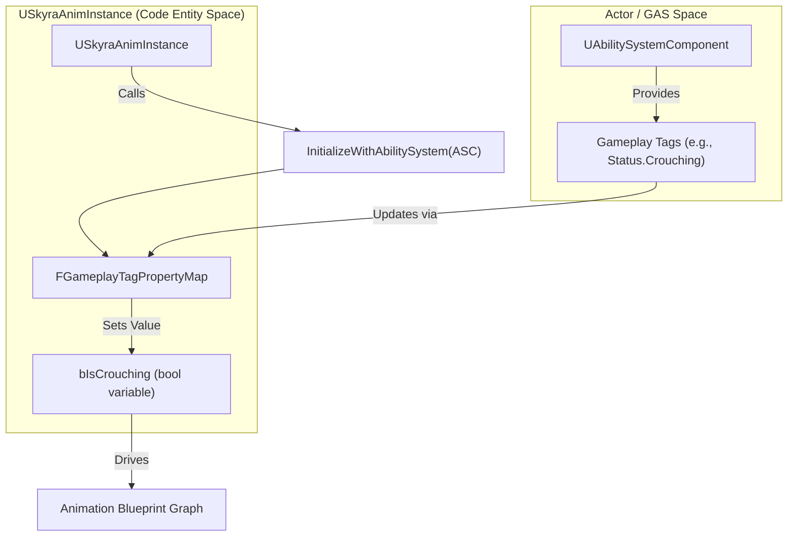
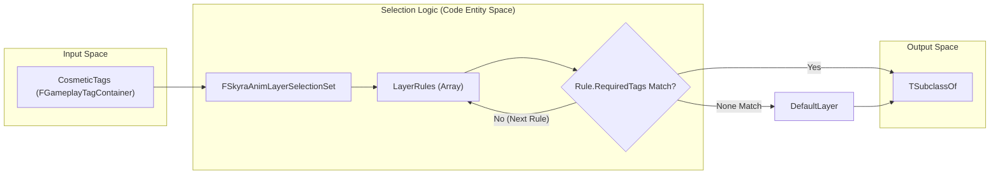

# Animation

Relevant source files

The following files were used as context for generating this wiki page:

- [.gitattributes](.gitattributes)

The SkyraFramework animation system provides a data-driven approach to character and weapon animation, tightly integrated with the Gameplay Ability System (GAS) and the cosmetics framework. It focuses on two primary pillars: a GAS-aware base animation instance that synchronizes gameplay tags to animation variables, and a selection system for dynamic animation layers based on cosmetic and equipment tags.

## USkyraAnimInstance

`USkyraAnimInstance` is the base class for animation blueprints in SkyraFramework. Its primary responsibility is to bridge the gap between the `UAbilitySystemComponent` (ASC) and the animation graph by automatically mapping gameplay tags to member variables.

### GAS Integration and Tag Mapping

The class utilizes a `FGameplayTagPropertyMap` to synchronize state. This allows developers to define boolean or float properties in the AnimBP that automatically update when specific Gameplay Tags are added to or removed from the owning actor [Source/SkyraGame/Private/Animation/SkyraAnimInstance.h:35-38]().

The initialization flow ensures that the animation instance is always connected to the actor's ASC:
1.  **Initialization**: During `NativeInitializeAnimation`, the instance attempts to locate an ASC on the owning actor via `UAbilitySystemGlobals` [Source/SkyraGame/Private/Animation/SkyraAnimInstance.cpp:38-49]().
2.  **Binding**: If found, it calls `InitializeWithAbilitySystem`, which binds the `GameplayTagPropertyMap` to the ASC [Source/SkyraGame/Private/Animation/SkyraAnimInstance.cpp:20-25]().
3.  **Validation**: In the editor, `IsDataValid` ensures that the property map is correctly configured, preventing runtime errors from mismatched tags or missing properties [Source/SkyraGame/Private/Animation/SkyraAnimInstance.cpp:28-35]().

### Data Flow: GAS to Animation

The following diagram illustrates how gameplay state flows from the Ability System into the Animation Graph.

**Animation State Synchronization**

**Sources:** [Source/SkyraGame/Private/Animation/SkyraAnimInstance.cpp:20-25](), [Source/SkyraGame/Private/Animation/SkyraAnimInstance.h:35-38]()

---

## Cosmetic Animation Selection

SkyraFramework uses a "Layer Selection" pattern to handle complex animation requirements, such as changing locomotion sets when a weapon is equipped or switching styles based on character parts. This is handled by `FSkyraAnimLayerSelectionSet`.

### FSkyraAnimLayerSelectionSet

This structure allows the system to choose an `UAnimInstance` (typically an Animation Layer Interface) based on a collection of `FGameplayTagContainer` cosmetic tags [Source/SkyraGame/Private/Cosmetics/SkyraCosmeticAnimationTypes.h:38-41]().

*   **Layer Rules**: A list of `FSkyraAnimLayerSelectionEntry` objects. Each entry contains a reference to an Anim BP Class and a set of required tags [Source/SkyraGame/Private/Cosmetics/SkyraCosmeticAnimationTypes.h:25-33]().
*   **Selection Logic**: The `SelectBestLayer` function iterates through the rules. The first rule whose `RequiredTags` are all present in the provided `CosmeticTags` container is returned [Source/SkyraGame/Private/Cosmetics/SkyraCosmeticAnimationTypes.cpp:10-21]().
*   **Default Fallback**: If no rules match, a `DefaultLayer` is returned to ensure the character does not T-pose [Source/SkyraGame/Private/Cosmetics/SkyraCosmeticAnimationTypes.cpp:20-20]().

### FSkyraAnimBodyStyleSelectionSet

Similar to the layer selection, this struct selects a `USkeletalMesh` based on tags. This is used for character parts that might change visually (and potentially require different animation offsets) based on the current equipment or cosmetic state [Source/SkyraGame/Private/Cosmetics/SkyraCosmeticAnimationTypes.cpp:23-34]().

### Selection Logic Workflow

The diagram below shows how the cosmetic system resolves a specific animation layer from a set of rules.

**Cosmetic Tag Resolution**

**Sources:** [Source/SkyraGame/Private/Cosmetics/SkyraCosmeticAnimationTypes.cpp:10-21](), [Source/SkyraGame/Private/Cosmetics/SkyraCosmeticAnimationTypes.h:38-52]()

---

## Technical Reference

### Key Classes and Structures

| Class/Struct | Purpose | Key Functions |
| :--- | :--- | :--- |
| `USkyraAnimInstance` | Base AnimInstance with GAS integration. | `InitializeWithAbilitySystem` [Source/SkyraGame/Private/Animation/SkyraAnimInstance.cpp:20](), `NativeInitializeAnimation` [Source/SkyraGame/Private/Animation/SkyraAnimInstance.cpp:38]() |
| `FSkyraAnimLayerSelectionSet` | Data structure for selecting animation layers based on tags. | `SelectBestLayer` [Source/SkyraGame/Private/Cosmetics/SkyraCosmeticAnimationTypes.cpp:10]() |
| `FSkyraAnimBodyStyleSelectionSet` | Data structure for selecting skeletal meshes based on tags. | `SelectBestBodyStyle` [Source/SkyraGame/Private/Cosmetics/SkyraCosmeticAnimationTypes.cpp:23]() |
| `FSkyraAnimLayerSelectionEntry` | Individual rule mapping tags to an Anim BP class. | N/A [Source/SkyraGame/Private/Cosmetics/SkyraCosmeticAnimationTypes.h:25]() |

**Sources:** [Source/SkyraGame/Private/Animation/SkyraAnimInstance.h:18-21](), [Source/SkyraGame/Private/Cosmetics/SkyraCosmeticAnimationTypes.h:38-41](), [Source/SkyraGame/Private/Cosmetics/SkyraCosmeticAnimationTypes.h:55-58]()

### Implementation Details

*   **Ground Information**: The `NativeUpdateAnimation` contains logic to pull `FSkyraCharacterGroundInfo` from the `USkyraCharacterMovementComponent` (if available), providing `GroundDistance` for landing and falling logic [Source/SkyraGame/Private/Animation/SkyraAnimInstance.cpp:51-64]().
*   **Property Mapping**: The `GameplayTagPropertyMap` is a feature of the `UAbilitySystemComponent` that is leveraged here to avoid manual `HasTag` checks in the `BlueprintUpdateAnimation` tick [Source/SkyraGame/Private/Animation/SkyraAnimInstance.h:35-38]().

**Sources:** [Source/SkyraGame/Private/Animation/SkyraAnimInstance.cpp:51-64](), [Source/SkyraGame/Private/Animation/SkyraAnimInstance.h:35-38]()