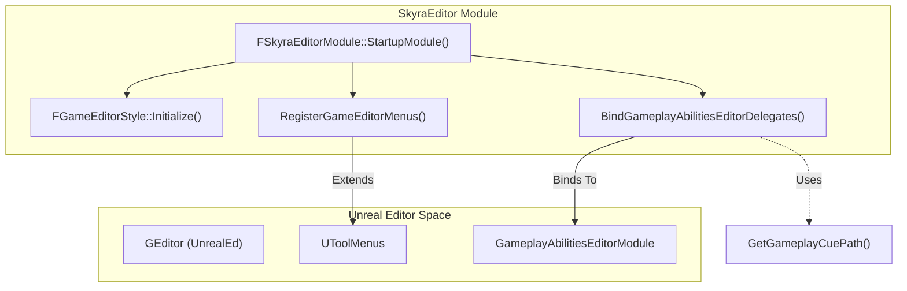
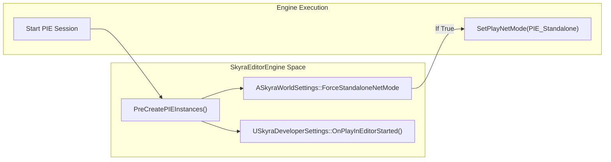

# SkyraEditor Module

Relevant source files

The following files were used as context for generating this wiki page:

- [.gitattributes](.gitattributes)

The `SkyraEditor` module provides editor-only functionality to support the SkyraFramework ecosystem. It focuses on enhancing developer productivity through custom toolbar extensions, streamlining the Gameplay Ability System (GAS) workflow, enforcing project standards via an asset validation pipeline, and providing specialized asset management tools.

## Module Startup and Extensions
The entry point for the editor module is `FSkyraEditorModule`. Upon startup, it initializes custom Slate styles and integrates into the Unreal Editor's menu system. A key feature is the extension of the Level Editor toolbar to include project-specific utilities.

### Toolbar Extensions
The module extends `LevelEditor.LevelEditorToolBar.PlayToolBar` [Source/SkyraEditor/Private/SkyraEditor.cpp:151-152]() to add:
*   **Check Content**: A manual trigger for the asset validation framework [Source/SkyraEditor/Private/SkyraEditor.cpp:171-183]().
*   **Common Maps**: A dropdown menu populated from `USkyraDeveloperSettings` that allows developers to quickly jump between frequently used maps [Source/SkyraEditor/Private/SkyraEditor.cpp:185-198]().

### GAS Editor Integration
To improve the GAS developer experience, the module binds delegates to the `GameplayAbilitiesEditorModule`. This includes logic for:
*   **GameplayCue Paths**: Automatically determining the folder structure for new GameplayCue notifies based on their tags [Source/SkyraEditor/Private/SkyraEditor.cpp:56-86]().
*   **Class Filtering**: Restricting the GameplayCue editor to specific notify classes (Burst, Latent, Looping) [Source/SkyraEditor/Private/SkyraEditor.cpp:33-39]().

### Editor Engine Lifecycle
`USkyraEditorEngine` extends the standard editor engine to handle PIE (Play In Editor) specific logic. For example, it can force `Standalone` net mode based on `ASkyraWorldSettings` [Source/SkyraEditor/Private/SkyraEditorEngine.cpp:56-73]() and triggers developer setting overrides when a PIE session begins [Source/SkyraEditor/Private/SkyraEditorEngine.cpp:76-77]().

For details, see [Editor Module Startup and Extensions](#11.1).

---

## Asset Validation Framework
SkyraEditor implements a robust validation pipeline to ensure assets meet technical requirements before being committed or cooked. This system is accessible via the "Check Content" toolbar button or through commandlets for CI/CD integration.

The framework utilizes `UEditorValidator` as a base class to implement specific checks for:
*   **Blueprints**: Ensuring valid parent classes and variable configurations.
*   **Material Functions**: Checking for performance regressions or naming conventions.
*   **Source Control**: Validating that assets are correctly checked out and synced.

For details, see [Asset Validation Framework](#11.2).

---

## Editor Utilities and Context Effects Tools
The module provides specialized tools for managing complex assets like the Context Effects system. This includes custom `FAssetTypeActions` and factories to streamline the creation of `USkyraContextEffectsLibrary` assets.

Additionally, various utility functions are provided to:
*   Check Chaos mesh collisions.
*   Manage redirectors and collection references.

For details, see [Editor Utilities and Context Effects Asset Tools](#11.3).

---

## System Architecture

### Editor Startup Flow
The following diagram illustrates how the `SkyraEditor` module initializes and hooks into the Unreal Editor environment.

**SkyraEditor Initialization Bridge**

**Sources:** [Source/SkyraEditor/Private/SkyraEditor.cpp:204-220](), [Source/SkyraEditor/Private/SkyraEditor.cpp:149-152]()

### PIE Lifecycle Management
The `USkyraEditorEngine` manages the transition from editor to play mode, ensuring developer-specific configurations are applied.

**PIE Execution Flow**

**Sources:** [Source/SkyraEditor/Private/SkyraEditorEngine.cpp:56-83]()

| Class / Function | Responsibility |
| :--- | :--- |
| `FSkyraEditorModule` | Main module class; handles registration of styles and menus. [Source/SkyraEditor/Private/SkyraEditor.cpp:204-210]() |
| `USkyraEditorEngine` | Custom editor engine class; manages PIE state and workspace defaults. [Source/SkyraEditor/Private/SkyraEditorEngine.cpp:20-23]() |
| `FGameEditorStyle` | Defines the visual appearance (icons/colors) for Skyra-specific editor UI. [Source/SkyraEditor/Private/SkyraEditor.cpp:144-147]() |
| `GetGameplayCuePath` | Logic for determining where `GameplayCue` assets should reside in the `/Game` folder. [Source/SkyraEditor/Private/SkyraEditor.cpp:56-60]() |
| `CheckGameContent_Clicked` | Invokes the `UEditorValidator` suite on current selection or checked-out files. [Source/SkyraEditor/Private/SkyraEditor.cpp:171-183]() |

**Sources:** [Source/SkyraEditor/Private/SkyraEditor.cpp:33-220](), [Source/SkyraEditor/Private/SkyraEditorEngine.cpp:20-83]()