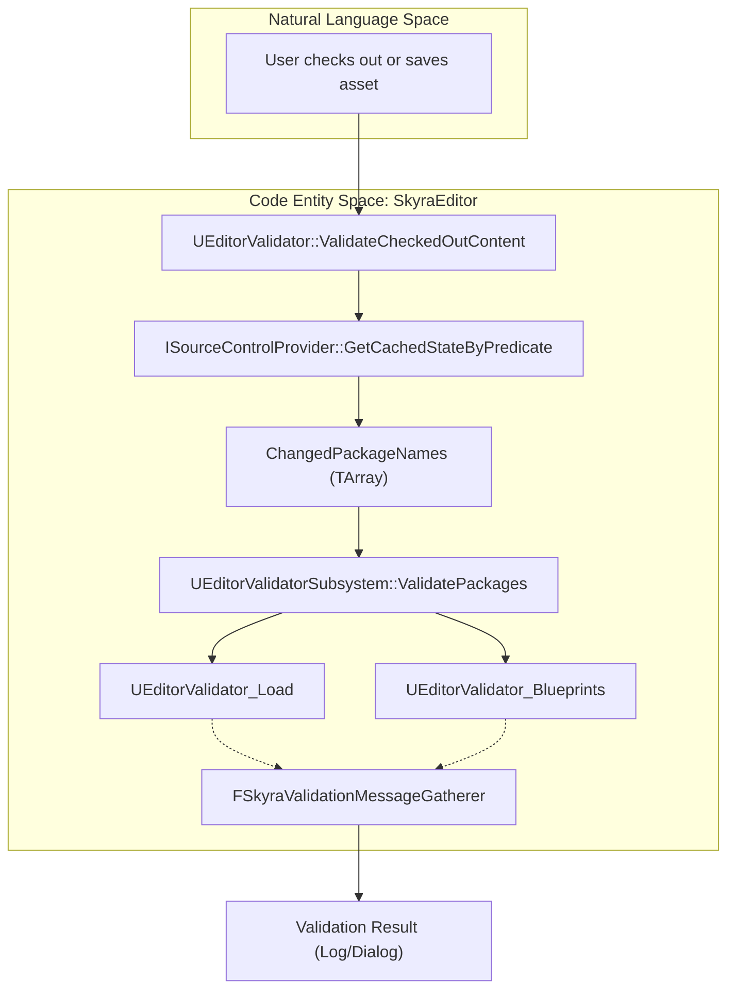
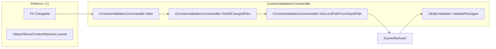

# Asset Validation Framework

Relevant source files

The following files were used as context for generating this wiki page:

- [.gitattributes](.gitattributes)

The Asset Validation Framework in SkyraFramework provides a robust, extensible system for ensuring content integrity across the project. It integrates with Unreal Engine's Data Validation plugin to perform checks during asset saving, manual "Check Content" actions, and automated CI/CD pipelines via a custom commandlet.

## Core Validation Architecture

The framework is built upon `UEditorValidator`, an abstract base class that extends `UEditorValidatorBase`. It provides static utility functions for batch validation and project-wide settings checks.

### UEditorValidator
This class serves as the central hub for validation logic. It handles the discovery of changed assets (including those affected by C++ header changes) and manages the execution of specific validator subclasses.

*   **Key Functionality**:
    *   `ValidateCheckedOutContent`: Identifies all files currently checked out in Source Control and runs validation on them [Source/SkyraEditor/Private/Validation/EditorValidator.cpp:42-159]().
    *   `ValidatePackages`: The core loop that loads assets and passes them through the validation subsystem [Source/SkyraEditor/Private/Validation/EditorValidator.cpp:161-300]().
    *   `GetChangedAssetsForCode`: Uses the Asset Registry to find assets that depend on specific C++ classes when a header file is modified [Source/SkyraEditor/Private/Validation/EditorValidator.cpp:387-466]().

### Message Gathering
The framework uses `FSkyraValidationMessageGatherer` to intercept log messages during validation. This allows the system to catch warnings or errors emitted by the engine during asset loading or processing that might not be explicitly returned by a validator.

| Class | Responsibility |
| :--- | :--- |
| `FSkyraValidationMessageGatherer` | A `FOutputDevice` that captures `ELogVerbosity::Warning` and `Error` during a scoped block [Source/SkyraEditor/Public/Validation/EditorValidator.h:11-78](). |
| `FScopedContentValidationMessageGatherer` | A specialized version used within the Commandlet to track if at least one error occurred [Source/SkyraEditor/Private/Commandlets/ContentValidationCommandlet.cpp:20-44](). |

**Sources:** [Source/SkyraEditor/Public/Validation/EditorValidator.h:11-108](), [Source/SkyraEditor/Private/Validation/EditorValidator.cpp:37-40]()

## Specialized Validators

SkyraFramework implements several specialized validators to handle different asset types and infrastructure requirements.

### EditorValidator_Load
This validator ensures that an asset can be loaded without emitting warnings or errors. 
*   **Implementation**: To avoid issues with assets already in memory, it copies the asset file to a `/Temp/` package, loads it, and monitors the output log via `FSkyraValidationMessageGatherer` [Source/SkyraEditor/Private/Validation/EditorValidator_Load.cpp:84-140]().
*   **Special Handling**: For Blueprints, it compiles the original before loading the duplicate to handle circular references [Source/SkyraEditor/Private/Validation/EditorValidator_Load.cpp:108-125]().

### EditorValidator_Blueprints
Focuses on Blueprint integrity. When "Full Validation" is enabled, it recursively finds all non-data-only Blueprints that hard-reference the current asset and validates them to ensure that changes didn't break their compilation [Source/SkyraEditor/Private/Validation/EditorValidator_Blueprints.cpp:35-107]().

### EditorValidator_MaterialFunctions
Similar to the Blueprint validator, when a `UMaterialFunction` is validated, this class finds all `UMaterial` assets that reference it and verifies they still compile correctly [Source/SkyraEditor/Private/Validation/EditorValidator_MaterialFunctions.cpp:32-95]().

### EditorValidator_SourceControl
Ensures that assets submitted to Source Control (Perforce) do not reference local-only assets. It queries the `ISourceControlProvider` to check the state of all package dependencies [Source/SkyraEditor/Private/Validation/EditorValidator_SourceControl.cpp:33-57]().

**Sources:** [Source/SkyraEditor/Private/Validation/EditorValidator_Load.cpp:23-140](), [Source/SkyraEditor/Private/Validation/EditorValidator_Blueprints.cpp:17-107](), [Source/SkyraEditor/Private/Validation/EditorValidator_SourceControl.cpp:15-57](), [Source/SkyraEditor/Private/Validation/EditorValidator_MaterialFunctions.cpp:32-95]()

## Validation Data Flow

The following diagram illustrates how the system transitions from a high-level request (like checking out a file) to specific code entities and validation results.

### Logic Flow: Source Control to Validation
Title: Validation Execution Pipeline

**Sources:** [Source/SkyraEditor/Private/Validation/EditorValidator.cpp:42-103](), [Source/SkyraEditor/Private/Validation/EditorValidator.cpp:161-186]()

## Content Validation Commandlet

`UContentValidationCommandlet` provides a headless entry point for CI/CD integration, specifically designed for Perforce (P4) environments.

### Execution Parameters
The commandlet supports several flags to determine which assets to validate:
*   `-P4Changelist=[CL]`: Validates files in a specific changelist [Source/SkyraEditor/Private/Commandlets/ContentValidationCommandlet.cpp:81-84]().
*   `-P4Opened`: Validates all files currently opened in the workspace [Source/SkyraEditor/Private/Commandlets/ContentValidationCommandlet.cpp:92-112]().
*   `-InPath=[Path]`: Validates all assets within a specific directory [Source/SkyraEditor/Private/Commandlets/ContentValidationCommandlet.cpp:129-132]().
*   `-OfType=[ClassName]`: Validates all assets of a specific class [Source/SkyraEditor/Private/Commandlets/ContentValidationCommandlet.cpp:135-141]().

### Path Mapping
The commandlet includes logic to map Perforce depot paths to Unreal Engine long package names (e.g., mapping `SkyraGame/Content/Items/` to `/Game/Items/`) [Source/SkyraEditor/Private/Commandlets/ContentValidationCommandlet.cpp:184-206]().

### CI/CD Pipeline Integration
Title: Commandlet Integration and Mapping

**Sources:** [Source/SkyraEditor/Private/Commandlets/ContentValidationCommandlet.cpp:51-90](), [Source/SkyraEditor/Private/Commandlets/ContentValidationCommandlet.cpp:174-206]()

## Summary Table of Key Functions

| Function | File | Description |
| :--- | :--- | :--- |
| `ValidatePackages` | `EditorValidator.cpp` | Static entry point that iterates through packages and triggers the validation subsystem [Source/SkyraEditor/Private/Validation/EditorValidator.cpp:161](). |
| `GetLoadWarningsAndErrorsForPackage` | `EditorValidator_Load.cpp` | Core logic for "side-loading" an asset into a temp package to check for load-time issues [Source/SkyraEditor/Private/Validation/EditorValidator_Load.cpp:64](). |
| `GetAllChangedFiles` | `ContentValidationCommandlet.cpp` | Executes P4 commands to retrieve a list of files to be validated in a CI context [Source/SkyraEditor/Private/Commandlets/ContentValidationCommandlet.cpp:174](). |
| `ValidateProjectSettings` | `EditorValidator.cpp` | Checks global project configurations (e.g., packaging settings) for common errors [Source/SkyraEditor/Private/Validation/EditorValidator.cpp:302](). |

**Sources:** [Source/SkyraEditor/Private/Validation/EditorValidator.cpp:161-300](), [Source/SkyraEditor/Private/Validation/EditorValidator_Load.cpp:64-185](), [Source/SkyraEditor/Private/Commandlets/ContentValidationCommandlet.cpp:174-240]()