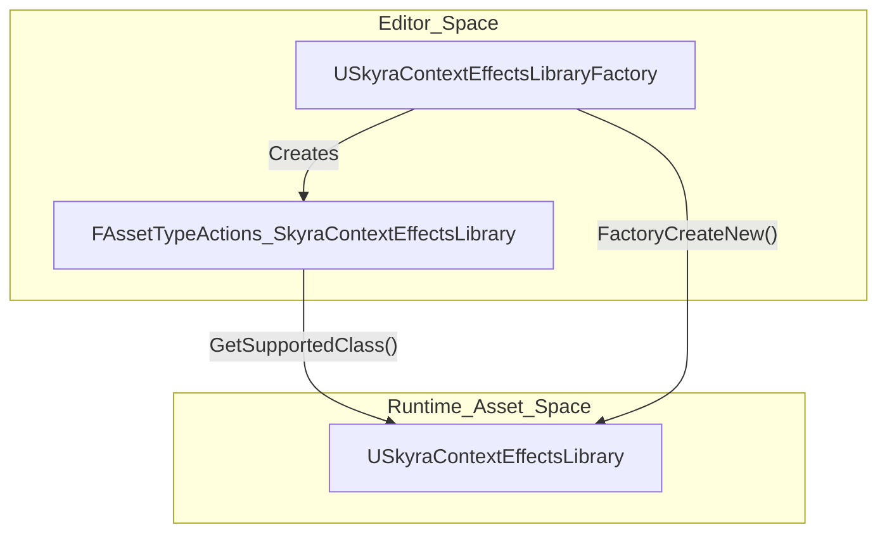
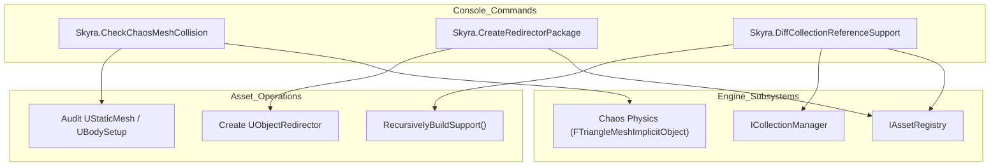

# Editor Utilities and Context Effects Asset Tools

Relevant source files

The following files were used as context for generating this wiki page:

- [.gitattributes](.gitattributes)

This page documents the editor-only utilities and asset pipeline extensions provided by the `SkyraEditor` module. These tools facilitate asset maintenance, collision debugging, and the creation of custom gameplay assets like the Context Effects Library.

## Context Effects Asset Pipeline

The Context Effects system requires specialized asset types to map gameplay tags and physical surfaces to specific visual or audio effects. The `SkyraEditor` module provides the necessary infrastructure to create and manage these assets within the Unreal Editor.

### USkyraContextEffectsLibraryFactory
This class enables the creation of new `USkyraContextEffectsLibrary` assets directly from the Content Browser's "New Asset" menu. It is configured to appear in the menu and automatically handles the instantiation of the library object [Source/SkyraEditor/Public/SkyraContextEffectsLibraryFactory.h:14-26]().

*   **Initialization**: The constructor sets the supported class to `USkyraContextEffectsLibrary` and enables `bCreateNew` [Source/SkyraEditor/Private/SkyraContextEffectsLibraryFactory.cpp:13-21]().
*   **Creation**: `FactoryCreateNew` performs the actual `NewObject` allocation for the library [Source/SkyraEditor/Private/SkyraContextEffectsLibraryFactory.cpp:23-28]().

### FAssetTypeActions_SkyraContextEffectsLibrary
This class defines how the Context Effects Library asset appears and behaves in the editor. It inherits from `FAssetTypeActions_Base` to provide standard asset functionality [Source/SkyraEditor/Public/AssetTypeActions_SkyraContextEffectsLibrary.h:10-18]().

*   **Categorization**: Assets are placed under the **Gameplay** category in the editor menus [Source/SkyraEditor/Public/AssetTypeActions_SkyraContextEffectsLibrary.h:17-17]().
*   **Visuals**: The asset is assigned a specific color (RGB: 65, 200, 98) for easy identification in the Content Browser [Source/SkyraEditor/Public/AssetTypeActions_SkyraContextEffectsLibrary.h:15-15]().

### Context Effects Asset Creation Flow
The following diagram illustrates the relationship between the Editor Factory and the resulting Runtime Asset.

**Diagram: Context Effects Asset Entity Mapping**

**Sources:** [Source/SkyraEditor/Private/SkyraContextEffectsLibraryFactory.cpp:13-28](), [Source/SkyraEditor/Private/AssetTypeActions_SkyraContextEffectsLibrary.cpp:11-14]()

---

## Editor Utility Tools

The `SkyraEditor` module includes several console-driven utilities to assist developers with asset auditing and maintenance. These are registered as `FAutoConsoleCommandWithWorldArgsAndOutputDevice` commands.

### Chaos Mesh Collision Checker
The `Skyra.CheckChaosMeshCollision` command audits all currently loaded `UStaticMesh` assets for degenerate triangles in their Chaos physics data. Degenerate triangles (triangles with zero area) can cause instability or crashes in the physics engine [Source/SkyraEditor/Private/Utilities/CheckChaosMeshCollision.cpp:74-84]().

*   **Logic**: It iterates through `TObjectRange<UStaticMesh>`, accesses the `UBodySetup`, and retrieves the `FTriangleMeshImplicitObject` [Source/SkyraEditor/Private/Utilities/CheckChaosMeshCollision.cpp:56-71]().
*   **Validation**: The `CheckMeshDataForProblem` function calculates the normal of each triangle using a cross product of its edges. If the normalized result is less than `SMALL_NUMBER`, the triangle is flagged as degenerate [Source/SkyraEditor/Private/Utilities/CheckChaosMeshCollision.cpp:17-52]().

### Redirector Package Creator
The `Skyra.CreateRedirectorPackage` command allows developers to programmatically create `UObjectRedirector` assets. This is useful for fixing broken references or moving assets without breaking existing dependencies [Source/SkyraEditor/Private/Utilities/CreateRedirectorPackage.cpp:15-19]().

*   **Parameters**: Requires a `RedirectorName` (the path where the redirector will be created) and a `TargetPackage` (the asset it should point to) [Source/SkyraEditor/Private/Utilities/CreateRedirectorPackage.cpp:31-32]().
*   **Implementation**: It creates a new `UPackage`, instantiates a `UObjectRedirector` within it, and sets the `DestinationObject` to the target asset [Source/SkyraEditor/Private/Utilities/CreateRedirectorPackage.cpp:56-61]().

### Collection Reference Support Diff
The `Skyra.DiffCollectionReferenceSupport` command provides a deep analysis of asset dependencies between two Editor Collections. It identifies which assets in an "Old" collection are supporting (referencing) assets introduced in a "New" collection [Source/SkyraEditor/Private/Utilities/DiffCollectionReferenceSupport.cpp:14-22]().

*   **Recursive Analysis**: The tool uses `RecursivelyBuildSupport` to traverse the reference graph via the `IAssetRegistry`. It identifies both direct and indirect referencers [Source/SkyraEditor/Private/Utilities/DiffCollectionReferenceSupport.cpp:73-104]().
*   **Deduplication**: An optional third parameter allows users to deduplicate assets that are supported by multiple sources, helping identify the "strongest" supporters [Source/SkyraEditor/Private/Utilities/DiffCollectionReferenceSupport.cpp:41-41]().
*   **Output**: Logs a sorted list of supporter assets and a list of "loose" assets in the new collection that have no referencers in the old collection [Source/SkyraEditor/Private/Utilities/DiffCollectionReferenceSupport.cpp:124-167]().

---

## Utility Data Flow

The following diagram demonstrates how the Editor Utilities interact with the Unreal Engine's core systems (Asset Registry, Chaos Physics) to perform audits and modifications.

**Diagram: Editor Utility System Interactions**

**Sources:** [Source/SkyraEditor/Private/Utilities/CheckChaosMeshCollision.cpp:56-72](), [Source/SkyraEditor/Private/Utilities/CreateRedirectorPackage.cpp:22-23](), [Source/SkyraEditor/Private/Utilities/DiffCollectionReferenceSupport.cpp:26-27](), [Source/SkyraEditor/Private/Utilities/DiffCollectionReferenceSupport.cpp:73-74]()

### Summary of Commands

| Command | Purpose | Key File |
| :--- | :--- | :--- |
| `Skyra.CheckChaosMeshCollision` | Finds degenerate triangles in loaded Static Mesh collision. | [Source/SkyraEditor/Private/Utilities/CheckChaosMeshCollision.cpp]() |
| `Skyra.CreateRedirectorPackage` | Creates a redirector asset pointing to a target package. | [Source/SkyraEditor/Private/Utilities/CreateRedirectorPackage.cpp]() |
| `Skyra.DiffCollectionReferenceSupport` | Analyzes dependency relationships between two collections. | [Source/SkyraEditor/Private/Utilities/DiffCollectionReferenceSupport.cpp]() |

**Sources:** [Source/SkyraEditor/Private/Utilities/CheckChaosMeshCollision.cpp:74-75](), [Source/SkyraEditor/Private/Utilities/CreateRedirectorPackage.cpp:15-16](), [Source/SkyraEditor/Private/Utilities/DiffCollectionReferenceSupport.cpp:14-15]()