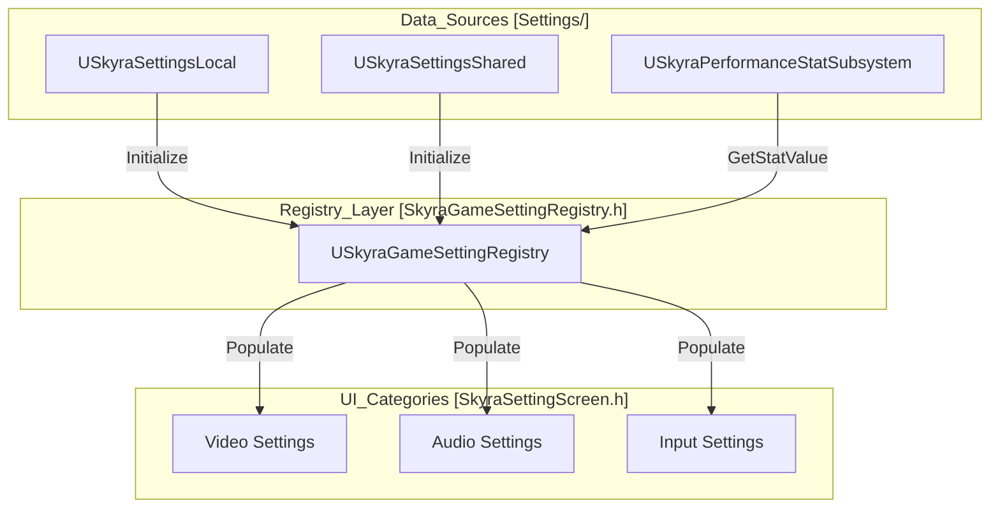
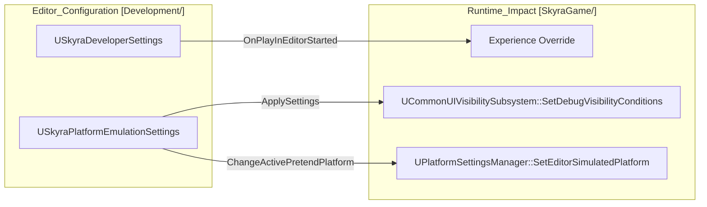

# Performance, Settings, and Infrastructure

Relevant source files

The following files were used as context for generating this wiki page:

- [.gitattributes](.gitattributes)

This section provides a high-level overview of the cross-cutting systems that support the SkyraFramework's operational stability and user configuration. These systems handle everything from low-level performance tracking and physics interactions to high-level user preferences and live service hotfixes.

The infrastructure is designed to be modular, allowing for platform-specific overrides (e.g., mobile vs. PC settings) and robust development tools for testing varied network and hardware environments.

## Performance and Settings Systems

The settings architecture in SkyraFramework is split into local, shared, and data-driven registry components. This separation ensures that hardware-specific scalability settings (Local) are managed independently from user preferences like audio volume or gameplay toggles (Shared).

### System Overview
- **`USkyraSettingsLocal`**: Manages machine-specific data, including video scalability, custom input mappings, and device profiles. It handles the application of "Scalability Snapshots" to ensure consistent performance across different hardware tiers.
- **`USkyraSettingsShared`**: Stores per-user preferences that are intended to follow the player across different devices, such as subtitles, sensitivity, and colorblind modes.
- **`USkyraPerformanceStatSubsystem`**: A runtime subsystem used to track and display performance metrics (FPS, Latency, Memory) directly in the UI.
- **`USkyraGameSettingRegistry`**: The central authority for exposing settings to the UI. It categorizes settings into Audio, Video, Gameplay, Mouse/Keyboard, and Gamepad, providing a unified API for the settings screen to query and modify values.

For details on how these settings are registered and applied, see **[Performance and Settings Systems](#12.1)**.

### Settings Infrastructure Map
The following diagram illustrates how the different settings classes interact with the `USkyraGameSettingRegistry` to bridge the gap between local data and the user interface.

---

## Hotfix, Replays, and Development Tools

SkyraFramework includes a suite of tools designed for live operations and developer productivity. This includes a hotfix system for remote configuration updates and a replay subsystem for match review.

### Key Components
- **Hotfix System**: Managed by `USkyraHotfixManager`, this system allows the game to receive updates to `USkyraRuntimeOptions` and `USkyraTextHotfixConfig` without requiring a full binary patch. This is critical for adjusting balance variables or disabling broken features in a live environment.
- **Replay Subsystem**: `USkyraReplaySubsystem` facilitates the recording and playback of game sessions. It utilizes `UAsyncAction_QueryReplays` to asynchronously fetch available replays for the UI.
- **Developer Settings**: `USkyraDeveloperSettings` provides a centralized location for editor-only overrides, such as forcing a specific `USkyraExperienceDefinition` during PIE (Play In Editor) sessions.
- **Platform Emulation**: `USkyraPlatformEmulationSettings` allows developers to "pretend" to be on a different platform (e.g., emulating a mobile device on a PC) to test UI visibility and platform-specific traits.

For details on runtime configuration and debugging tools, see **[Hotfix, Replays, and Development Tools](#12.2)**.

### Development Infrastructure Flow
This diagram shows how developer settings and platform emulation affect the runtime environment during testing, mapping editor-only configurations to runtime behavior.

### Physics and Materials
The framework extends Unreal's physics system using `USkyraPhysicalMaterialWithTags`. This allows physical materials to carry Gameplay Tags, which the `USkyraContextEffectsSubsystem` uses to trigger surface-aware audio and visual effects (e.g., different footstep sounds for "Grass" vs. "Metal").

| Class | Responsibility |
| :--- | :--- |
| `USkyraHotfixManager` | Fetches and applies remote patches to data assets. |
| `USkyraRuntimeOptions` | Data-driven toggles for game features (e.g., enabling/disabling a specific map). |
| `USkyraReplaySubsystem` | High-level API for starting/stopping replays. |
| `USkyraPlatformEmulationSettings` | Configures `PretendPlatform` and `PretendBaseDeviceProfile`. |

**Sources:** `.gitattributes:1-4` (Infrastructure/LFS configuration)