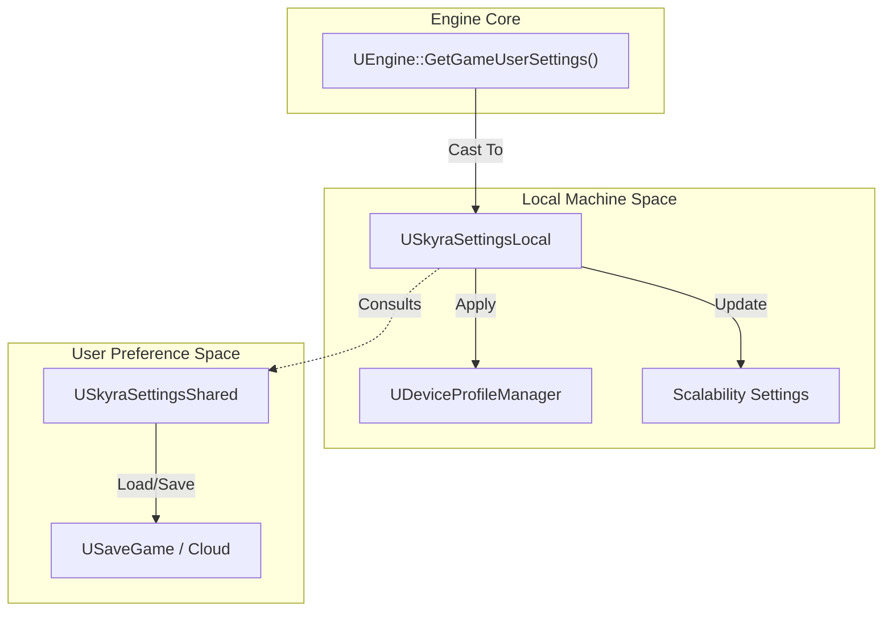
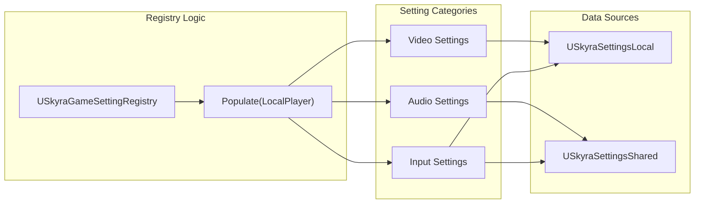

# Performance and Settings Systems

Relevant source files

The following files were used as context for generating this wiki page:

- [.gitattributes](.gitattributes)

The SkyraFramework provides a robust, multi-layered infrastructure for managing hardware scalability, user preferences, and real-time performance monitoring. This system separates transient local hardware configurations from persistent user-specific account settings, while providing a unified registry for exposing these options to the UI.

## Performance Statistics Subsystem

The `USkyraPerformanceStatSubsystem` is responsible for tracking and broadcasting real-time performance metrics (e.g., FPS, Frame Time, Latency). It acts as a central hub where various engine-level stats are sampled and then piped to the UI through a delegate-based system.

### Key Components
- **Stat Tracking**: It monitors specific `ESkyraDisplayablePerformanceStat` enum values.
- **Data Flow**: The subsystem samples values during `Tick` and triggers `OnStatChanged` delegates for any active listeners (typically UI widgets).

### Performance Settings
Global performance configuration is defined in `USkyraPerformanceSettings`. This data asset allows developers to categorize performance stats and define which stats are available for display in different build configurations.

Sources: [Source/SkyraGame/Private/Performance/SkyraPerformanceSettings.cpp:1-10](), [Source/SkyraGame/Private/Performance/SkyraPerformanceStatSubsystem.cpp:1-15]()

## Settings Architecture

Skyra splits settings into two primary categories to handle the difference between "how the game runs on this machine" and "how this specific user likes to play."

### SkyraSettingsLocal
`USkyraSettingsLocal` inherits from `UGameUserSettings`. It handles machine-specific data that should not be synced across different devices (e.g., PC vs. Console).
- **Scalability Snapshots**: Manages resolution scale, shadow quality, and view distance.
- **Device Profiles**: Integrates with Unreal's `UDeviceProfileManager` to apply platform-specific optimizations.
- **Input Mappings**: Stores local keybind overrides and sensitivity settings.

### SkyraSettingsShared
`USkyraSettingsShared` handles persistent user preferences that are intended to follow a user account across different devices.
- **Audio/Video Preferences**: Subtitles, colorblind modes, and volume levels.
- **Gameplay Toggles**: "Auto-run" or "Hold to Crouch" preferences.
- **Data Serialization**: Uses `USaveGame` to persist data to the local disk or cloud storage.

### Data Flow: Settings Initialization
The following diagram illustrates how the settings system initializes and interfaces with the Unreal Engine hardware layer.

**Settings Initialization and Hardware Interaction**

Sources: [Source/SkyraGame/Private/Settings/SkyraSettingsLocal.cpp:1-50](), [Source/SkyraGame/Private/Settings/SkyraSettingsShared.cpp:1-30]()

## Game Setting Registry

The `USkyraGameSettingRegistry` serves as the bridge between the raw data in `SkyraSettingsLocal/Shared` and the UI. It organizes settings into logical categories (Video, Audio, Gameplay, etc.) and provides `UGameSetting` objects that the UI can automatically generate widgets for.

### Per-Category Registries
The registry populates itself by querying specialized providers for each category:
- **Audio**: Volume sliders and output device selection.
- **Video**: Display mode, VSync, and frame rate limits.
- **Gamepad/Mouse & Keyboard**: Sensitivity, inversion, and key remapping.
- **Performance Stats**: Toggles for showing FPS or Net Debug info.

**Registry Entity Mapping**

Sources: [Source/SkyraGame/Private/Settings/SkyraGameSettingRegistry.cpp:1-100]()

## Development and Emulation Tools

For testing performance across various hardware tiers without physical access to multiple devices, Skyra includes developer-only settings.

### SkyraDeveloperSettings
The `USkyraDeveloperSettings` class provides editor-only overrides for testing specific gameplay scenarios.
- **Experience Overrides**: Forces a specific `USkyraExperienceDefinition` to load regardless of the map's default [Source/SkyraGame/Private/Development/SkyraDeveloperSettings.cpp:50-58]().
- **Notification System**: Triggers Slate notifications when overrides are active to prevent accidental "dirty" testing [Source/SkyraGame/Private/Development/SkyraDeveloperSettings.cpp:52-57]().

### SkyraPlatformEmulationSettings
The `USkyraPlatformEmulationSettings` allows developers to simulate different platforms (e.g., mobile or console) directly within the PC editor.
- **Pretend Platform**: Uses `UPlatformSettingsManager::SetEditorSimulatedPlatform` to trick the engine into using platform-specific logic [Source/SkyraGame/Private/Development/SkyraPlatformEmulationSettings.cpp:110-111]().
- **Trait Overrides**: Manages `AdditionalPlatformTraitsToEnable` and `AdditionalPlatformTraitsToSuppress` which interface with the `UCommonUIVisibilitySubsystem` to hide/show UI elements based on the emulated platform [Source/SkyraGame/Private/Development/SkyraPlatformEmulationSettings.cpp:95-96]().
- **Device Profile Selection**: Automatically picks a "reasonable" base device profile (e.g., picking the shortest matching name for the platform) to apply scalability settings [Source/SkyraGame/Private/Development/SkyraPlatformEmulationSettings.cpp:161-193]().

Sources: [Source/SkyraGame/Private/Development/SkyraDeveloperSettings.cpp:12-60](), [Source/SkyraGame/Private/Development/SkyraPlatformEmulationSettings.cpp:35-113](), [Source/SkyraGame/Private/Development/SkyraPlatformEmulationSettings.cpp:161-193]()