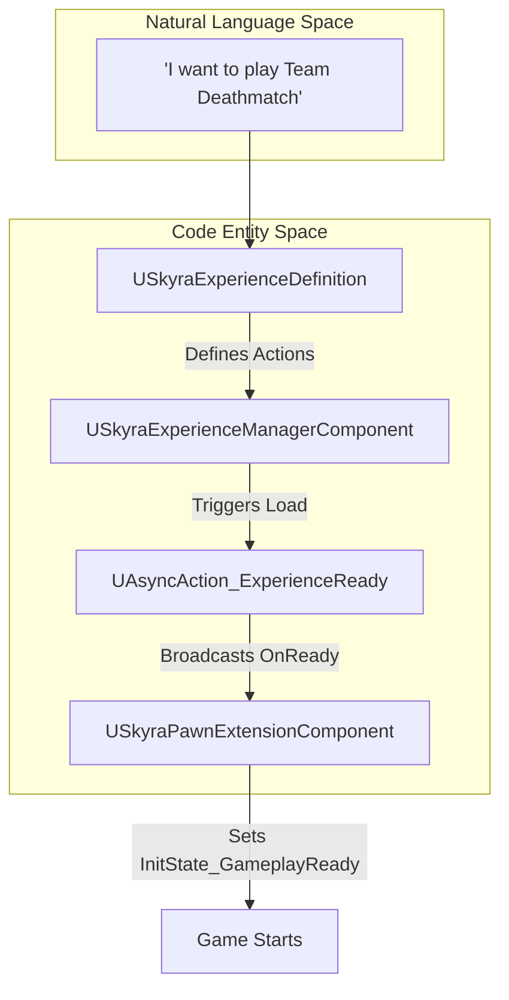
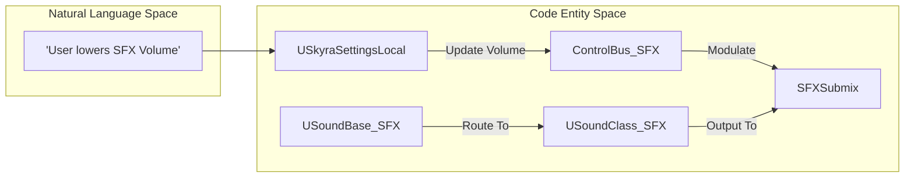

# Glossary

Relevant source files

The following files were used as context for generating this wiki page:

- [.gitattributes](.gitattributes)
- [.gitignore](.gitignore)
- [Content/Assets/Audio/AttenuationPresets/ATT_Amb_Pad.uasset](Content/Assets/Audio/AttenuationPresets/ATT_Amb_Pad.uasset)
- [Content/Assets/Audio/AttenuationPresets/ATT_Default.uasset](Content/Assets/Audio/AttenuationPresets/ATT_Default.uasset)
- [Content/Assets/Audio/AttenuationPresets/ATT_Foley.uasset](Content/Assets/Audio/AttenuationPresets/ATT_Foley.uasset)
- [Content/Assets/Audio/AttenuationPresets/ATT_Footstep_NPC.uasset](Content/Assets/Audio/AttenuationPresets/ATT_Footstep_NPC.uasset)
- [Content/Assets/Audio/Classes/Overall.uasset](Content/Assets/Audio/Classes/Overall.uasset)
- [Content/Assets/Audio/Classes/SFX.uasset](Content/Assets/Audio/Classes/SFX.uasset)
- [Content/Assets/Audio/Concurrency/SCON_Footsteps.uasset](Content/Assets/Audio/Concurrency/SCON_Footsteps.uasset)
- [Content/Assets/Audio/MetaSounds/lib_WhizBy.uasset](Content/Assets/Audio/MetaSounds/lib_WhizBy.uasset)
- [Content/Assets/Audio/MetaSounds/mx_System.uasset](Content/Assets/Audio/MetaSounds/mx_System.uasset)

This glossary defines the technical terms, abbreviations, and domain-specific concepts used throughout the SkyraFramework codebase. It provides a bridge between high-level gameplay concepts and their low-level C++ implementations, including infrastructure and audio terminology.

## Core Framework Concepts

### Experience
A data-driven definition of a game mode. Unlike standard Unreal Engine `AGameMode`, an Experience is defined by a `USkyraExperienceDefinition` data asset which specifies the pawn data, actions to take on load (like adding Game Features), and the game flow logic.
*   **Implementation**: `USkyraExperienceDefinition` [Source/SkyraGame/Private/GameModes/SkyraExperienceDefinition.h]()
*   **Management**: Handled by the `USkyraExperienceManagerComponent` attached to the `ASkyraGameState`.
*   **Loading**: Asynchronous loading is facilitated by `UAsyncAction_ExperienceReady` [Source/SkyraGame/Private/GameModes/AsyncAction_ExperienceReady.cpp:17-29]().

### Pawn Data
A configuration object (`USkyraPawnData`) that defines the "identity" of a pawn, including its base class, the `USkyraAbilitySet` to grant, and the `USkyraInputConfig` to use for mapping player input to gameplay tags.
*   **Implementation**: `USkyraPawnData` [Source/SkyraGame/Private/Character/SkyraPawnData.h]()
*   **Usage**: Assigned to pawns via the `USkyraPawnExtensionComponent::SetPawnData` function [Source/SkyraGame/Private/Character/SkyraPawnExtensionComponent.cpp:76-98]().

### Initialization State (Init State)
A state-machine pattern used to synchronize the readiness of modular components on an Actor. Components register with the `UGameFrameworkComponentManager` and progress through tags like `InitState_Spawned` and `InitState_GameplayReady`.
*   **Key Component**: `USkyraPawnExtensionComponent` [Source/SkyraGame/Private/Character/SkyraPawnExtensionComponent.cpp:213-222]().

## Gameplay Ability System (GAS) Extensions

### Ability Activation Policy
Determines how a `USkyraGameplayAbility` starts.
*   **OnInputTriggered**: Activates when the input button is first pressed.
*   **WhileInputActive**: Activates on press and cancels when the input is released.
*   **OnSpawn**: Activates automatically when the actor is spawned/initialized.
*   **Implementation**: `ESkyraAbilityActivationPolicy` [Source/SkyraGame/Private/AbilitySystem/Abilities/SkyraGameplayAbility.h]().

### Ability Tag Relationship Mapping
A data asset (`USkyraAbilityTagRelationshipMapping`) that defines how gameplay tags interact with each other globally (e.g., "Tag A blocks Tag B" or "Tag C cancels Tag D").
*   **Implementation**: `USkyraAbilityTagRelationshipMapping` [Source/SkyraGame/Private/AbilitySystem/SkyraAbilityTagRelationshipMapping.h]().
*   **Usage**: Applied to the `USkyraAbilitySystemComponent` during pawn initialization [Source/SkyraGame/Private/Character/SkyraPawnExtensionComponent.cpp:144-147]().

### Game Phase
A specialized gameplay ability (`USkyraGamePhaseAbility`) that represents a high-level state of the game (e.g., "Warmup", "Playing", "GameOver"). Phases can be nested using gameplay tags.
*   **Subsystem**: `USkyraGamePhaseSubsystem` manages the starting and ending of phases [Source/SkyraGame/Private/AbilitySystem/Phases/SkyraGamePhaseSubsystem.cpp:50-70]().

### Global Ability System
A world subsystem that allows applying gameplay effects or granting abilities to all registered Ability System Components (ASCs) in the world simultaneously.
*   **Implementation**: `USkyraGlobalAbilitySystem` [Source/SkyraGame/Private/AbilitySystem/SkyraGlobalAbilitySystem.h]().
*   **Registration**: ASCs register themselves during `InitAbilityActorInfo` [Source/SkyraGame/Private/AbilitySystem/SkyraAbilitySystemComponent.cpp:79-83]().

## Equipment and Inventory

### Equipment Definition vs. Instance
*   **Equipment Definition (`USkyraEquipmentDefinition`)**: A static data asset describing what an item is, what actors it spawns, and what abilities it grants [Source/SkyraGame/Private/Equipment/SkyraEquipmentDefinition.h]().
*   **Equipment Instance (`USkyraEquipmentInstance`)**: A spawned UObject representing a specific piece of equipment currently owned by a pawn. It manages the lifecycle of physical actors (meshes) in the world [Source/SkyraGame/Private/Equipment/SkyraEquipmentInstance.h]().

### Context Effects
A system for triggering feedback (Niagara particles or Sounds) based on a "Context" (e.g., Surface Type) and an "Effect" (e.g., Footstep).
*   **Library**: `USkyraContextEffectsLibrary` stores the mappings [Source/SkyraGame/Private/Feedback/ContextEffects/SkyraContextEffectsLibrary.h]().
*   **Triggering**: Usually performed via `AnimNotify_SkyraContextEffects`.

## Audio and Feedback Terms

### MetaSound
A high-performance audio graph system used for procedural sound generation and complex logic.
*   **Examples**: `mx_System` [Content/Assets/Audio/MetaSounds/mx_System.uasset:1-4](), `lib_WhizBy` [Content/Assets/Audio/MetaSounds/lib_WhizBy.uasset:1-4]().

### Attenuation
Defines how sound volume and spatialization change based on the distance between the listener and the sound source.
*   **Presets**: `ATT_Default` [Content/Assets/Audio/AttenuationPresets/ATT_Default.uasset:1-4](), `ATT_Foley` [Content/Assets/Audio/AttenuationPresets/ATT_Foley.uasset:1-4]().

### Concurrency
Settings that control how many instances of a specific sound can play simultaneously to prevent audio clutter and performance issues.
*   **Example**: `SCON_Footsteps` [Content/Assets/Audio/Concurrency/SCON_Footsteps.uasset:1-4]().

### Submix and Control Bus
*   **Submix**: An audio endpoint where multiple sounds are summed together for group processing (e.g., applying reverb to all SFX).
*   **Control Bus (CB)**: A modulation source used to drive parameters across multiple sounds or submixes (e.g., a volume slider in settings).

### Foley
Sound effects representing the incidental movement of a character, such as clothing rustle or gear rattling.
*   **Attenuation**: `ATT_Foley` [Content/Assets/Audio/AttenuationPresets/ATT_Foley.uasset:1-4]().

## System Architecture Diagrams

### Experience Loading Data Flow
This diagram shows how the system transitions from a requested Experience to a fully initialized Gameplay state.

**Sources**: [Source/SkyraGame/Private/GameModes/AsyncAction_ExperienceReady.cpp:61-82](), [Source/SkyraGame/Private/Character/SkyraPawnExtensionComponent.cpp:213-222]()

### Audio Routing and Control
Mapping the conceptual "Adjusting SFX Volume" to the internal engine and framework entities.

**Sources**: [Content/Assets/Audio/Classes/SFX.uasset:1-4](), [Source/SkyraGame/Private/Settings/SkyraSettingsLocal.h]()

## Technical Abbreviations and Infrastructure

| Abbreviation | Full Name | Description |
| :--- | :--- | :--- |
| **ASC** | Ability System Component | The core component of Unreal's Gameplay Ability System [Source/SkyraGame/Private/AbilitySystem/SkyraAbilitySystemComponent.h](). |
| **CDO** | Class Default Object | The default instance of a class, used for template data. |
| **DDC** | Derived Data Cache | A cache used by Unreal to store versions of assets in formats optimized for specific platforms. |
| **LFS** | Large File Storage | Git extension for handling large binary files like `.uasset` [ .gitattributes:3-3](). |
| **UBT / UHT** | Unreal Build Tool / Header Tool | Tools responsible for compiling the C++ code and generating reflection data. |
| **GE / GA** | Gameplay Effect / Ability | Core GAS primitives for logic and attribute modification. |
| **PIE** | Play In Editor | Running the game within the Unreal Editor environment. |

## Plugin Dependencies
The SkyraFramework relies on several modular plugins to provide its core functionality.
*   **ModularGameplay**: Provides the `GameFrameworkComponentManager` used for Init States.
*   **GameplayAbilities**: The foundation for the GAS implementation.
*   **GameFeatures**: Used by Experiences to toggle modular content.
*   **CommonUI**: Foundation for the cross-platform UI system.

**Sources**: [SkyraFramework.uplugin:29-138]()