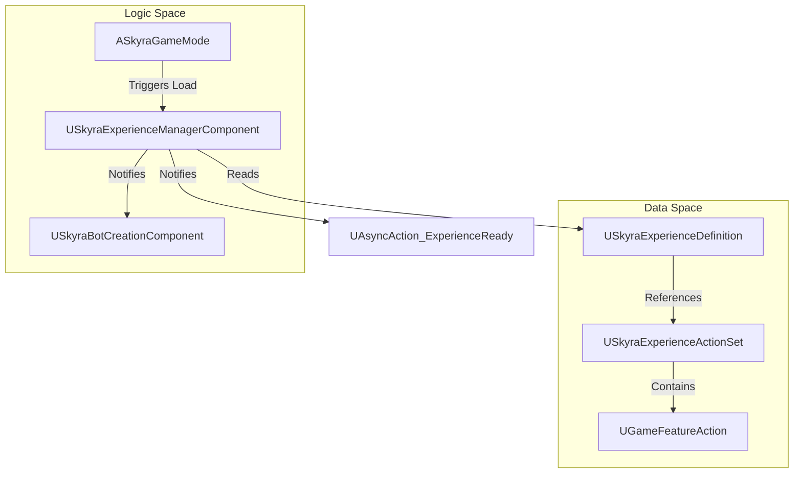
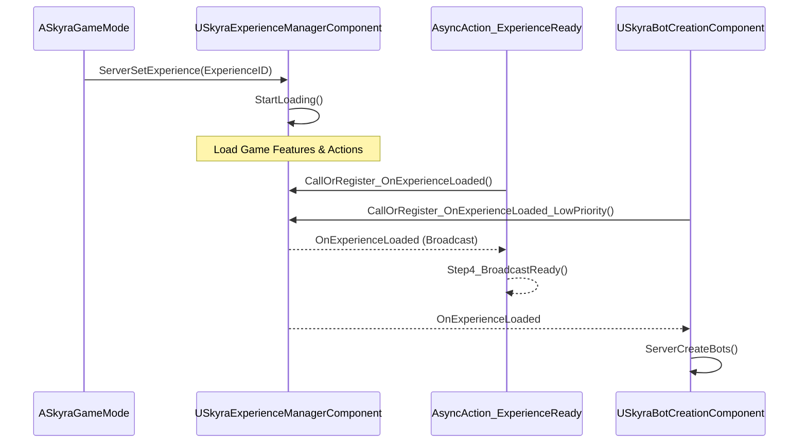

# Experience and Game Mode System

Relevant source files

The following files were used as context for generating this wiki page:

- [.gitattributes](.gitattributes)

The **Experience and Game Mode System** in SkyraFramework is a data-driven architecture that decouples game logic from the traditional `AGameMode` class. Instead of creating numerous C++ or Blueprint subclasses of a Game Mode for different match types, Skyra uses **Experiences** (`USkyraExperienceDefinition`) to define the rules, features, and assets required for a specific gameplay session.

This system leverages the **Modular Gameplay** and **Game Features** plugins to dynamically load and unload content, allowing for a highly flexible and asynchronous initialization pipeline.

## Core Architecture

The system transitions from a static Game Mode structure to a dynamic, component-based loading flow. The `ASkyraGameMode` acts as a shell that triggers the loading of a specific Experience, which then populates the world with necessary components and rules.

### System Overview Diagram

**Sources:** [Source/SkyraGame/Private/GameModes/SkyraExperienceActionSet.cpp:24-38](), [Source/SkyraGame/Private/GameModes/AsyncAction_ExperienceReady.cpp:61-82]()

## Key Components

### Experience Definition
The `USkyraExperienceDefinition` is the primary data asset that defines a game mode. It contains lists of `UGameFeatureAction` objects and references to `USkyraExperienceActionSet` assets. These define everything from the HUD widgets to the specific Gameplay Abilities granted to players.
* For details, see [Experience Definition and Loading](#2.1).

### Game Mode and State
`ASkyraGameMode` is the entry point. It handles the initial request to load an experience and manages player spawning. It works alongside `ASkyraGameState`, which hosts the `USkyraExperienceManagerComponent`.
* For details, see [Game Mode, Game State, and World Settings](#2.2).

### Experience Manager Component
`USkyraExperienceManagerComponent` (attached to `ASkyraGameState`) manages the actual state machine of loading an experience. It handles the asynchronous loading of assets and the activation of Game Features.
* For details, see [Experience Definition and Loading](#2.1).

## Initialization Pipeline

Skyra uses an asynchronous pipeline to ensure that all assets (Game Features, Ability Sets, etc.) are fully loaded before gameplay begins. This is often managed via `UAsyncAction_ExperienceReady`, which allows UI or other systems to wait for the environment to be fully prepared.

### Loading Flow Diagram

**Sources:** [Source/SkyraGame/Private/GameModes/AsyncAction_ExperienceReady.cpp:61-94](), [Source/SkyraGame/Private/GameModes/SkyraBotCreationComponent.cpp:21-32]()

## Sub-Systems

### Bot Creation
The `USkyraBotCreationComponent` integrates with the experience system to spawn AI players once the experience is ready. It supports developer overrides for bot counts and utilizes the `ASkyraGameMode` for standardized pawn initialization.
* **Key Function:** `ServerCreateBots` [Source/SkyraGame/Private/GameModes/SkyraBotCreationComponent.cpp:44-78]()
* **Initialization:** Listens for `OnExperienceLoaded` before spawning [Source/SkyraGame/Private/GameModes/SkyraBotCreationComponent.cpp:21-30]().

### Game Feature Actions
Actions are the modular building blocks of an experience. `USkyraExperienceActionSet` acts as a container for these actions, allowing common sets of functionality (like "Base Combat Rules") to be shared across multiple experiences.
* **Data Validation:** The system includes editor-side validation to ensure all actions in a set are valid [Source/SkyraGame/Private/GameModes/SkyraExperienceActionSet.cpp:19-42]().
* For details, see [Game Features and Actions](#2.3).

## Child Pages
* **[Experience Definition and Loading](#2.1)**: Deep dive into the loading state machine and asset bundling.
* **[Game Mode, Game State, and World Settings](#2.2)**: Details on pawn spawning and world-specific configurations.
* **[Game Features and Actions](#2.3)**: Documentation on specific actions like adding abilities, widgets, and input mappings.