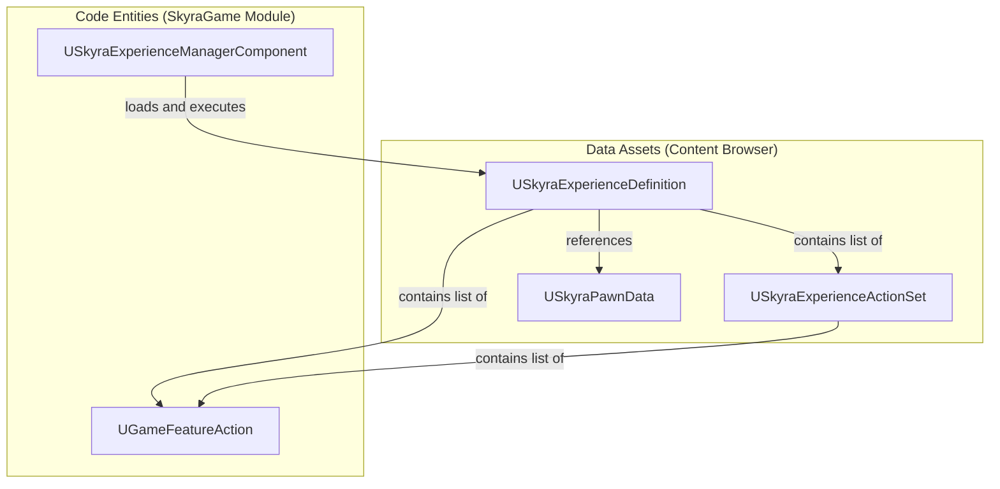
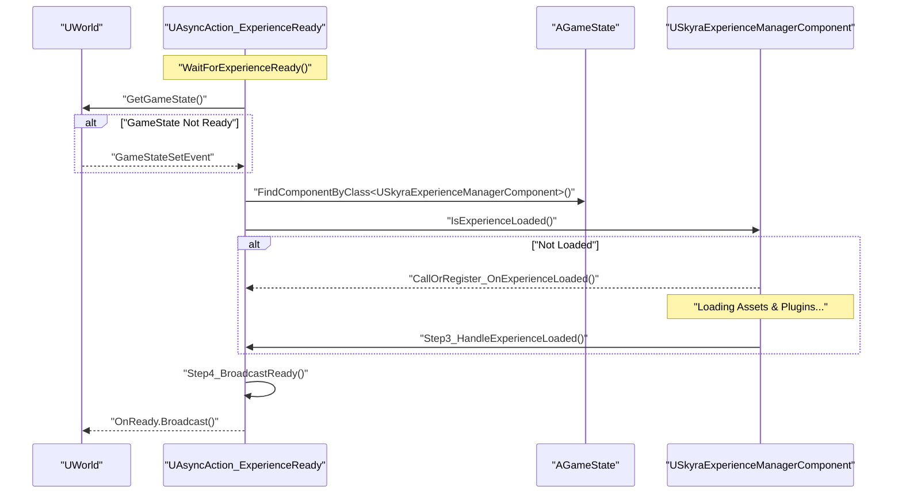

# Experience Definition and Loading

Relevant source files

The following files were used as context for generating this wiki page:

- [.gitattributes](.gitattributes)

The Experience system in SkyraFramework is a data-driven architecture that defines the rules, content, and capabilities of a game session. Unlike traditional Unreal Engine development where logic is often hardcoded into `AGameMode`, Skyra uses `USkyraExperienceDefinition` to orchestrate the activation of Game Features, the spawning of pawns, and the configuration of the Gameplay Ability System (GAS).

## Core Data Structures

The system relies on three primary data assets to define what a "game" consists of.

### USkyraExperienceDefinition
This is the top-level asset that describes a complete game experience. It acts as a manifest for everything that needs to be loaded and initialized.
*   **Game Features**: A list of Game Feature Plugins that must be activated for this experience [Source/SkyraGame/Public/GameModes/SkyraExperienceDefinition.h:38-39]().
*   **Action Sets**: References to `USkyraExperienceActionSet` assets that contain modular rules [Source/SkyraGame/Public/GameModes/SkyraExperienceDefinition.h:45-46]().
*   **Actions**: Inline `UGameFeatureAction` list for experience-specific logic [Source/SkyraGame/Public/GameModes/SkyraExperienceDefinition.h:42-43]().
*   **Default Pawn Data**: Defines the default pawn class and associated GAS data for the experience [Source/SkyraGame/Public/GameModes/SkyraExperienceDefinition.h:35-36]().

### USkyraExperienceActionSet
Action Sets allow for reusable groups of `UGameFeatureAction` entities. This is useful for sharing common functionality (e.g., "Standard Shooter UI" or "Inventory System") across multiple experiences [Source/SkyraGame/Public/GameModes/SkyraExperienceActionSet.h:17-18]().
*   **Validation**: The class includes editor-time validation to ensure no null entries exist in the action list [Source/SkyraGame/Private/GameModes/SkyraExperienceActionSet.cpp:19-41]().
*   **Asset Bundles**: It supports asset bundle updates to ensure all referenced assets in the actions are correctly cooked and loaded [Source/SkyraGame/Private/GameModes/SkyraExperienceActionSet.cpp:45-56]().

### Data Entity Relationship
The following diagram illustrates how these data assets associate with code entities.

**Experience Data Mapping**

Sources: [Source/SkyraGame/Public/GameModes/SkyraExperienceDefinition.h:17-50](), [Source/SkyraGame/Public/GameModes/SkyraExperienceActionSet.h:17-27]()

---

## Experience Manager Component

The `USkyraExperienceManagerComponent` is the engine room of the system. It is attached to the `AGameState` and manages the lifecycle of the current experience, including the asynchronous loading of assets and the activation of Game Features.

### Loading Flow
The component handles the transition from a "No Experience" state to a "Fully Loaded" state.
1.  **Experience Identification**: The Game Mode determines which experience to load.
2.  **Asset Loading**: The manager uses the `USkyraAssetManager` to load the `USkyraExperienceDefinition` and all referenced `UGameFeatureAction` assets.
3.  **Feature Activation**: It interfaces with the `UGameFeaturesSubsystem` to load and activate the required plugins.
4.  **Action Execution**: It iterates through all actions (both inline and from Action Sets) to apply gameplay changes.

### State Tracking
The component provides delegates for other systems to react to the loading process:
*   `IsExperienceLoaded()`: Returns true only after all assets, plugins, and actions are ready [Source/SkyraGame/Private/GameModes/SkyraExperienceManagerComponent.cpp:67-71]().
*   `CallOrRegister_OnExperienceLoaded()`: A helper that either executes a callback immediately if the experience is ready or binds it to the completion delegate [Source/SkyraGame/Private/GameModes/SkyraExperienceManagerComponent.cpp:80-81]().

---

## Async Loading Pipeline

Because loading plugins and assets is time-consuming, Skyra uses an asynchronous action to prevent frame hitches and ensure initialization order.

### AsyncAction_ExperienceReady
The `UAsyncAction_ExperienceReady` class is a Blueprint-exposed latent action that allows UI or world actors to wait until the experience is fully initialized before executing logic [Source/SkyraGame/Public/GameModes/AsyncAction_ExperienceReady.h:18-22]().

**Experience Loading Sequence**

Sources: [Source/SkyraGame/Private/GameModes/AsyncAction_ExperienceReady.cpp:31-49](), [Source/SkyraGame/Private/GameModes/AsyncAction_ExperienceReady.cpp:61-82]()

### Implementation Details
*   **Step 1 (HandleGameStateSet)**: Waits for the World to register a GameState if it is not yet present when the action starts [Source/SkyraGame/Private/GameModes/AsyncAction_ExperienceReady.cpp:51-59]().
*   **Step 2 (ListenToExperienceLoading)**: Locates the `USkyraExperienceManagerComponent` and checks its status. If already loaded, it still delays for one frame via `SetTimerForNextTick` to ensure consistent execution patterns [Source/SkyraGame/Private/GameModes/AsyncAction_ExperienceReady.cpp:61-82]().
*   **Step 4 (BroadcastReady)**: Fires the `OnReady` delegate, signaling that systems like the HUD or Player Spawning can safely proceed [Source/SkyraGame/Private/GameModes/AsyncAction_ExperienceReady.cpp:89-94]().

---

## Game Feature Activation

A key part of the experience load is the activation of Game Feature Plugins. This allows the codebase to remain modular; for example, a "Shooter" experience can activate a "WeaponSystem" plugin that is completely absent in a "Racing" experience.

The `USkyraExperienceManagerComponent` processes the `GameFeaturesToEnable` list in the definition. This involves:
1.  Requesting the `GameFeaturesSubsystem` to load the plugin.
2.  Waiting for the plugin to reach the `Active` state.
3.  Executing `UGameFeatureAction` objects which bind the plugin's content (Abilities, Input, UI) to the live world.

**Sources:**
*   `Source/SkyraGame/Public/GameModes/SkyraExperienceDefinition.h`
*   `Source/SkyraGame/Public/GameModes/SkyraExperienceActionSet.h`
*   `Source/SkyraGame/Private/GameModes/SkyraExperienceActionSet.cpp`
*   `Source/SkyraGame/Public/GameModes/AsyncAction_ExperienceReady.h`
*   `Source/SkyraGame/Private/GameModes/AsyncAction_ExperienceReady.cpp`
*   `Source/SkyraGame/Private/GameModes/SkyraExperienceManagerComponent.cpp`