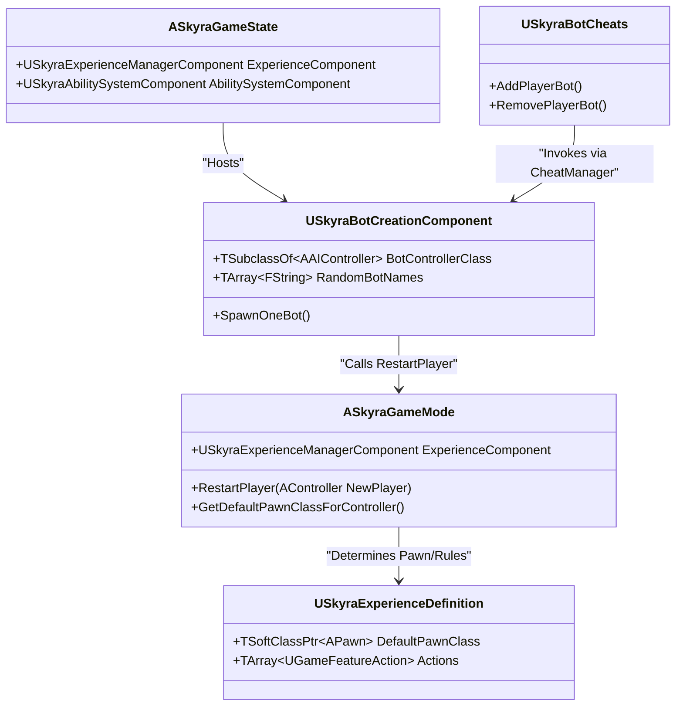

# Game Mode, Game State, and World Settings

<details>
<summary>Relevant source files</summary>

The following files were used as context for generating this wiki page:

- [.gitattributes](.gitattributes)

</details>


This page details the core gameplay framework classes in SkyraFramework. It covers the modular game mode architecture, the state management for networked games, specialized world settings, and the automated bot spawning system.

## ASkyraGameMode

`ASkyraGameMode` serves as the foundation for modular gameplay in SkyraFramework. Unlike traditional Unreal Engine game modes that hardcode pawn classes and logic, `ASkyraGameMode` is "Experience-driven," deferring much of its configuration to the `USkyraExperienceDefinition` [Source/SkyraGame/Private/GameModes/SkyraGameMode.cpp:20-30]().

### Key Responsibilities
*   **Modular Initialization**: Inherits from `AModularGameMode` to support `IGameFrameworkComponentManager` [Source/SkyraGame/Public/GameModes/SkyraGameMode.h:23-25]().
*   **Experience Integration**: Works with `USkyraExperienceManagerComponent` to determine when the world is ready for players to spawn [Source/SkyraGame/Private/GameModes/SkyraGameMode.cpp:100-115]().
*   **Pawn Spawning**: Overrides `GetDefaultPawnClassForController_Implementation` to provide a pawn class based on the current Experience's `USkyraPawnData` [Source/SkyraGame/Private/GameModes/SkyraGameMode.cpp:78-90]().
*   **Player Initialization**: Handles the `GenericPlayerInitialization` and `RestartPlayer` flow, ensuring that both human players and AI bots receive proper initialization [Source/SkyraGame/Private/GameModes/SkyraGameMode.cpp:120-140]().

### Spawning Flow
The game mode coordinates with the Experience system to ensure players only spawn once all required Game Features and Actions are loaded.

**Experience-Driven Spawning Logic**
1.  `PostLogin` occurs.
2.  `ASkyraGameMode` checks if the Experience is loaded via `USkyraExperienceManagerComponent` [Source/SkyraGame/Private/GameModes/SkyraGameMode.cpp:105-110]().
3.  If not ready, the player is held in a "waiting" state.
4.  Once loaded, `RestartPlayer` is called, and `GetDefaultPawnClassForController` retrieves the class from the Experience's Pawn Data [Source/SkyraGame/Private/GameModes/SkyraGameMode.cpp:85-88]().

**Sources:** [Source/SkyraGame/Public/GameModes/SkyraGameMode.h:1-50](), [Source/SkyraGame/Private/GameModes/SkyraGameMode.cpp:1-150]()

---

## ASkyraGameState

`ASkyraGameState` is the central authority for synchronized game state across the network. It inherits from `AModularGameState` to allow components to be added dynamically via Game Features.

### Key Components
*   **USkyraExperienceManagerComponent**: Manages the lifecycle of the current `USkyraExperienceDefinition` [Source/SkyraGame/Public/GameModes/SkyraGameState.h:35-40]().
*   **USkyraAbilitySystemComponent**: Provides a global Ability System Component (ASC) for the game state itself, used for game-wide tags and phases [Source/SkyraGame/Public/GameModes/SkyraGameState.h:42-45]().

**Sources:** [Source/SkyraGame/Public/GameModes/SkyraGameState.h:1-60]()

---

## ASkyraWorldSettings

`ASkyraWorldSettings` extends the standard `AWorldSettings` to provide Skyra-specific configuration at the map level.

### Force Standalone Net Mode
The primary feature of `ASkyraWorldSettings` is the `bForceStandaloneNetMode` property. When enabled, this forces the engine to treat the world as a standalone instance, bypassing certain networking logic even if the engine is running in a networked configuration [Source/SkyraGame/Public/GameModes/SkyraWorldSettings.h:23-27](). This is particularly useful for UI-only maps or frontend menus.

**Sources:** [Source/SkyraGame/Public/GameModes/SkyraWorldSettings.h:1-30]()

---

## SkyraBotCreationComponent

`USkyraBotCreationComponent` is a component attached to the Game State (via `ASkyraGameMode`) that automates the creation and management of AI bots. It is designed to be data-driven, pulling bot counts and names from configuration or developer settings.

### Bot Spawning Logic
The component listens for the Experience to be fully loaded before initiating bot creation [Source/SkyraGame/Private/GameModes/SkyraBotCreationComponent.cpp:26-30]().

| Function | Role |
| :--- | :--- |
| `OnExperienceLoaded` | Triggered when the Experience is ready; calls `ServerCreateBots` [Source/SkyraGame/Private/GameModes/SkyraBotCreationComponent.cpp:32-40](). |
| `ServerCreateBots` | Calculates the `EffectiveBotCount` based on defaults, URL options (`?NumBots=X`), or `USkyraDeveloperSettings` [Source/SkyraGame/Private/GameModes/SkyraBotCreationComponent.cpp:44-78](). |
| `SpawnOneBot` | Spawns an `AAIController` (using `BotControllerClass`), assigns a random name, and calls `RestartPlayer` on the Game Mode [Source/SkyraGame/Private/GameModes/SkyraBotCreationComponent.cpp:98-129](). |
| `RemoveOneBot` | Selects a random bot from `SpawnedBotList`, triggers `DamageSelfDestruct` on its `USkyraHealthComponent`, and destroys the controller [Source/SkyraGame/Private/GameModes/SkyraBotCreationComponent.cpp:131-163](). |

### Cheat Integration
Bots can be managed at runtime using the `USkyraBotCheats` extension, which provides console commands to add or remove bots by interacting with this component [Source/SkyraGame/Private/Development/SkyraBotCheats.cpp:27-45]().

### Bot Spawning Data Flow
The following diagram illustrates how the `USkyraBotCreationComponent` bridges the Experience loading process to the actual spawning of AI entities.

**AI Bot Initialization Pipeline**
```mermaid
graph TD
    subgraph "Experience System"
        "ExpComp[USkyraExperienceManagerComponent]" -- "OnExperienceLoaded" --> "BotComp[USkyraBotCreationComponent]"
    end

    subgraph "Logic: USkyraBotCreationComponent"
        "BotComp" -- "1. Get Effective Count" --> "Calc[ServerCreateBots_Implementation]"
        "Calc" -- "2. Loop Spawn" --> "Spawn[SpawnOneBot]"
    end

    subgraph "Entity Creation"
        "Spawn" -- "SpawnActor" --> "AIC[AAIController]"
        "Spawn" -- "Initialize" --> "GM[ASkyraGameMode::GenericPlayerInitialization]"
        "GM" -- "Restart" --> "GM_Restart[ASkyraGameMode::RestartPlayer]"
    end

    subgraph "Configuration Sources"
        "DevSet[USkyraDeveloperSettings]" -.-> "Calc"
        "URL[OptionsString: NumBots]" -.-> "Calc"
    end
```
**Sources:** [Source/SkyraGame/Private/GameModes/SkyraBotCreationComponent.cpp:44-129](), [Source/SkyraGame/Private/Development/SkyraBotCheats.cpp:47-58]()

---

## System Interaction Diagram

This diagram maps the relationships between the core Game Mode classes and the data assets they consume.

**Game Mode and State Entity Mapping**

**Sources:** [Source/SkyraGame/Private/GameModes/SkyraGameMode.cpp:78-90](), [Source/SkyraGame/Private/GameModes/SkyraBotCreationComponent.cpp:108-117](), [Source/SkyraGame/Private/Development/SkyraBotCheats.cpp:47-58]()