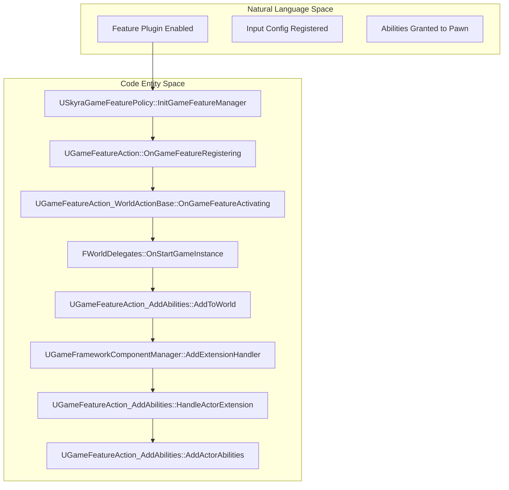
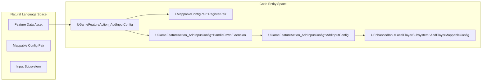

# Game Features and Actions

Relevant source files

The following files were used as context for generating this wiki page:

- [.gitattributes](.gitattributes)

The Game Features and Actions system in SkyraFramework provides a data-driven mechanism to extend the game's functionality dynamically when a Game Feature Plugin is activated. This is primarily achieved through subclasses of `UGameFeatureAction`, which handle the injection of abilities, input configurations, UI components, and world settings into the running game state.

## Skyra Game Feature Policy

The `USkyraGameFeaturePolicy` is the central authority for managing how Game Features are processed. It coordinates observers that react to the lifecycle of feature plugins, such as registration and loading.

### Key Responsibilities
*   **Observer Management**: Registers `USkyraGameFeature_HotfixManager` and `USkyraGameFeature_AddGameplayCuePaths` to the `UGameFeaturesSubsystem` [Source/SkyraGame/Private/GameFeatures/SkyraGameFeaturePolicy.cpp:19-31]().
*   **Loading Mode**: Determines whether to load client or server data based on the current execution context (Dedicated Server vs. Client) [Source/SkyraGame/Private/GameFeatures/SkyraGameFeaturePolicy.cpp:55-60]().
*   **Gameplay Cue Integration**: `USkyraGameFeature_AddGameplayCuePaths` scans for `UGameFeatureAction_AddGameplayCuePath` actions during plugin registration to update the `USkyraGameplayCueManager` with new asset notify paths [Source/SkyraGame/Private/GameFeatures/SkyraGameFeaturePolicy.cpp:91-128]().

**Sources:**
* `USkyraGameFeaturePolicy` [Source/SkyraGame/Private/GameFeatures/SkyraGameFeaturePolicy.cpp:9-17]()
* `USkyraGameFeature_AddGameplayCuePaths` [Source/SkyraGame/Private/GameFeatures/SkyraGameFeaturePolicy.cpp:91-159]()

## World Action Base

`UGameFeatureAction_WorldActionBase` serves as the abstract base class for actions that need to be applied to a specific `UWorld`. It ensures that actions are correctly applied to existing worlds and any worlds created after the feature is activated.

### Data Flow: World Application
1.  **OnGameFeatureActivating**: Binds to `FWorldDelegates::OnStartGameInstance` and iterates through all existing `GEngine` world contexts [Source/SkyraGame/Private/GameFeatures/GameFeatureAction_WorldActionBase.cpp:10-23]().
2.  **HandleGameInstanceStart**: A callback that triggers `AddToWorld` when a new game instance begins [Source/SkyraGame/Private/GameFeatures/GameFeatureAction_WorldActionBase.cpp:35-44]().
3.  **AddToWorld**: Virtual function implemented by child classes to perform specific logic (e.g., adding widgets or abilities).

**Sources:**
* `UGameFeatureAction_WorldActionBase` [Source/SkyraGame/Private/GameFeatures/GameFeatureAction_WorldActionBase.cpp:10-44]()

## Ability and Attribute Injection

`UGameFeatureAction_AddAbilities` allows Game Features to grant Gameplay Abilities, Attribute Sets, and Ability Sets to actors.

### Implementation Details
*   **Actor Tracking**: Uses `FPerContextData` to track `ActiveExtensions` and `ComponentRequests` per feature activation [Source/SkyraGame/Private/GameFeatures/GameFeatureAction_AddAbilities.cpp:22-32]().
*   **Extension Handlers**: Leverages `UGameFrameworkComponentManager` to listen for actors of a specific class entering the world [Source/SkyraGame/Private/GameFeatures/GameFeatureAction_AddAbilities.cpp:114-130]().
*   **Authority Check**: Abilities and attributes are only granted on the server (`HasAuthority`) [Source/SkyraGame/Private/GameFeatures/GameFeatureAction_AddAbilities.cpp:164-167]().

| Feature | Description |
| :--- | :--- |
| **GrantedAbilities** | List of `FSkyraAbilityGrant` (Ability Type + Level). |
| **GrantedAttributes** | List of `FSkyraAttributeSetGrant` (Attribute Set + Initialization Data). |
| **GrantedAbilitySets** | Soft pointers to `USkyraAbilitySet` assets. |

**Sources:**
* `UGameFeatureAction_AddAbilities` [Source/SkyraGame/Private/GameFeatures/GameFeatureAction_AddAbilities.cpp:20-131]()
* `AddActorAbilities` [Source/SkyraGame/Private/GameFeatures/GameFeatureAction_AddAbilities.cpp:161-193]()

## Input Configuration Actions

Skyra utilizes several actions to integrate with the Enhanced Input system.

### AddInputBinding vs AddInputConfig vs AddInputContextMapping

1.  **AddInputBinding**: Binds `USkyraInputConfig` to a `USkyraHeroComponent`. It calls `HeroComponent->AddAdditionalInputConfig` when the pawn is ready [Source/SkyraGame/Private/GameFeatures/GameFeatureAction_AddInputBinding.cpp:122-141]().
2.  **AddInputConfig**: Registers `FMappableConfigPair` with local settings during registration so they appear in menus even if the feature isn't active [Source/SkyraGame/Private/GameFeatures/GameFeatureAction_AddInputConfig.cpp:26-37](). It adds/removes configs from the `UEnhancedInputLocalPlayerSubsystem` [Source/SkyraGame/Private/GameFeatures/GameFeatureAction_AddInputConfig.cpp:146-173]().
3.  **AddInputContextMapping**: Manages `UInputMappingContext` (IMC) registration. It ensures IMCs are registered with `UEnhancedInputUserSettings` so they can be remapped by players [Source/SkyraGame/Private/GameFeatures/GameFeatureAction_AddInputContextMapping.cpp:88-115]().

**Sources:**
* `UGameFeatureAction_AddInputBinding` [Source/SkyraGame/Private/GameFeatures/GameFeatureAction_AddInputBinding.cpp:24-120]()
* `UGameFeatureAction_AddInputConfig` [Source/SkyraGame/Private/GameFeatures/GameFeatureAction_AddInputConfig.cpp:26-144]()
* `UGameFeatureAction_AddInputContextMapping` [Source/SkyraGame/Private/GameFeatures/GameFeatureAction_AddInputContextMapping.cpp:25-115]()

## UI and Widget Management

`UGameFeatureAction_AddWidgets` manages the injection of HUD layouts and UI extensions.

### Logic Flow
*   **Targeting**: Specifically targets `ASkyraHUD` actors using the `UGameFrameworkComponentManager` [Source/SkyraGame/Private/GameFeatures/GameFeatureAction_AddWidget.cpp:99-108]().
*   **Layouts**: Pushes `UCommonActivatableWidget` classes to specific UI layers using `UCommonUIExtensions::PushContentToLayer_ForPlayer` [Source/SkyraGame/Private/GameFeatures/GameFeatureAction_AddWidget.cpp:151-157]().
*   **Extensions**: Registers widgets into specific slots (e.g., a "Weapon Status" slot) via the `UUIExtensionSubsystem` [Source/SkyraGame/Private/GameFeatures/GameFeatureAction_AddWidget.cpp:159-163]().

**Sources:**
* `UGameFeatureAction_AddWidgets` [Source/SkyraGame/Private/GameFeatures/GameFeatureAction_AddWidget.cpp:20-109]()
* `AddWidgets` [Source/SkyraGame/Private/GameFeatures/GameFeatureAction_AddWidget.cpp:138-165]()

## System Architecture Diagrams

### Action Activation Pipeline
This diagram illustrates how a Game Feature Action transitions from registration to world application.

**Sources:**
* `USkyraGameFeaturePolicy` [Source/SkyraGame/Private/GameFeatures/SkyraGameFeaturePolicy.cpp:19-31]()
* `UGameFeatureAction_WorldActionBase` [Source/SkyraGame/Private/GameFeatures/GameFeatureAction_WorldActionBase.cpp:10-23]()
* `UGameFeatureAction_AddAbilities` [Source/SkyraGame/Private/GameFeatures/GameFeatureAction_AddAbilities.cpp:106-131]()

### Input Configuration Data Flow
This diagram tracks how input configurations move from the Game Feature asset to the Enhanced Input subsystem.

**Sources:**
* `UGameFeatureAction_AddInputConfig` [Source/SkyraGame/Private/GameFeatures/GameFeatureAction_AddInputConfig.cpp:26-37]()
* `AddInputConfig` [Source/SkyraGame/Private/GameFeatures/GameFeatureAction_AddInputConfig.cpp:146-173]()

## Miscellaneous Actions

### Splitscreen Configuration
`UGameFeatureAction_SplitscreenConfig` provides a voting system to disable splitscreen.
*   **GlobalDisableVotes**: A static map tracking votes across different game contexts [Source/SkyraGame/Private/GameFeatures/GameFeatureAction_SplitscreenConfig.cpp:16]().
*   **Logic**: When `bDisableSplitscreen` is true, it calls `VC->SetForceDisableSplitscreen(true)` on the `UGameViewportClient` [Source/SkyraGame/Private/GameFeatures/GameFeatureAction_SplitscreenConfig.cpp:54-75]().

### Gameplay Cue Paths
`UGameFeatureAction_AddGameplayCuePath` is a simple data container for directory paths [Source/SkyraGame/Private/GameFeatures/GameFeatureAction_AddGameplayCuePath.cpp:12-16](). The actual logic for adding these paths to the `USkyraGameplayCueManager` is handled by the `USkyraGameFeature_AddGameplayCuePaths` observer in the policy [Source/SkyraGame/Private/GameFeatures/SkyraGameFeaturePolicy.cpp:91-128]().

**Sources:**
* `UGameFeatureAction_SplitscreenConfig` [Source/SkyraGame/Private/GameFeatures/GameFeatureAction_SplitscreenConfig.cpp:18-75]()
* `UGameFeatureAction_AddGameplayCuePath` [Source/SkyraGame/Private/GameFeatures/GameFeatureAction_AddGameplayCuePath.cpp:12-34]()