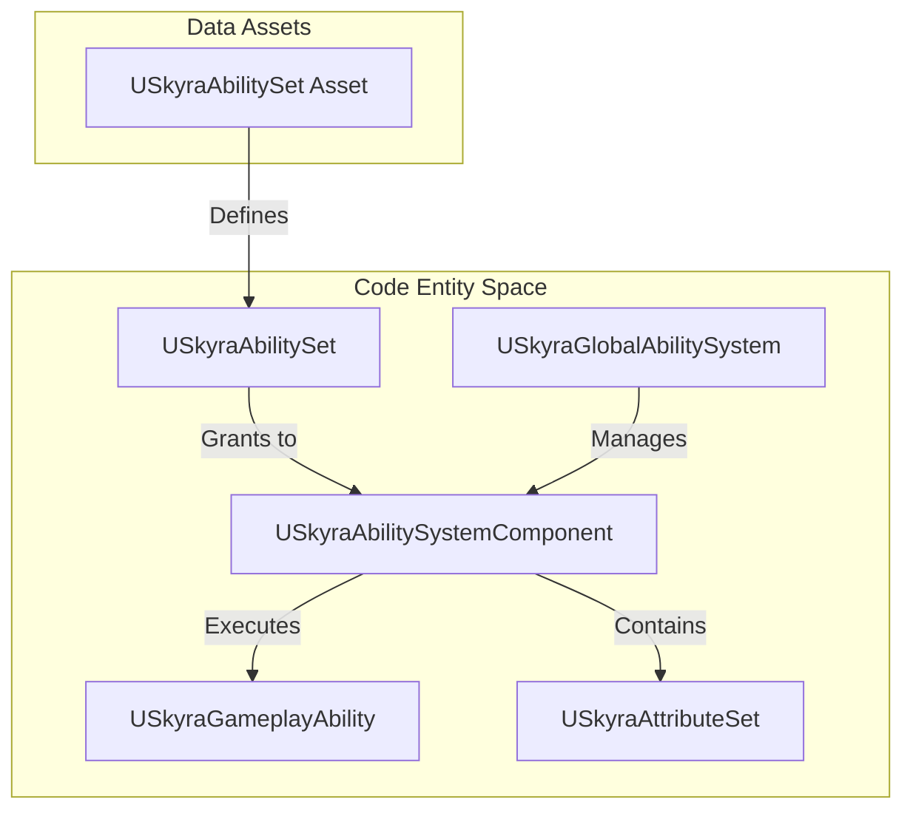
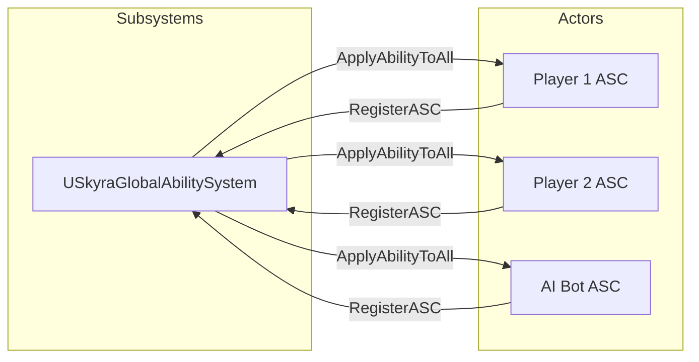

# Gameplay Ability System (GAS)

Relevant source files

The following files were used as context for generating this wiki page:

- [.gitattributes](.gitattributes)

SkyraFramework extends Unreal Engine's Gameplay Ability System (GAS) to provide a data-driven architecture for abilities, attributes, and gameplay effects. The framework introduces specialized components for input routing, robust attribute sets for combat and health, and a global ability system for managing cross-actor gameplay logic.

### System Overview

The core of the GAS implementation revolves around `USkyraAbilitySystemComponent`, which acts as the central hub for ability execution and attribute management. It integrates deeply with the `USkyraGameplayAbility` class to handle activation policies and input tag mapping.

#### GAS Entity Relationship
The following diagram illustrates the relationship between the primary GAS classes in SkyraFramework.

**GAS Entity Relationship**

Sources: [Source/SkyraGame/Private/AbilitySystem/SkyraAbilitySystemComponent.cpp:19-27](), [Source/SkyraGame/Private/AbilitySystem/SkyraAbilitySet.cpp:73-81](), [Source/SkyraGame/Private/AbilitySystem/SkyraGlobalAbilitySystem.cpp:126-140]()

---

### Ability System Component and Ability Classes
The `USkyraAbilitySystemComponent` (ASC) is the foundation of the system. It handles the registration of abilities and their connection to the input system via Gameplay Tags. Unlike the standard ASC, Skyra's implementation provides explicit support for "Activation Groups" to prevent conflicting abilities from running simultaneously and handles avatar changes during pawn possession.

`USkyraGameplayAbility` extends the base ability class to include:
*   **Activation Policies**: Defines if an ability triggers on input press, while held, or automatically on spawn [Source/SkyraGame/Private/AbilitySystem/SkyraAbilitySystemComponent.cpp:159-163]().
*   **Ability Sets**: `USkyraAbilitySet` is a data asset used to grant groups of abilities, effects, and attribute sets to an ASC in a single operation [Source/SkyraGame/Private/AbilitySystem/SkyraAbilitySet.cpp:84-146]().

For details, see [Ability System Component and Ability Classes](#3.1).

---

### Attribute Sets and Execution Calculations
Attributes in SkyraFramework are organized into specialized sets to maintain modularity. The `USkyraAttributeSet` serves as the base class, with specific implementations for health and combat logic.

*   **USkyraHealthSet**: Manages `Health`, `MaxHealth`, and `Shield` attributes.
*   **USkyraCombatSet**: Contains attributes related to damage output and resistance.
*   **Execution Calculations**: Custom calculations like `SkyraDamageExecution` handle the complex logic of converting gameplay effects into attribute changes, accounting for resistances and modifiers.

For details, see [Attribute Sets and Execution Calculations](#3.2).

---

### Ability Costs, Game Phases, and Global Systems
SkyraFramework introduces several high-level systems to manage GAS across the entire game state:

*   **Global Ability System**: `USkyraGlobalAbilitySystem` is a world subsystem that can apply abilities or effects to all registered ASCs simultaneously, useful for global debuffs or game-wide mechanics [Source/SkyraGame/Private/AbilitySystem/SkyraGlobalAbilitySystem.cpp:82-104]().
*   **Game Phases**: Abilities can be tied to specific game phases (e.g., "Warmup", "Active", "PostGame") using `SkyraGamePhaseAbility`.
*   **Ability Costs**: Extensions that allow abilities to cost inventory items or specific tag stacks rather than just numeric attributes.

**Global System Integration**

Sources: [Source/SkyraGame/Private/AbilitySystem/SkyraGlobalAbilitySystem.cpp:82-92](), [Source/SkyraGame/Private/AbilitySystem/SkyraGlobalAbilitySystem.cpp:126-140]()

For details, see [Ability Costs, Game Phases, and Global Ability System](#3.3).

---
**Sources:**
* [Source/SkyraGame/Private/AbilitySystem/SkyraAbilitySystemComponent.cpp]()
* [Source/SkyraGame/Private/AbilitySystem/SkyraAbilitySet.cpp]()
* [Source/SkyraGame/Private/AbilitySystem/SkyraGlobalAbilitySystem.cpp]()
* [.gitattributes:1-4]()