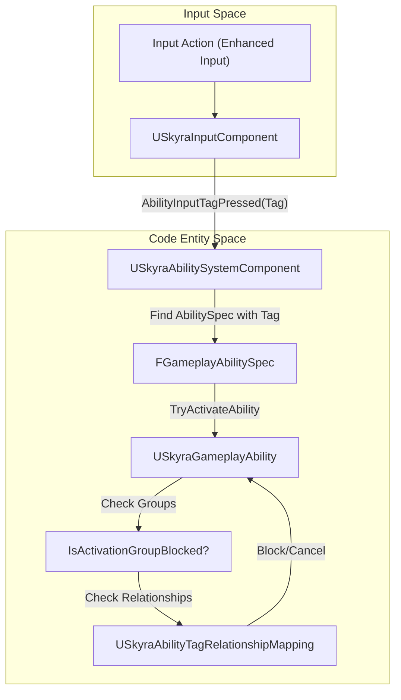
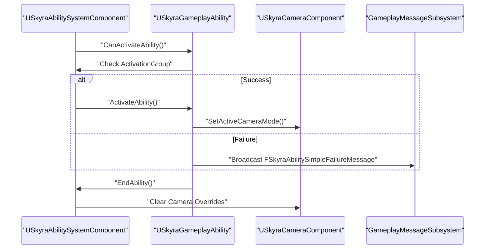

# Ability System Component and Ability Classes

Relevant source files

The following files were used as context for generating this wiki page:

- [.gitattributes](.gitattributes)

This page details the core classes of the SkyraFramework Gameplay Ability System (GAS) implementation. It covers how the framework extends the base Unreal Engine GAS to support input tag routing, activation groups, data-driven ability sets, and specialized death handling.

## USkyraAbilitySystemComponent

`USkyraAbilitySystemComponent` (ASC) is the central hub for gameplay mechanics in Skyra. It extends `UAbilitySystemComponent` to provide specialized logic for input handling, ability activation grouping, and tag-based relationship mapping.

### Input Routing and Tag Mapping
Unlike the standard GAS which often relies on integer-based input IDs, Skyra uses `FGameplayTag` for input binding.
*   **Input Queuing**: The ASC tracks handles for pressed, released, and held inputs [Source/SkyraGame/Private/AbilitySystem/SkyraAbilitySystemComponent.cpp:22-24]().
*   **Tag-to-Ability Mapping**: Input tags are passed from the `USkyraInputComponent` to the ASC via `AbilityInputTagPressed` and `AbilityInputTagReleased` [Source/SkyraGame/Private/AbilitySystem/SkyraAbilitySystemComponent.cpp:194]().
*   **Activation Policies**: Abilities can be configured to trigger `OnInputTriggered` (instant) or `WhileInputActive` (continuous) [Source/SkyraGame/Private/AbilitySystem/Abilities/SkyraGameplayAbility.cpp:44]().

### Activation Groups
Skyra introduces `ESkyraAbilityActivationGroup` to manage ability concurrency and mutual exclusivity:
*   **Independent**: Can run alongside any other ability.
*   **Exclusive_Replaceable**: Can be canceled by other exclusive abilities.
*   **Exclusive_Blocking**: Prevents other exclusive abilities from starting while active.

The ASC maintains counts of active abilities per group to determine if a new ability can be activated [Source/SkyraGame/Private/AbilitySystem/SkyraAbilitySystemComponent.cpp:26]().

### Tag Relationship Mapping
The ASC utilizes `USkyraAbilityTagRelationshipMapping` to define how tags interact globally. This data asset allows designers to specify:
*   **AbilityTagsToBlock**: Tags that prevent abilities from starting.
*   **AbilityTagsToCancel**: Tags that force active abilities to end.
*   **ActivationRequiredTags**: Tags that must be present on the actor for the ability to start.
*   **ActivationBlockedTags**: Tags that prevent activation if present on the actor.

**Data Flow: Input to Ability Activation**

Sources: [Source/SkyraGame/Private/AbilitySystem/SkyraAbilitySystemComponent.cpp:194](), [Source/SkyraGame/Private/AbilitySystem/SkyraAbilityTagRelationshipMapping.cpp:8-46](), [Source/SkyraGame/Private/AbilitySystem/Abilities/SkyraGameplayAbility.cpp:148-156]()

---

## USkyraGameplayAbility

`USkyraGameplayAbility` is the base class for all gameplay logic. It provides integration with the framework's camera system, UI messaging, and cost structures.

### Key Features
*   **Camera Mode Overrides**: Abilities can specify a `USkyraCameraMode` that is pushed onto the camera stack when the ability becomes active [Source/SkyraGame/Private/AbilitySystem/Abilities/SkyraGameplayAbility.cpp:49]().
*   **Failure Communication**: When an ability fails to activate, it can broadcast `FSkyraAbilitySimpleFailureMessage` or play a failure montage based on the failure tags [Source/SkyraGame/Private/AbilitySystem/Abilities/SkyraGameplayAbility.cpp:102-132]().
*   **Activation Policies**:
    *   `OnInputTriggered`: Activates once when the button is pressed.
    *   `WhileInputActive`: Activates when pressed, stays active until released.
    *   `OnSpawn`: Automatically attempts to activate when granted to the ASC [Source/SkyraGame/Private/AbilitySystem/Abilities/SkyraGameplayAbility.cpp:179-180]().

### Ability Costs
Costs are implemented as an array of `USkyraAbilityCost` objects. This allows a single ability to have multiple varied costs (e.g., consuming both stamina and an inventory item) [Source/SkyraGame/Private/AbilitySystem/Abilities/SkyraGameplayAbility.cpp:10]().

**Ability Lifecycle**

Sources: [Source/SkyraGame/Private/AbilitySystem/Abilities/SkyraGameplayAbility.cpp:135-159](), [Source/SkyraGame/Private/AbilitySystem/Abilities/SkyraGameplayAbility.cpp:102-118]()

---

## USkyraGameplayAbility_Death

A specialized ability that handles the actor's transition to a dead state.

*   **Trigger**: Automatically triggered by the `GameplayEvent.Death` tag [Source/SkyraGame/Private/AbilitySystem/Abilities/SkyraGameplayAbility_Death.cpp:26]().
*   **Priority**: It cancels all other abilities except those marked with `Ability.Behavior.SurvivesDeath` [Source/SkyraGame/Private/AbilitySystem/Abilities/SkyraGameplayAbility_Death.cpp:38-42]().
*   **Execution**:
    1.  Sets activation group to `Exclusive_Blocking` to prevent new abilities.
    2.  Calls `StartDeath()` on the `USkyraHealthComponent` [Source/SkyraGame/Private/AbilitySystem/Abilities/SkyraGameplayAbility_Death.cpp:70-79]().
    3.  When the ability ends, it ensures `FinishDeath()` is called to clean up the actor [Source/SkyraGame/Private/AbilitySystem/Abilities/SkyraGameplayAbility_Death.cpp:81-90]().

Sources: [Source/SkyraGame/Private/AbilitySystem/Abilities/SkyraGameplayAbility_Death.cpp:14-57]()

---

## USkyraAbilitySet

`USkyraAbilitySet` is a data asset used to grant a collection of GAS logic to an actor in a single operation. It is primarily used by the Experience system and Pawn initialization.

### Granted Content
An ability set can contain:
1.  **Gameplay Abilities**: Array of `FSkyraAbilitySet_GameplayAbility` (Ability class, level, and input tag) [Source/SkyraGame/Private/AbilitySystem/SkyraAbilitySet.cpp:84-106]().
2.  **Gameplay Effects**: Array of `FSkyraAbilitySet_GameplayEffect` (Effect class and level) [Source/SkyraGame/Private/AbilitySystem/SkyraAbilitySet.cpp:109-126]().
3.  **Attribute Sets**: Array of `FSkyraAbilitySet_AttributeSet` (Attribute set class) [Source/SkyraGame/Private/AbilitySystem/SkyraAbilitySet.cpp:129-146]().

### Management
*   **GiveToAbilitySystem**: Instantiates and grants all items in the set to the provided ASC. It returns a `FSkyraAbilitySet_GrantedHandles` structure [Source/SkyraGame/Private/AbilitySystem/SkyraAbilitySet.cpp:73-81]().
*   **TakeFromAbilitySystem**: Uses the stored handles to cleanly remove only the abilities and effects granted by that specific set, leaving other sets untouched [Source/SkyraGame/Private/AbilitySystem/SkyraAbilitySet.cpp:32-66]().

Sources: [Source/SkyraGame/Private/AbilitySystem/SkyraAbilitySet.cpp:11-30](), [Source/SkyraGame/Private/AbilitySystem/SkyraAbilitySet.cpp:73-147]()