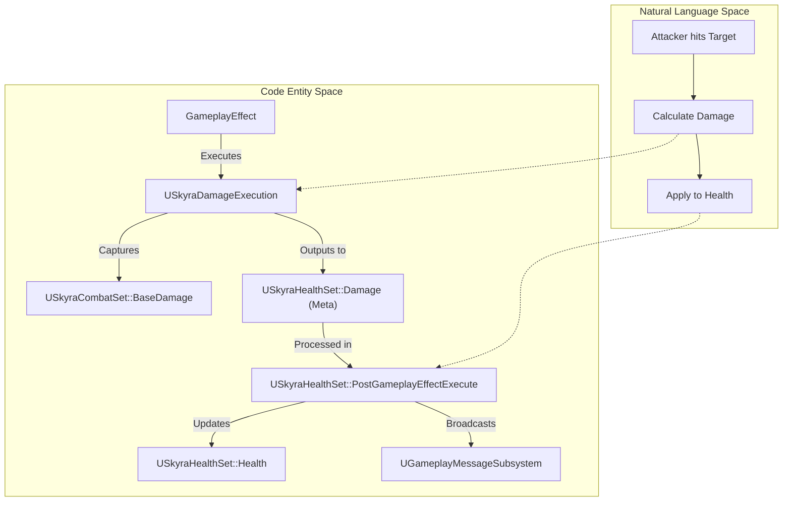
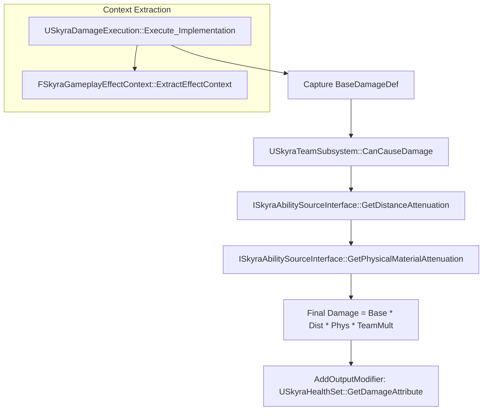

# 属性集与执行计算

Relevant source files

以下文件用作生成本Wiki页面的上下文：

- [.gitattributes](.gitattributes)

本页面详细介绍了SkyraFramework中游戏玩法技能系统（GAS）属性架构和自定义执行逻辑的实现。涵盖了数据如何从属性通过复杂计算来修改角色状态。

## 核心属性集层次结构

SkyraFramework采用模块化的属性集方法，继承自一个公共基类以提供实用函数和对`USkyraAbilitySystemComponent`的标准化访问。

### USkyraAttributeSet (基类)
`USkyraAttributeSet`作为框架中所有属性集的基础。它提供了辅助方法来访问世界上下文以及技能系统组件的Skyra专用版本 [Source/SkyraGame/Private/AbilitySystem/Attributes/SkyraAttributeSet.cpp:12-27]()。

### USkyraCombatSet
此集包含在计算过程中用于确定效果大小的“源”属性。这些属性通常不在目标上直接修改，而是在执行期间从源读取 [Source/SkyraGame/Private/AbilitySystem/Attributes/SkyraCombatSet.cpp:13-17]()。

*   **BaseDamage**：由源提供的原始伤害值 [Source/SkyraGame/Private/AbilitySystem/Attributes/SkyraCombatSet.cpp:23]()。
*   **BaseHeal**：由源提供的原始治疗值 [Source/SkyraGame/Private/AbilitySystem/Attributes/SkyraCombatSet.cpp:24]()。

### USkyraHealthSet
用于管理角色生命值的主要属性集。它处理应用伤害/治疗、钳制数值以及广播诸如死亡等事件的逻辑 [Source/SkyraGame/Private/AbilitySystem/Attributes/SkyraHealthSet.cpp:21-28]().

| 属性 | 作用 | 复制 |
| :--- | :--- | :--- |
| `Health` | 当前生命值。 | `COND_None` [Source/SkyraGame/Private/AbilitySystem/Attributes/SkyraHealthSet.cpp:34]() |
| `MaxHealth` | 最大生命值。 | `COND_None` [Source/SkyraGame/Private/AbilitySystem/Attributes/SkyraHealthSet.cpp:35]() |
| `Damage` | 用于接收传入伤害的元属性。 | 不适用（元） |
| `Healing` | 用于接收传入治疗的元属性。 | 不适用（元） |

**来源：**
- [Source/SkyraGame/Private/AbilitySystem/Attributes/SkyraAttributeSet.cpp:12-27]()
- [Source/SkyraGame/Private/AbilitySystem/Attributes/SkyraCombatSet.cpp:13-35]()
- [Source/SkyraGame/Private/AbilitySystem/Attributes/SkyraHealthSet.cpp:21-36]()

## 属性数据流和生命周期

该框架遵循严格的属性更改生命周期，使用 `PreGameplayEffectExecute` 进行验证，并使用 `PostGameplayEffectExecute` 进行最终状态解析和事件广播。

### 伤害/治疗解析逻辑
当游戏效果（GE）目标为 `USkyraHealthSet` 时，执行以下流程：

1.  **预执行验证**：`PreGameplayEffectExecute` 检查是否存在如 `Gameplay.DamageImmunity` 或 `Cheat.GodMode` 的标签。如果存在，则将幅度置零 [Source/SkyraGame/Private/AbilitySystem/Attributes/SkyraHealthSet.cpp:76-99]().
2.  **元属性转换**：在 `PostGameplayEffectExecute` 中，如果 `Damage` 属性被修改，则会从 `Health` 中减去，并进行钳制，然后将 `Damage` 元属性重置为 0 [Source/SkyraGame/Private/AbilitySystem/Attributes/SkyraHealthSet.cpp:128-150]().
3.  **事件广播**：如果生命值降为零，则触发 `OnOutOfHealth` 委托 [Source/SkyraGame/Private/AbilitySystem/Attributes/SkyraHealthSet.cpp:176-179]().

### 属性交互图
此图展示了在伤害应用过程中代码实体之间的交互方式。

**来源：**
- [Source/SkyraGame/Private/AbilitySystem/Attributes/SkyraHealthSet.cpp:68-106]()
- [Source/SkyraGame/Private/AbilitySystem/Attributes/SkyraHealthSet.cpp:108-183]()
- [Source/SkyraGame/Private/AbilitySystem/Executions/SkyraDamageExecution.cpp:130-136]()

## 自定义执行计算

SkyraFramework 使用 `GameplayEffectExecutionCalculation` 类来处理无法通过简单修饰符表达的复杂逻辑，例如队伍检查和距离衰减。

### SkyraDamageExecution
`USkyraDamageExecution` 类在服务器上计算最终伤害 [Source/SkyraGame/Private/AbilitySystem/Executions/SkyraDamageExecution.cpp:35-37]()。

*   **属性捕获**：它从源捕获 `USkyraCombatSet::BaseDamage` [Source/SkyraGame/Private/AbilitySystem/Executions/SkyraDamageExecution.cpp:19-32]()。
*   **队伍过滤**：使用 `USkyraTeamSubsystem::CanCauseDamage` 判断交互是否有效（例如防止友军伤害）[Source/SkyraGame/Private/AbilitySystem/Executions/SkyraDamageExecution.cpp:92-97]()。
*   **衰减**：查询 `ISkyraAbilitySourceInterface` 以应用基于距离的衰减和物理材质修正 [Source/SkyraGame/Private/AbilitySystem/Executions/SkyraDamageExecution.cpp:118-127]()。
*   **输出**：向 `USkyraHealthSet::Damage` 属性添加一个加法修正 [Source/SkyraGame/Private/AbilitySystem/Executions/SkyraDamageExecution.cpp:135]()。

### SkyraHealExecution
一个更简单的执行，它捕获 `USkyraCombatSet::BaseHeal` 并输出到 `USkyraHealthSet::Healing` [Source/SkyraGame/Private/AbilitySystem/Executions/SkyraHealExecution.cpp:27-53]()。

### 执行计算逻辑流程
此图表将 `Execute_Implementation` 逻辑映射到所涉及的特定系统。

**源文件：**
- [Source/SkyraGame/Private/AbilitySystem/Executions/SkyraDamageExecution.cpp:13-33]()
- [Source/SkyraGame/Private/AbilitySystem/Executions/SkyraDamageExecution.cpp:35-138]()
- [Source/SkyraGame/Private/AbilitySystem/Executions/SkyraHealExecution.cpp:10-55]()

## 全局游戏消息

`USkyraHealthSet` 与 `UGameplayMessageSubsystem` 集成，以便全局广播伤害事件。这使得解耦的系统（如 UI 或统计数据）能够在不直接依赖于技能系统的情况下对战斗做出反应。

当在 `PostGameplayEffectExecute` 中评估伤害时，如果伤害量大于零，则会填充一个 `FSkyraVerbMessage`，其中包含：
*   **动词**：`Skyra.Damage.Message` [Source/SkyraGame/Private/AbilitySystem/Attributes/SkyraHealthSet.cpp:134]()
*   **发起者/目标**：所涉及的参与者 [Source/SkyraGame/Private/AbilitySystem/Attributes/SkyraHealthSet.cpp:135-137]()
*   **伤害量**：最终伤害值 [Source/SkyraGame/Private/AbilitySystem/Attributes/SkyraHealthSet.cpp:141]()

**来源：**
- [Source/SkyraGame/Private/AbilitySystem/Attributes/SkyraHealthSet.cpp:15-19]()
- [Source/SkyraGame/Private/AbilitySystem/Attributes/SkyraHealthSet.cpp:131-145]()