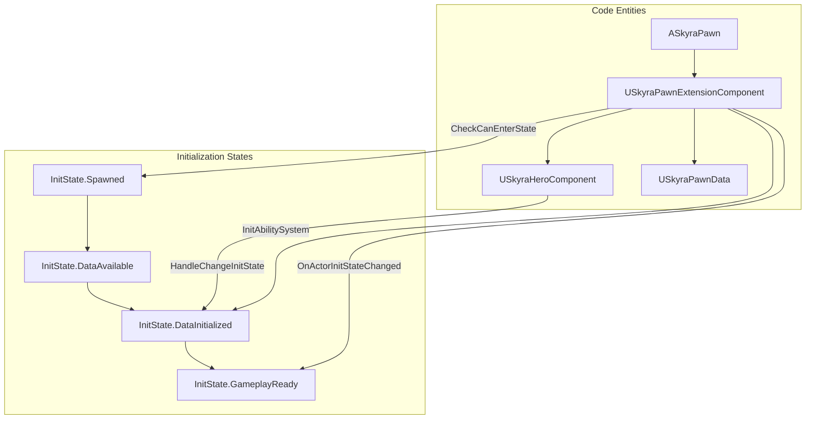
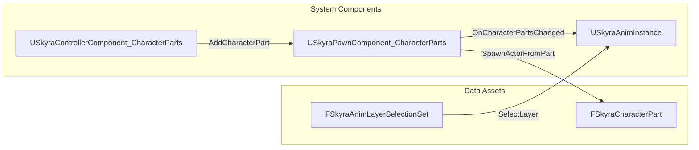

# 角色与Pawn系统

Relevant source files

以下文件用于生成此Wiki页面的上下文：

- [.gitattributes](.gitattributes)

SkyraFramework中的角色与Pawn系统提供了一种模块化、基于组件的架构来定义和初始化Actor。它通过使用由`GameFrameworkComponentManager`协调的状态驱动初始化管线，摆脱了单体式的Pawn类。这使得基础Pawn逻辑、数据驱动配置以及输入和摄像机处理等玩家特定功能之间实现了清晰的分离。

### 系统架构概览

该系统围绕几个核心组件构建，这些组件协同工作，将Pawn从生成的Actor转变为可进行游戏的实体。

| 组件 | 角色 |
| :--- | :--- |
| `ASkyraPawn` | 所有Pawn的基类，通过`ISkyraTeamAgentInterface`提供团队集成。[Source/SkyraGame/Private/Character/SkyraPawn.cpp:15-18]() |
| `USkyraPawnData` | 一个数据资产，定义Pawn的类、输入配置和默认摄像机模式。[Source/SkyraGame/Private/Character/SkyraPawnData.cpp:7-13]() |
| `USkyraPawnExtensionComponent` | 协调 pawn 的模块化初始化，并管理技能系统组件（ASC）的配对。[Source/SkyraGame/Private/Character/SkyraPawnExtensionComponent.cpp:22-32]() |
| `USkyraHeroComponent` | 处理玩家特定的逻辑，如输入绑定和摄像机模式确定。[Source/SkyraGame/Private/Character/SkyraHeroComponent.cpp:41-46]() |
| `USkyraHealthComponent` | 管理 pawn 的生命周期，包括健康状态和死亡处理。[Source/SkyraGame/Private/Character/SkyraHealthComponent.cpp:20-25]() |

### 组件关系与初始化

框架使用“功能状态”机确保组件在网络中按正确顺序初始化。`USkyraPawnExtensionComponent` 使用 `IGameFrameworkInitStateInterface` 作为这些状态的主要协调器。

#### Pawn 初始化流程
初始化通过 `SkyraGameplayTags` 中定义的四个主要状态进行：`InitState.Spawned` -> `InitState.DataAvailable` -> `InitState.DataInitialized` -> `InitState.GameplayReady`。[Source/SkyraGame/Private/Character/SkyraPawnExtensionComponent.cpp:218-221]()

"Pawn 初始化管线"

**Sources:** [Source/SkyraGame/Private/Character/SkyraPawnExtensionComponent.cpp:218-240](), [Source/SkyraGame/Private/Character/SkyraHeroComponent.cpp:130-136]()

### 核心组件

#### SkyraPawn 与 PawnData
`ASkyraPawn` 是该系统的基础。它实现了 `ISkyraTeamAgentInterface`，使 pawn 能够归属于某个队伍，该队伍通常与拥有它的 `AController` 同步。[Source/SkyraGame/Private/Character/SkyraPawn.cpp:44-50]()

`USkyraPawnData` 是一个不可变的数据资产，用于定义 pawn 的“身份”。它包含：
*   **PawnClass**：实际生成的 Actor 类。
*   **AbilitySets**：通过 `USkyraAbilitySet` 在生成时授予的 GAS 能力。[Source/SkyraGame/Private/Character/SkyraPawnData.cpp:15-18]()
*   **InputConfig**：输入动作到游戏标签的映射。[Source/SkyraGame/Private/Character/SkyraPawnData.cpp:21-23]()
*   **DefaultCameraMode**：此 pawn 的摄像机行为。[Source/SkyraGame/Private/Character/SkyraPawnData.cpp:24-26]()

有关如何应用这些资产的详细信息，请参阅 [Pawn 初始化与扩展组件](#4.1)。

#### 英雄组件
`USkyraHeroComponent` 专用于玩家控制的 pawn。它负责：
*   **输入绑定**：在 `DataInitialized` 状态期间，将 `USkyraInputComponent` 连接到 `USkyraPawnData` 中定义的动作。[Source/SkyraGame/Private/Character/SkyraHeroComponent.cpp:168-175]()
*   **摄像机控制**：将 `DetermineCameraMode` 委托提供给 `USkyraCameraComponent`。[Source/SkyraGame/Private/Character/SkyraHeroComponent.cpp:179-183]()

有关输入和玩家特定初始化的详细信息，请参阅[英雄组件与生命系统](#4.2)。

#### 健康与生命周期
`USkyraHealthComponent` 与 GAS `USkyraHealthSet` 协同工作。它监听属性变化（伤害、治疗），并触发向“死亡”状态的过渡，这涉及激活 `USkyraGameplayAbility_Death`。[Source/SkyraGame/Private/Character/SkyraHealthComponent.cpp:105-112]()

### 装饰品与角色部件
SkyraFramework 包含一个模块化装饰系统，允许将“角色部件”（骨骼或静态网格体）附加到 Pawn 上。该系统由 `USkyraPawnComponent_CharacterParts` 驱动，并可通过 `FSkyraAnimLayerSelectionSet` 影响动画。

“装饰系统链接”

**来源：** [Source/SkyraGame/Private/Cosmetics/SkyraPawnComponent_CharacterParts.cpp:18-25]()、[Source/SkyraGame/Private/Cosmetics/SkyraControllerComponent_CharacterParts.cpp:12-18]()

有关装饰品管线的详细信息，请参阅[装饰品与角色部件](#4.3)。

---
**子页面：**
*   [Pawn 初始化和扩展组件](#4.1)
*   [英雄组件与生命系统](#4.2)
*   [外观与角色部件](#4.3)