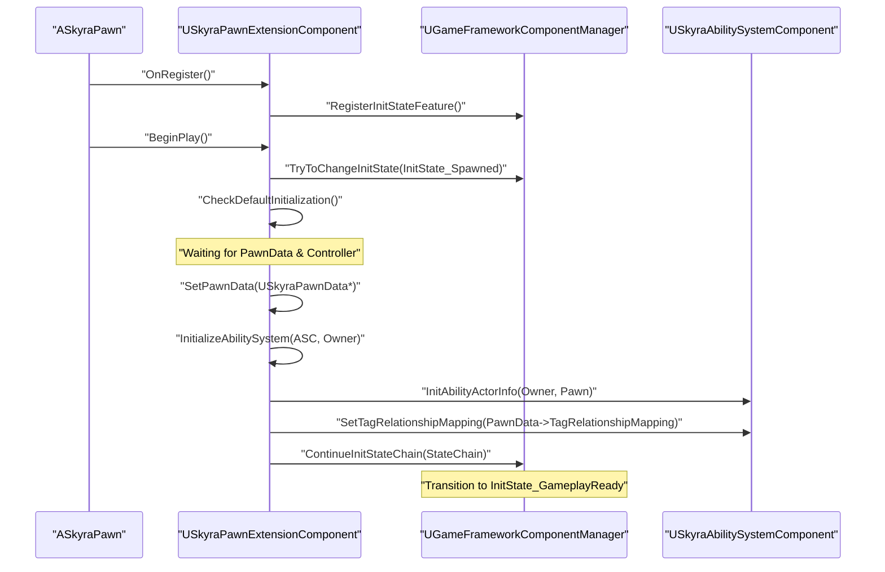

# Pawn 初始化与扩展组件

<details>
<summary>Relevant source files</summary>

以下文件被用作生成此维基页面的上下文：

- [.gitattributes](.gitattributes)

</details>


SkyraFramework 中的 Pawn 系统围绕模块化、数据驱动的初始化管道设计。与单体类不同，Pawn 使用由 `GameFrameworkComponentManager` 中介的“基于功能”的初始化流程。这允许不同的组件（能力系统、输入、摄像机、生命值）在服务器和客户端之间同步其设置阶段。

## SkyraPawn

`ASkyraPawn` 作为框架中所有 Pawn 的基类。其主要职责是管理团队身份并为扩展组件提供基础。

### 团队集成
Pawn 实现了 `ISkyraTeamAgentInterface` 以集成框架的团队系统。它在控制事件期间根据其 `AController` 动态更新其团队 ID。

*   **控制**：当被控制时，Pawn 将控制器转换为 `ISkyraTeamAgentInterface`，缓存团队 ID，并绑定到 `OnTeamChangedDelegate` [Source/SkyraGame/Private/Character/SkyraPawn.cpp:37-50]()。
*   **取消控制**：取消控制时，它停止监听控制器并确定新的团队 ID（通常恢复为中立状态）[Source/SkyraGame/Private/Character/SkyraPawn.cpp:52-68]()。
*   **权限**：只有在 Pawn 未被控制且调用者具有网络权限时，才能直接设置团队 ID [Source/SkyraGame/Private/Character/SkyraPawn.cpp:70-89]()。

### 团队变更流程
| 事件 | 操作 |
| :--- | :--- |
| `PossessedBy` | 绑定到 `ControllerAsTeamProvider->GetTeamChangedDelegateChecked()` |
| `UnPossessed` | 在旧控制器委托上调用 `RemoveAll(this)` |
| `OnRep_MyTeamID` | 向本地客户端广播 `ConditionalBroadcastTeamChanged` |

**来源：**
- [Source/SkyraGame/Private/Character/SkyraPawn.cpp:15-111]()

---

## SkyraPawnData

`USkyraPawnData` 是一个 `UDataAsset`，用于定义 Pawn 的身份和功能。它充当 `SkyraPawnExtensionComponent` 在运行时配置 Actor 的“模板”。

### 关键属性
*   **PawnClass**：实际生成的Actor类 [Source/SkyraGame/Private/Character/SkyraPawnData.cpp:10-10]()。
*   **AbilitySets**：要授予该Pawn的`USkyraAbilitySet`列表（在头文件中定义）。
*   **InputConfig**：用于将输入动作映射到游戏玩法标签的`USkyraInputConfig` [Source/SkyraGame/Private/Character/SkyraPawnData.cpp:11-11]()。
*   **DefaultCameraMode**：要使用的初始`USkyraCameraMode` [Source/SkyraGame/Private/Character/SkyraPawnData.cpp:12-12]()。
*   **TagRelationshipMapping**：定义游戏玩法标签如何阻止或取消其他标签（应用到ASC） [Source/SkyraGame/Private/Character/SkyraPawnExtensionComponent.cpp:144-147]()。

**来源：**
- [Source/SkyraGame/Private/Character/SkyraPawnData.cpp:7-13]()
- [Source/SkyraGame/Private/Character/SkyraPawnExtensionComponent.cpp:144-147]()

---

## SkyraPawnExtensionComponent

`USkyraPawnExtensionComponent`是Pawn的“协调器”。它管理Gameplay Ability System（GAS）的初始化，并实现`IGameFrameworkInitStateInterface`以同步模块化组件。

### 初始化状态机
该组件通过一系列在 `SkyraGameplayTags` 中定义的 `InitState` 标签来驱动 Pawn。这确保了诸如 `SkyraHeroComponent` 或 `SkyraHealthComponent` 之类的组件在其依赖项（如 PlayerState 或 PawnData）就绪之前不会初始化。

**Pawn 初始化序列**
```mermaid
graph TD
    "InitState_Spawned" --> "InitState_DataAvailable"
    "InitState_DataAvailable" --> "InitState_DataInitialized"
    "InitState_DataInitialized" --> "InitState_GameplayReady"

    subgraph "DataAvailable Requirements"
    "HasPawnData"
    "HasController/PlayerState"
    end

    subgraph "DataInitialized Requirements"
    "ASC_Initialized"
    "Input_Bound"
    end
```

### Ability System 生命周期
扩展组件负责将 Pawn（Avatar）连接到 Ability System Component（Owner，通常位于 `PlayerState` 上）。

*   **InitializeAbilitySystem**：在 ASC 变得可用时调用。它调用 `InitAbilityActorInfo` 并应用来自 `PawnData` 的 `TagRelationshipMapping` [源：SkyraGame/Private/Character/SkyraPawnExtensionComponent.cpp:105-150]()。
*   **UninitializeAbilitySystem**：通过清除 actor 信息、移除游戏提示并取消不具备 `Ability.Behavior.SurvivesDeath` 标签的技能来清理 ASC [源：SkyraGame/Private/Character/SkyraPawnExtensionComponent.cpp:152-183]()。

### 与模块化游戏玩法的集成
该组件使用 `GameFrameworkComponentManager` 将自身注册为“功能”。

1.  **OnRegister**：注册 `PawnExtension` 功能名称 [源：SkyraGame/Private/Character/SkyraPawnExtensionComponent.cpp:41-54]()。
2.  **BeginPlay**：绑定状态更改并推送初始 `InitState_Spawned` 状态 [源：SkyraGame/Private/Character/SkyraPawnExtensionComponent.cpp:56-66]()。
3.  **CheckDefaultInitialization**：一个可重入的函数，尝试推进 `StateChain`（`Spawned` -> `DataAvailable` -> `DataInitialized` -> `GameplayReady`）[源：SkyraGame/Private/Character/SkyraPawnExtensionComponent.cpp:213-222]()。

**来源：**
- [Source/SkyraGame/Private/Character/SkyraPawnExtensionComponent.cpp:20-32]()
- [Source/SkyraGame/Private/Character/SkyraPawnExtensionComponent.cpp:105-183]()
- [Source/SkyraGame/Private/Character/SkyraPawnExtensionComponent.cpp:213-222]()

---

## 初始化流程图

该图表将自然语言描述的初始化步骤映射到负责转换的具体代码实体和函数。

**代码实体初始化流程**


**源代码：**
- [Source/SkyraGame/Private/Character/SkyraPawnExtensionComponent.cpp:41-66]()
- [Source/SkyraGame/Private/Character/SkyraPawnExtensionComponent.cpp:105-150]()
- [Source/SkyraGame/Private/Character/SkyraPawnExtensionComponent.cpp:213-222]()