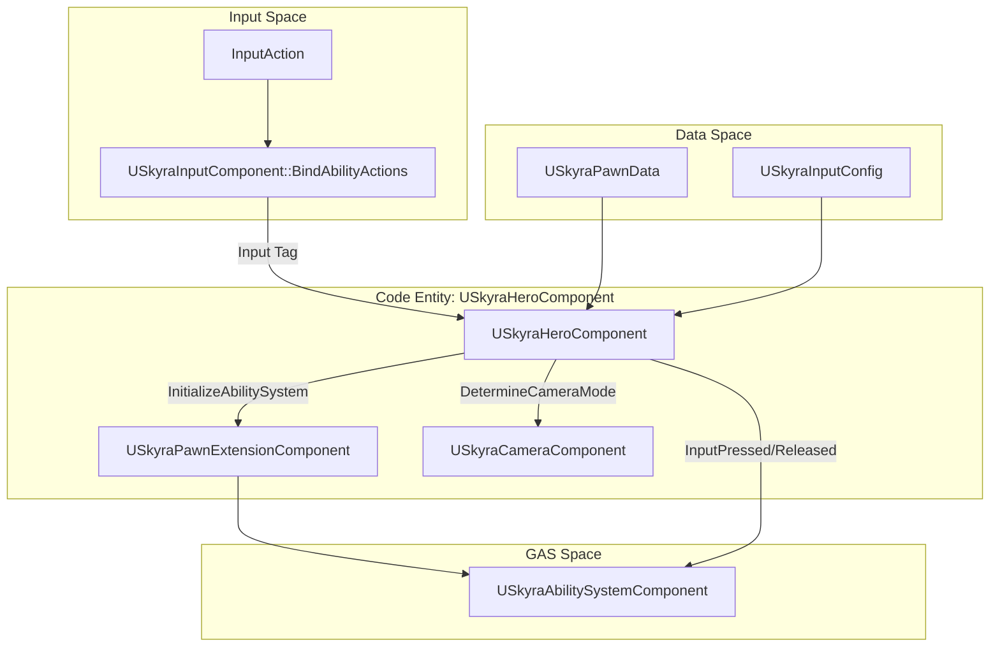
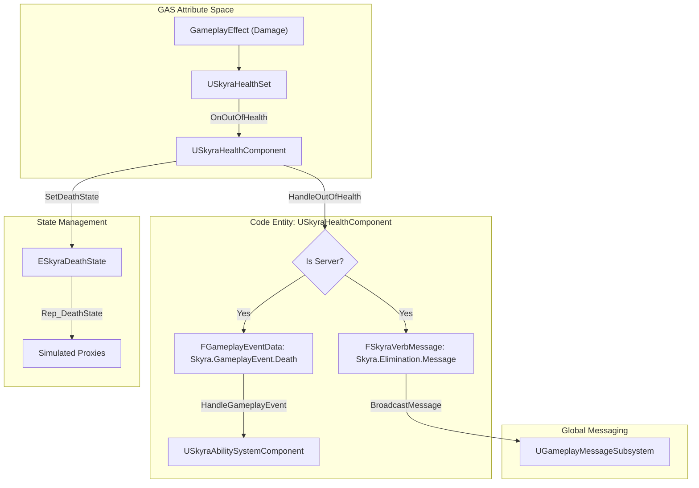

# 英雄组件与健康系统

Relevant source files

以下文件被用作生成此维基页面的上下文：

- [.gitattributes](.gitattributes)

英雄组件和健康系统在玩家输入、游戏能力系统(GAS)和Pawn的物理状态之间架起了桥梁。虽然`USkyraPawnExtensionComponent`处理通用初始化，但`USkyraHeroComponent`专门为玩家控制的角色设计，管理输入绑定和摄像头集成。与此相辅相成，`USkyraHealthComponent`管理Pawn的生命周期，将GAS属性变化转化为诸如死亡或淘汰等游戏世界状态。

## 英雄组件

`USkyraHeroComponent`是一个必须放置在`Pawn`上的模块化组件[.gitattributes:1-4]()。它协调包括`USkyraInputComponent`和`USkyraCameraComponent`在内的玩家特定系统的初始化。

### 初始化状态机
该组件参与`UGameFrameworkComponentManager`初始化流程，通过各个状态推进，确保所有依赖项（玩家状态、输入和Pawn数据）在游戏开始前准备就绪[.gitattributes:1-4]()。

| 状态 | 需求 |
| :--- | :--- |
| `InitState_Spawned` | 有效的Pawn所有者[.gitattributes:1-4]()。 |
| `InitState_DataAvailable` | 有效的 `ASkyraPlayerState`。对于本地玩家，需要有效的 `ASkyraPlayerController` 和 `InputComponent` [.gitattributes:1-4]()。 |
| `InitState_DataInitialized` | `USkyraPawnExtensionComponent` 必须已达到 `DataInitialized`。技能系统在此初始化 [.gitattributes:1-4]()。 |
| `InitState_GameplayReady` | 最终转换状态 [.gitattributes:1-4]()。 |

### 输入绑定和相机模式
英雄组件将来自 `USkyraInputComponent` 的输入路由到技能系统组件（ASC）。它使用 `USkyraInputConfig` 将输入动作映射到游戏标签，然后 ASC 使用这些标签触发技能 [.gitattributes:1-4]()。

此外，它向 `USkyraCameraComponent` 提供了 `DetermineCameraMode` 委托。这使得英雄的当前状态（或激活的技能）能够覆盖 `USkyraPawnData` 中定义的默认相机模式 [.gitattributes:1-4]()。

### 英雄组件数据流
下图说明了 `USkyraHeroComponent` 如何将输入和相机数据连接到底层 Pawn 架构。

**英雄组件集成**

来源：[.gitattributes:1-4]()

## 健康系统

`USkyraHealthComponent` 作为 `USkyraHealthSet` 属性的监听器。它管理生死状态之间的转换，并通过 `UGameplayMessageSubsystem` 向其他系统广播事件。

### 属性监听
在通过 `InitializeWithAbilitySystem` 初始化期间，组件绑定到由 `USkyraHealthSet` [.gitattributes:1-4]() 提供的委托：
* `OnHealthChanged`
* `OnMaxHealthChanged`
* `OnOutOfHealth`

### 死亡处理与状态机
该组件维护一个复制的 `DeathState` [.gitattributes:1-4]()。当生命值归零时，服务器上触发 `HandleOutOfHealth`，从而启动死亡序列：

1.  **游戏事件**：向 ASC 发送 `Skyra.GameplayEvent.Death` 以触发与死亡相关的能力 [.gitattributes:1-4]()。
2.  **动词消息**：通过 `TAG_Skyra_Elimination_Message` 向 `UGameplayMessageSubsystem` 广播 `Skyra.Elimination.Message`，用于 UI 和计分系统 [.gitattributes:1-4]()。
3.  **状态转换**：从 `NotDead` 移动到 `DeathStarted` 并最终 `DeathFinished` [.gitattributes:1-4]()。

### 健康系统数据流
下图追踪了从游戏效果（伤害）到最终死亡状态和消息广播的流程。

**健康与死亡逻辑流程**

来源：[.gitattributes:1-4]()

### 关键函数和变量

| 类 | 成员 | 描述 |
| :--- | :--- | :--- |
| `USkyraHeroComponent` | `InitializePlayerInput` | 使用提供的 `USkyraInputConfig` 将输入动作绑定到 ASC [.gitattributes:1-4]()。|
| `USkyraHeroComponent` | `DetermineCameraMode` | 返回要使用的 `USkyraCameraMode`，允许基于能力的覆盖 [.gitattributes:1-4]()。 |
| `USkyraHealthComponent` | `InitializeWithAbilitySystem` | 挂钩到 `USkyraHealthSet` 委托并将生命值重置为最大生命值 [.gitattributes:1-4]()。 |
| `USkyraHealthComponent` | `HandleOutOfHealth` | 仅限服务器的函数，触发死亡事件和消息 [.gitattributes:1-4]()。 |
| `USkyraHealthComponent` | `DeathState` | 复制的枚举，跟踪 `NotDead`、`DeathStarted` 或 `DeathFinished` [.gitattributes:1-4]()。 |

来源: [.gitattributes:1-4]()