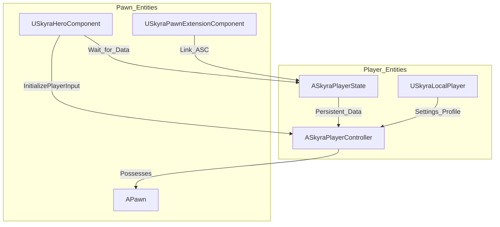
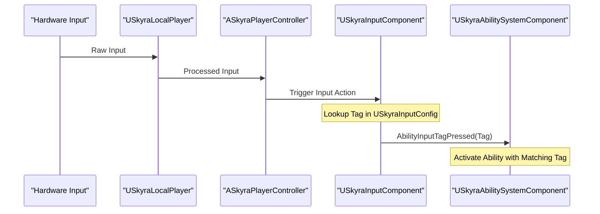

# 玩家系统

Relevant source files

以下文件作为生成此维基页面的上下文：

- [.gitattributes](.gitattributes)

SkyraFramework 中的**玩家系统**为玩家表示、本地状态管理以及人类玩家与游戏世界之间的接口提供了基础性基础设施。它扩展了标准的虚幻引擎 `PlayerController` 和 `PlayerState`，以与该框架的模块化系统集成，这些系统包括游戏技能系统（GAS）、团队系统和体验系统。

该系统旨在通过统一接口处理人类玩家和AI Bot，同时为输入处理和生成逻辑提供专用组件。

## 核心玩家类

该框架使用特定的玩家相关类层次结构来管理玩家会话的生命周期。

| 类 | 职责 |
| :--- | :--- |
| `ASkyraPlayerController` | 玩家输入和摄像机管理的主要接口。处理团队分配和高级玩家操作。 |
| `ASkyraPlayerState` | 保存持久化数据，在Pawn销毁后依然存在（例如分数、队伍、GAS组件）。 |
| `USkyraLocalPlayer` | 管理本地用户设置、输入配置和平台特定的玩家数据。 |
| `USkyraHeroComponent` | 添加到Pawn的模块化组件，用于协调Controller、PlayerState和Input之间的初始化。 |

### 玩家初始化流程
玩家控制的Pawn初始化由`USkyraHeroComponent`使用`GameFrameworkComponentManager`进行协调。它确保在游戏开始前`ASkyraPlayerState`可用，并且`AbilitySystemComponent`正确链接到该Pawn。

---

## 玩家控制器、状态与生成 (#5.1)

该子系统管理世界中玩家的生命周期，从初始生成到跨比赛持久化。

*   **ASkyraPlayerController**：扩展基础控制器，以支持框架的摄像机辅助功能、通过`ISkyraTeamAgentInterface`实现的基于队伍的逻辑，并与`SkyraCheatManager`集成。
*   **ASkyraPlayerState**：充当玩家特定游戏数据的“枢纽”。在SkyraFramework中，`AbilitySystemComponent`和`AttributeSets`位于PlayerState而非Pawn上，以确保它们跨重生持久化。
*   **生成管理**：由`SkyraPlayerSpawningManagerComponent`处理，它与`SkyraPlayerStart` Actor协作，根据队伍需求和经验特定规则查找有效位置。

有关控制器逻辑、机器人支持和生成的详细信息，请参见[玩家控制器、状态和生成](#5.1)。

---

## 输入系统（#5.2）

SkyraFramework 使用**增强输入**插件，该插件封装在数据驱动的架构中，将输入动作映射到游戏玩法标签。

*   **USkyraInputComponent**：扩展标准输入组件以允许将游戏玩法能力直接绑定到输入标签。
*   **USkyraInputConfig**：一个数据资产，定义了 `UInputAction` 和 `FGameplayTag` 之间的映射。这允许设计人员更改控制而无需修改 C++ 代码。
*   **初始化**：当 Pawn 准备就绪时，`USkyraHeroComponent` 触发 `InitializePlayerInput`，将相应的 `InputMappingContext` 推送给本地玩家。

有关映射、灵敏度设置和能力输入路由的详细信息，请参见[输入系统](#5.2)。

---

## 系统交互图

下图说明了玩家系统如何弥补原始硬件输入与游戏玩法能力系统之间的差距。

---

## 关键类摘要

| 类名 | 角色 |
| :--- | :--- |
| `ASkyraPlayerController` | 本地/远程玩家权限和摄像机控制。 |
| `ASkyraPlayerState` | GAS 容器及持久化属性存储。 |
| `USkyraLocalPlayer` | 每用户设置和本地输入状态。 |
| `USkyraHeroComponent` | Pawn/Controller/Input 初始化的协调器。 |
| `USkyraInputComponent` | 将输入动作路由到 GAS 标签。 |

**来源:** [Source/SkyraGame/Private/Character/SkyraHeroComponent.cpp:17-19](), [Source/SkyraGame/Private/Character/SkyraHeroComponent.cpp:77-144](), [Source/SkyraGame/Private/Character/SkyraHeroComponent.cpp:160-174]()