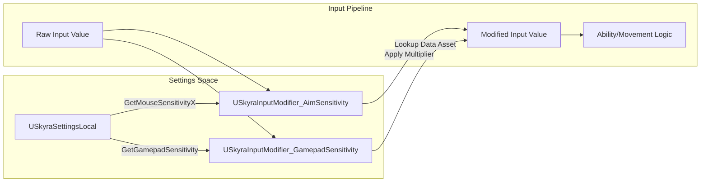

# 输入系统

Relevant source files

生成此Wiki页面时使用了以下文件作为上下文：

- [.gitattributes](.gitattributes)

SkyraFramework 输入系统基于 **Enhanced Input** 插件构建，并对其进行了扩展以与 Gameplay Ability System (GAS) 无缝集成。它提供了一种数据驱动的方法，将硬件输入操作映射到特定 Gameplay 标签，管理玩家可映射配置，并处理瞄准时的灵敏度缩放。

## 核心输入组件

### USkyraInputComponent
`USkyraInputComponent` 是 Enhanced Input 系统和 Skyra Gameplay Ability System 之间的主要接口。它扩展了 `UEnhancedInputComponent`，以支持将输入操作直接绑定到 Gameplay 标签。

*   **技能绑定**：它允许将 `UInputAction` 资产绑定到特定的 `FGameplayTag` 标识符 [Source/SkyraGame/Private/Input/SkyraInputComponent.h:23-25]()。
*   **输入标签路由**：当一个操作被触发时，组件将输入路由到 `USkyraAbilitySystemComponent`。它处理三种状态：`Pressed`、`Released` 和 `Held` [Source/SkyraGame/Private/Input/SkyraInputComponent.cpp:33-54]()。

### USkyraInputConfig
用于定义 `UInputAction` 和 `FGameplayTag` 之间映射的数据资产。

*   **原生输入操作**：映射由原生 C++ 代码处理的操作（例如移动、视角） [Source/SkyraGame/Private/Input/SkyraInputConfig.h:37-41]()。
*   **能力输入动作**：映射旨在通过输入标签触发 GAS 能力的动作 [Source/SkyraGame/Private/Input/SkyraInputConfig.h:44-48]().
*   **查找函数**：提供实用方法，如 `FindNativeInputActionForTag` 和 `FindAbilityInputActionForTag`，以检索给定标签的正确动作 [Source/SkyraGame/Private/Input/SkyraInputConfig.cpp:20-47]().

### USkyraHeroComponent 集成
`USkyraHeroComponent` 协调玩家控制 Pawn 的输入初始化。它监听来自 `USkyraPawnExtensionComponent` 的 `NAME_BindInputsNow` 扩展事件以触发绑定流程 [Source/SkyraGame/Private/Character/SkyraHeroComponent.cpp:161-180]().

**输入初始化流程**

```mermaid
graph TD
    subgraph "Initialization Space"
        A["USkyraHeroComponent::InitializePlayerInput"] --> B["USkyraInputComponent::BindAbilityActions"]
        B --> C["USkyraInputConfig::AbilityInputActions"]
    end

    subgraph "Execution Space"
        D["Hardware Input"] --> E["UEnhancedInputComponent"]
        E --> F["USkyraInputComponent::Input_AbilityInputTagPressed"]
        F --> G["USkyraAbilitySystemComponent::AbilityInputTagPressed"]
        G --> H["Activate Ability by Tag"]
    end
```

来源：[Source/SkyraGame/Private/Input/SkyraInputComponent.cpp:33-54]()，[Source/SkyraGame/Private/Character/SkyraHeroComponent.cpp:161-220]()

## 输入配置与映射

### FMappableConfigPair
一种用于封装 `UPlayerMappableInputConfig` 及激活元数据的结构体。它确定配置是否应在注册时自动激活，并跟踪配置的加载状态 [Source/SkyraGame/Private/Input/SkyraMappableConfigPair.h:21-41]().

### 游戏功能动作
Skyra 使用 `GameFeatureActions` 根据当前游戏体验动态注入输入配置：

| 操作类 | 用途 |
| :--- | :--- |
| `UGameFeatureAction_AddInputBinding` | 将 `USkyraInputConfig` 集合绑定到 `USkyraHeroComponent`，用于能力路由 [Source/SkyraGame/Private/GameFeatures/GameFeatureAction_AddInputBinding.h:25-28](). |
| `UGameFeatureAction_AddInputConfig` | 注册并将 `FMappableConfigPair`（增强输入玩家可映射配置）添加到本地玩家子系统 [Source/SkyraGame/Private/GameFeatures/GameFeatureAction_AddInputConfig.h:27-30](). |
| `UGameFeatureAction_AddInputContextMapping` | 将具有特定优先级的 `UInputMappingContext`（IMC）资源直接注入到增强输入子系统 [Source/SkyraGame/Private/GameFeatures/GameFeatureAction_AddInputContextMapping.h:34-37](). |

源文件： [Source/SkyraGame/Private/GameFeatures/GameFeatureAction_AddInputBinding.cpp:122-148](), [Source/SkyraGame/Private/GameFeatures/GameFeatureAction_AddInputConfig.cpp:146-173](), [Source/SkyraGame/Private/GameFeatures/GameFeatureAction_AddInputContextMapping.cpp:98-113]()

## 瞄准灵敏度与修改器

### SkyraAimSensitivityData
一个数据资产（`USkyraAimSensitivityData`），定义了灵敏度枚举值（例如 慢速、正常、快速）与浮点值之间的映射 [Source/SkyraGame/Private/Input/SkyraAimSensitivityData.h:17-25]()。这允许用户在设置中选择离散的灵敏度级别，这些级别在输入管道中转化为精确的乘数。

### SkyraInputModifiers
自定义增强输入修改器用于根据用户设置动态应用灵敏度和死区：

*   **USkyraInputModifier_AimSensitivity**：根据从`USkyraSettingsLocal`获取的玩家当前灵敏度设置来乘以输入。它区分鼠标和手柄 [Source/SkyraGame/Private/Input/SkyraInputModifiers.cpp:30-65]()。
*   **USkyraInputModifier_GamepadSensitivity**：专门使用`USkyraAimSensitivityData`资源缩放手柄视角输入，以将`ESkyraGamepadSensitivity`枚举映射为浮点数 [Source/SkyraGame/Private/Input/SkyraInputModifiers.cpp:73-100]()。

**灵敏度数据流**

来源：[Source/SkyraGame/Private/Input/SkyraInputModifiers.cpp:30-65]()、[Source/SkyraGame/Private/Input/SkyraAimSensitivityData.h:17-25]()、[Source/SkyraGame/Private/Settings/SkyraSettingsLocal.h:20-40]()

## 用户设置与持久化

### USkyraInputUserSettings
Skyra 利用 `UEnhancedInputUserSettings` 来管理每个玩家的按键绑定和输入偏好。

*   **注册**：`UGameFeatureAction_AddInputContextMapping` 向用户设置子系统注册 IMC，使其可供 UI 查询和重新映射 [Source/SkyraGame/Private/GameFeatures/GameFeatureAction_AddInputContextMapping.cpp:107-110]()。
*   **可映射按键配置文件**：使用 `USkyraPlayerMappableKeyProfile` 来存储特定的硬件到操作映射以及平台特定的覆盖项 [Source/SkyraGame/Private/UserSettings/SkyraPlayerMappableKeyProfile.h:16-20]()。

### SkyraMappableConfigPair 静态注册
该框架提供了静态方法，通过 `FMappableConfigPair::RegisterPair` 和 `UnregisterPair` 全局跟踪已注册的输入配置 [Source/SkyraGame/Private/Input/SkyraMappableConfigPair.cpp:11-25]()。这确保了即使某个游戏功能当前未激活，其可能的按键绑定仍然可以在设置菜单中查看或修改。

来源： [Source/SkyraGame/Private/Input/SkyraMappableConfigPair.cpp:11-40](), [Source/SkyraGame/Private/GameFeatures/GameFeatureAction_AddInputContextMapping.cpp:88-115](), [Source/SkyraGame/Private/UserSettings/SkyraPlayerMappableKeyProfile.cpp:10-25]()