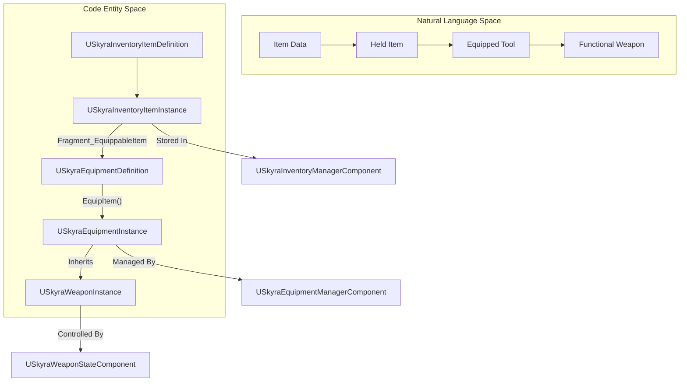
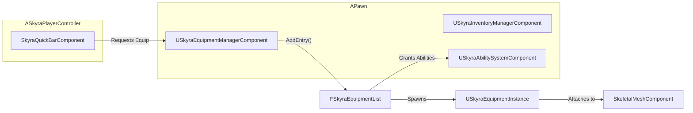

# 装备、背包与武器

Relevant source files

以下文件被用作生成本维基页面的上下文：

- [.gitattributes](.gitattributes)

SkyraFramework 提供了一个多层系统来处理物品，从抽象数据定义到物理武器实例。生命周期通常从**背包物品**开始，它可以被保存在一个集合中。当该物品被移动到“快捷栏”或被使用时，它会创建一个**装备实例**，该实例处理网格体的物理附着和授予 GAS 能力。最后，如果该装备是武器，它会利用**武器系统**来处理射击逻辑、弹药和特殊动画。

### 系统流程概述

下图说明了从数据定义到角色手中功能完备的武器的过渡。

**物品生命周期：从定义到实例**

---

### 背包系统
背包系统是物品生命周期的基础。它使用一种“基于片段”的方法，其中 `USkyraInventoryItemDefinition` 是一个简单的数据容器，持有各种 `USkyraInventoryItemFragment` 对象。这使得物品高度模块化——一种物品可能有一个用于 UI 图标的片段，而另一种物品则有一个将其定义为可装备的片段。

- **USkyraInventoryItemInstance**：表示背包中特定物品的瞬时对象。
- **USkyraInventoryManagerComponent**：处理物品实例的集合和复制。
- **片段**：定义行为，例如 `UInventoryFragment_EquippableItem`，它将背包物品链接到装备定义。

详情请参见 [物品系统](#6.1)。

---

### 装备系统
装备系统连接了菜单项与世界中的物理对象之间的鸿沟。当一个物品被“装备”时（通常通过 `SkyraQuickBarComponent`），`USkyraEquipmentManagerComponent` 会生成一个 `USkyraEquipmentInstance`。

- **USkyraEquipmentDefinition**：定义要生成的 Actor（网格体）以及装备物品时授予 Pawn 的`USkyraAbilitySet`。
- **USkyraEquipmentInstance**：管理生成的 Actor 的生命周期，并接收 `OnEquipped` / `OnUnequipped` 通知。
- **SkyraQuickBarComponent**：一个专用的管理器，跟踪一组有限的活动槽位，并在选择槽位时触发装备逻辑。

详情请参见 [装备系统](#6.2)。

---

### 武器系统
武器系统是装备系统的扩展。武器本质上是一种专用装备，添加了战斗特定的逻辑，例如射速、散布和动画层覆盖。

- **USkyraWeaponInstance**：继承自 `USkyraEquipmentInstance` 并添加武器特定的元数据。
- **USkyraGameplayAbility_RangedWeapon**：一种专门设计用于处理“开火”动作的 GAS 技能，与武器实例交互以计算射击时机和抛射物。
- **USkyraWeaponStateComponent**：跟踪武器的瞬时状态，例如上次开火后的时间，以确保客户端和服务器之间的同步。

详情请参阅[武器系统](#6.3)。

---

### 组件关系图
此图展示了各个组件如何在Pawn/Controller上交互以实现装备流程。

**代码实体关系**

**源文件：**
- [Source/SkyraGame/Private/Equipment/SkyraEquipmentManagerComponent.cpp:61-66]()
- [Source/SkyraGame/Private/Equipment/SkyraEquipmentInstance.cpp:75-81]()
- [Source/SkyraGame/Private/Equipment/SkyraQuickBarComponent.cpp:123-133]()