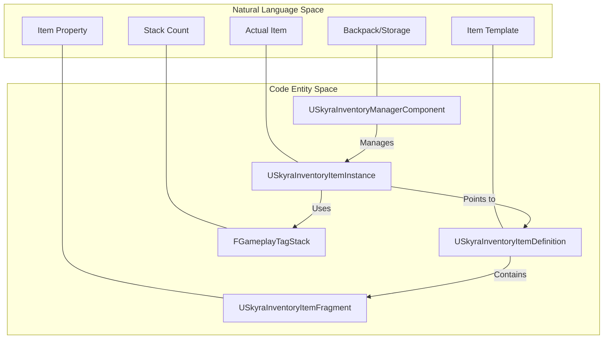
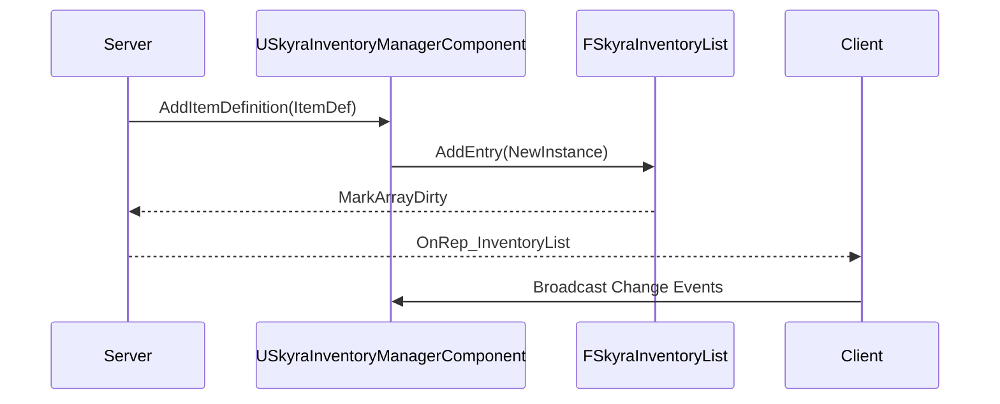

# 库存系统

Relevant source files

以下文件用作生成此 wiki 页面的上下文：

- [.gitattributes](.gitattributes)

SkyraFramework 中的库存系统提供了一种数据驱动的架构，使用基于片段的方法来管理物品。它将物品的定义（静态数据）与其实例（运行时状态）解耦，并使用专门的管理器组件来处理网络中的复制和生命周期。

## 核心架构

该系统围绕三个主要支柱构建：
1.  **物品定义**：静态数据资产，定义物品是什么以及它包含哪些“片段”（逻辑/数据块）。
2.  **物品实例**：在运行时创建的对象，代表库存中的特定物品，跟踪堆叠数量和动态状态。
3.  **库存管理器**：一个 actor 组件，跟踪物品实例的集合并处理网络通信。

### 自然语言到代码实体的映射

以下图表将高层级的库存概念映射到代码库中对应的类和结构。

标题：库存系统实体映射

**来源：** `USkyraInventoryItemDefinition` 定义于 [Source/SkyraGame/Private/Inventory/SkyraInventoryItemDefinition.h:18-35]()，`USkyraInventoryItemInstance` 在 [Source/SkyraGame/Private/Inventory/SkyraInventoryItemInstance.h:20-60]()，`USkyraInventoryManagerComponent` 在 [Source/SkyraGame/Private/Inventory/SkyraInventoryManagerComponent.h:103-149]()。

---

## 数据结构

### USkyraInventoryItemDefinition
这是一个 `UPrimaryDataAsset`，作为物品的“蓝图”[Source/SkyraGame/Private/Inventory/SkyraInventoryItemDefinition.h:18-19]()。它不使用严格的继承层次结构，而是使用 `USkyraInventoryItemFragment` 对象的列表 [Source/SkyraGame/Private/Inventory/SkyraInventoryItemDefinition.h:31-32]()。

*   **片段**：每个片段代表一个特定功能，例如用于世界表现的网格体、UI 图标或装备数据。
*   **FindFragmentByClass**：一个辅助函数，用于在运行时检索特定数据块 [Source/SkyraGame/Private/Inventory/SkyraInventoryItemDefinition.h:23-24]()。

**来源：** [Source/SkyraGame/Private/Inventory/SkyraInventoryItemDefinition.h:18-35]()

### USkyraInventoryItemInstance
一个 `UObject`，代表玩家或容器当前持有的物品 [Source/SkyraGame/Private/Inventory/SkyraInventoryItemInstance.h:20-21]()。
*   **复制**：它是一个复制对象，确保客户端知道他们拥有的物品 [Source/SkyraGame/Private/Inventory/SkyraInventoryItemInstance.h:23-24]()。
*   **状态标签**：使用 `FGameplayTagStackContainer` 存储与 Gameplay 标签关联的动态整数值（例如弹药数、耐久度、堆叠大小）[Source/SkyraGame/Private/Inventory/SkyraInventoryItemInstance.h:59-60]()。
*   **功能**：提供诸如 `AddStatTagStack`、`RemoveStatTagStack` 和 `GetStatTagStackCount` 等方法来操作物品状态 [Source/SkyraGame/Private/Inventory/SkyraInventoryItemInstance.h:34-40]()。

**来源：** [Source/SkyraGame/Private/Inventory/SkyraInventoryItemInstance.h:20-60]()

---

## 库存管理

### USkyraInventoryManagerComponent
它是角色库存的中央管理机构。它管理着 `FSkyraInventoryEntry` 结构列表，该列表存储在一个 `FSkyraInventoryList`（一个 `FFastArraySerializer`）中 [Source/SkyraGame/Private/Inventory/SkyraInventoryManagerComponent.h:103-110]()。

| 函数 | 描述 |
| :--- | :--- |
| `AddItemDefinition` | 基于定义创建一个新的 `USkyraInventoryItemInstance` 并将其添加到列表中 [Source/SkyraGame/Private/Inventory/SkyraInventoryManagerComponent.h:114-115](). |
| `RemoveItemInstance` | 从库存中移除特定实例 [Source/SkyraGame/Private/Inventory/SkyraInventoryManagerComponent.h:117-118](). |
| `GetAllItems` | 返回所有当前物品实例的列表 [Source/SkyraGame/Private/Inventory/SkyraInventoryManagerComponent.h:120-121](). |
| `FindFirstItemStackByDefinition` | 搜索特定物品类型的第一个实例 [Source/SkyraGame/Private/Inventory/SkyraInventoryManagerComponent.h:123-124](). |

标题：库存数据流

**来源：** [Source/SkyraGame/Private/Inventory/SkyraInventoryManagerComponent.h:50-149]()

---

## 库存片段

片段允许库存系统在不修改基类的情况下保持可扩展性。

| 片段类 | 用途 |
| :--- | :--- |
| `UInventoryFragment_EquippableItem` | 包含一个`TSubclassOf<USkyraEquipmentDefinition>`，供装备系统用于生成Actor/能力 [Source/SkyraGame/Private/Inventory/InventoryFragment_EquippableItem.h:13-19](). |
| `UInventoryFragment_PickupIcon` | 定义物品掉落时在世界中的3D网格体和视觉参数 [Source/SkyraGame/Private/Inventory/InventoryFragment_PickupIcon.h:13-28](). |
| `UInventoryFragment_QuickBarIcon` | 存储 HUD 快捷栏的 UI 纹理和显示名称 [Source/SkyraGame/Private/Inventory/InventoryFragment_QuickBarIcon.h:13-25]()。|
| `UInventoryFragment_SetStats` | 创建实例时要应用的初始 Gameplay Tags 和堆叠数量 [Source/SkyraGame/Private/Inventory/InventoryFragment_SetStats.h:13-22]()。|

**来源：** [Source/SkyraGame/Private/Inventory/InventoryFragment_EquippableItem.h:1-21](), [Source/SkyraGame/Private/Inventory/InventoryFragment_PickupIcon.h:1-30](), [Source/SkyraGame/Private/Inventory/InventoryFragment_QuickBarIcon.h:1-27](), [Source/SkyraGame/Private/Inventory/InventoryFragment_SetStats.h:1-24]()

---

## 交互与拾取

### IPickupable 接口
可以添加到库存中的 Actor 必须实现 `IPickupable` 接口 [Source/SkyraGame/Private/Inventory/IPickupable.h:40-41]()。该接口为交互系统提供了一种标准方式来查询 Actor 提供了哪些物品。

*   **GetPickupInventory()**：返回拾取物中包含的物品定义和数量 [Source/SkyraGame/Private/Inventory/IPickupable.h:47-48]()。

**来源：** [Source/SkyraGame/Private/Inventory/IPickupable.h:10-54]()

---

## 与 Gameplay Ability System (GAS) 的集成

库存物品通常充当能力的“消耗品”（例如，使用药水或消耗弹药）。

### USkyraAbilityCost_InventoryItem
一种游戏能力消耗，在允许激活前检查 `USkyraInventoryManagerComponent` 是否拥有指定数量的物品 [Source/SkyraGame/Private/AbilitySystem/Abilities/SkyraAbilityCost_InventoryItem.h:20-21]()。
*   `CheckCost`：验证库存中是否存在 `ItemDefinition` [Source/SkyraGame/Private/AbilitySystem/Abilities/SkyraAbilityCost_InventoryItem.cpp:14-31]()。
*   `ApplyCost`：在库存组件上调用 `ConsumeItemsByDefinition` [Source/SkyraGame/Private/AbilitySystem/Abilities/SkyraAbilityCost_InventoryItem.cpp:33-52]()。

### USkyraAbilityCost_ItemTagStack
一种更细粒度的消耗，用于检查特定 `USkyraInventoryItemInstance` 上的 `FGameplayTagStack` [Source/SkyraGame/Private/AbilitySystem/Abilities/SkyraAbilityCost_ItemTagStack.h:21-22]()。这通常用于武器消耗以标签形式存储在物品本身的弹药。
*   `CheckCost`：验证特定 `Tag` 的堆叠数量 [Source/SkyraGame/Private/AbilitySystem/Abilities/SkyraAbilityCost_ItemTagStack.cpp:19-40]()。
*   `ApplyCost`：从物品实例中移除指定数量的堆叠 [Source/SkyraGame/Private/AbilitySystem/Abilities/SkyraAbilityCost_ItemTagStack.cpp:42-59]()。

**来源：** [Source/SkyraGame/Private/AbilitySystem/Abilities/SkyraAbilityCost_InventoryItem.cpp:1-52](), [Source/SkyraGame/Private/AbilitySystem/Abilities/SkyraAbilityCost_ItemTagStack.cpp:1-59]()