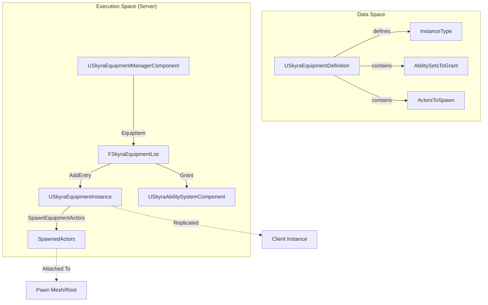
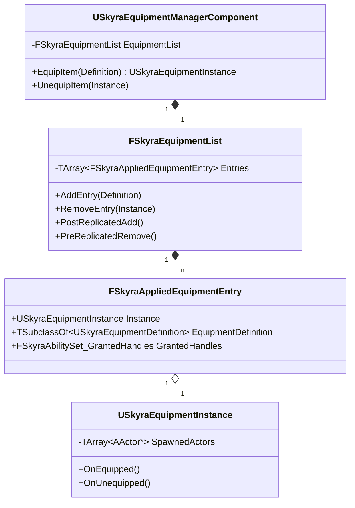

# 装备系统

Relevant source files

以下文件用作生成本维基页面的上下文：

- [.gitattributes](.gitattributes)

装备系统管理可被角色“穿戴”或“持有”的物品的生命周期。它弥合了抽象库存物品与这些物品在游戏世界中的物理表现之间的差距，包括生成Actor、授予游戏能力以及管理复制。

## 系统概述

该系统基于定义-实例模式构建。`USkyraEquipmentDefinition`定义物品是什么，而`USkyraEquipmentInstance`代表该装备在角色上的具体实例。`USkyraEquipmentManagerComponent`充当添加和移除这些实例的权威。

### 装备数据流
以下图表说明了数据如何从静态定义流向角色上的实时实例。

**装备生命周期流程**

**来源：** [Source/SkyraGame/Private/Equipment/SkyraEquipmentDefinition.cpp:8-12](), [Source/SkyraGame/Private/Equipment/SkyraEquipmentManagerComponent.cpp:68-107]()

## 关键类

### USkyraEquipmentDefinition
用于描述可装备物品的数据资产。它指定了：
*   **实例类**：要创建的`USkyraEquipmentInstance`的类 [源文件/SkyraGame/Private/Equipment/SkyraEquipmentDefinition.cpp:11]().
*   **能力集**：装备时授予Pawn的`USkyraAbilitySet`列表 [源文件/SkyraGame/Private/Equipment/SkyraEquipmentManagerComponent.cpp:91-95]().
*   **要生成的Actor**：要生成并附加到Pawn的Actor（网格体、效果）列表 [源文件/SkyraGame/Private/Equipment/SkyraEquipmentInstance.cpp:73-93]().

### USkyraEquipmentInstance
一个复制的`UObject`，表示已装备物品的“实时”状态。
*   **OnEquipped / OnUnequipped**：用于自定义逻辑的蓝图可实现事件 [源文件/SkyraGame/Private/Equipment/SkyraEquipmentInstance.cpp:106-114]().
*   **Actor管理**：处理与装备关联的物理Actor的生成和销毁 [源文件/SkyraGame/Private/Equipment/SkyraEquipmentInstance.cpp:73-104]().
*   **发起者跟踪**：跟踪触发该装备的`USkyraInventoryItemInstance` [源文件/SkyraGame/Private/Equipment/SkyraEquipmentInstance.cpp:41]().

### USkyraEquipmentManagerComponent
通常附加到`Pawn`的一个组件，用于管理活动装备列表。
*   **复制**：使用自定义的快速TArray序列化器（`FSkyraEquipmentList`）来高效地向客户端复制装备变更 [源文件/SkyraGame/Private/Equipment/SkyraEquipmentManagerComponent.cpp:141-146]().
*   **子对象复制**：通过 `ReplicateSubobjects` 管理 `USkyraEquipmentInstance` 对象的复制 [Source/SkyraGame/Private/Equipment/SkyraEquipmentManagerComponent.cpp:181-196]().
*   **条目管理**：提供 `EquipItem` 和 `UnequipItem` 函数来修改 `EquipmentList` [Source/SkyraGame/Private/Equipment/SkyraEquipmentManagerComponent.cpp:148-179]().

**源代码：** [Source/SkyraGame/Private/Equipment/SkyraEquipmentManagerComponent.cpp:133-139](), [Source/SkyraGame/Private/Equipment/SkyraEquipmentInstance.cpp:20-23]()

## 装备技能

装备通常会授予游戏技能。这些技能通过 `USkyraGameplayAbility_FromEquipment` 实现。

*   **上下文检索**：此类提供了辅助函数，用于查找授予技能的 `USkyraEquipmentInstance` 或原始 `USkyraInventoryItemInstance` [Source/SkyraGame/Private/Equipment/SkyraGameplayAbility_FromEquipment.cpp:18-35]().
*   **验证**：在编辑器中，它会确保基于装备的技能设置为 `InstancedPerActor` 或 `InstancedPerExecution`，因为它们需要实例特定的源对象数据 [Source/SkyraGame/Private/Equipment/SkyraGameplayAbility_FromEquipment.cpp:39-50]().

**源代码：** [Source/SkyraGame/Private/Equipment/SkyraGameplayAbility_FromEquipment.cpp:13-16]()

## SkyraQuickBarComponent

快速栏是一个专用组件（通常位于 `PlayerController` 上），用于管理一组固定插槽，这些插槽包含 `USkyraInventoryItemInstance` 对象。

### 插槽管理
*   **活动索引**：跟踪当前哪个插槽处于活动状态 [Source/SkyraGame/Private/Equipment/SkyraQuickBarComponent.cpp:33]().
*   **循环**：提供`CycleActiveSlotForward`和`CycleActiveSlotBackward`以导航槽位 [Source/SkyraGame/Private/Equipment/SkyraQuickBarComponent.cpp:46-84]()。
*   **库存集成**：当激活槽位时，会在物品的分片中搜索`UInventoryFragment_EquippableItem`，并通知`USkyraEquipmentManagerComponent`进行装备 [Source/SkyraGame/Private/Equipment/SkyraQuickBarComponent.cpp:86-109]()。

### 通信
快速栏使用`UGameplayMessageSubsystem`来通知UI和其他系统有关变更的信息。
*   **TAG_Skyra_QuickBar_Message_SlotsChanged**：当物品被添加到槽位或从槽位移除时广播 [Source/SkyraGame/Private/Equipment/SkyraQuickBarComponent.cpp:205-213]()。
*   **TAG_Skyra_QuickBar_Message_ActiveIndexChanged**：当玩家切换活动槽位时广播 [Source/SkyraGame/Private/Equipment/SkyraQuickBarComponent.cpp:215-223]()。

**来源：** [Source/SkyraGame/Private/Equipment/SkyraQuickBarComponent.cpp:19-21](), [Source/SkyraGame/Private/Equipment/SkyraQuickBarComponent.cpp:135-147]()

## 实现细节

### 装备列表复制
系统使用`FSkyraEquipmentList`（一个`FFastArraySerializer`）来管理`FSkyraAppliedEquipmentEntry`结构。这确保了当物品在服务器上装备时，客户端能正确触发生命周期事件。

**实体关系图**

### 初始化和清理
1.  **装备**：`AddEntry`创建`USkyraEquipmentInstance`，授予`USkyraAbilitySet`给ASC，并调用`SpawnEquipmentActors` [Source/SkyraGame/Private/Equipment/SkyraEquipmentManagerComponent.cpp:84-101]()。
2.  **取消装备**：`RemoveEntry`收回能力句柄并销毁生成的Actor [Source/SkyraGame/Private/Equipment/SkyraEquipmentManagerComponent.cpp:116-122]()。
3.  **拆卸**：当`USkyraEquipmentManagerComponent`取消初始化时，它会遍历所有活动实例并调用`UnequipItem`，以确保正确清理Actor和能力 [Source/SkyraGame/Private/Equipment/SkyraEquipmentManagerComponent.cpp:203-219]()。

**来源：** [Source/SkyraGame/Private/Equipment/SkyraEquipmentManagerComponent.cpp:18-38](), [Source/SkyraGame/Private/Equipment/SkyraEquipmentManagerComponent.cpp:109-128]()