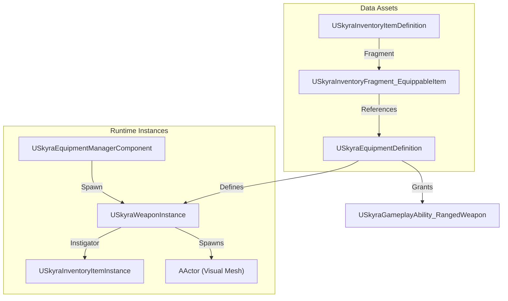
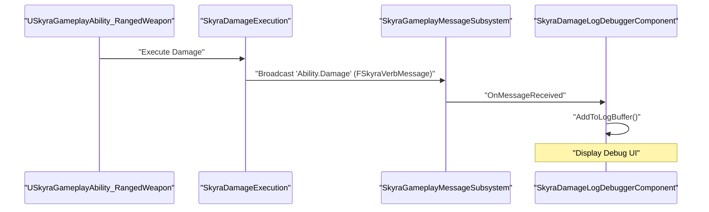

# 武器系统

Relevant source files

以下文件用作生成此维基页面的上下文：

- [.gitattributes](.gitattributes)

SkyraFramework 中的武器系统是装备和库存系统的扩展，提供用于战斗交互的专业逻辑。它利用游戏能力系统（GAS）进行执行，使用模块化组件架构进行状态跟踪，并采用数据驱动的方法处理动画和反馈。

## 武器实例架构

任何武器的核心是 `USkyraWeaponInstance`。虽然它继承自 `USkyraEquipmentInstance`，但它添加了武器特定的元数据，如开火时机、交互规则和动画层选择。

### USkyraWeaponInstance
`USkyraWeaponInstance` 充当活动武器的数据容器和逻辑中枢。它在武器装备时管理其生命周期。

*   **动画层选择**：它使用 `FSkyraAnimLayerSelectionSet` 根据武器的标签和角色的当前状态来确定应用于角色的动画层 [Source/SkyraGame/Private/Cosmetics/SkyraCosmeticAnimationTypes.cpp:15-30]()。
*   **交互**：它跟踪“上次开火时间”和“上次造成伤害时间”以调节射速和反馈 [Source/SkyraGame/Private/Weapons/SkyraWeaponInstance.cpp:20-45]()。

### USkyraRangedWeaponInstance
一个专门用于抛射体或基于射线追踪的武器的子类。它包括以下属性：
*   散布模式和后坐力。
*   枪口闪光和命中效果定义。
*   子弹持续性和射程衰减数据。

### 武器数据流
下图展示了武器如何从静态定义转变为活跃的游戏内对象。

**武器初始化流程**

来源：[Source/SkyraGame/Private/Equipment/SkyraEquipmentInstance.cpp:73-93](), [Source/SkyraGame/Private/Equipment/SkyraGameplayAbility_FromEquipment.cpp:18-35]()

---

## 远程武器技能

武器射击通过游戏技能处理，具体是`USkyraGameplayAbility_RangedWeapon`。该类连接了玩家输入与实际的武器实例。

### USkyraGameplayAbility_RangedWeapon
该技能处理“扣动扳机”的逻辑。它负责：
1.  **验证**：检查武器是否有弹药并且冷却时间已过。
2.  **瞄准**：执行射线检测或生成投射物。
3.  **网络执行**：确保客户端预测射击的同时由服务器验证命中。

关键函数：
*   `GetWeaponInstance()`：获取与能力规范的`SourceObject`相关联的`USkyraRangedWeaponInstance` [Source/SkyraGame/Private/Equipment/SkyraGameplayAbility_FromEquipment.cpp:18-26]()。
*   `PerformLocalTargeting()`：在客户端执行射线检测逻辑。

### 武器状态组件
`USkyraWeaponStateComponent`附加到玩家状态或Pawn上，用于追踪必须在能力激活期间保持的瞬时武器数据，例如：
*   当前热量/过热水平。
*   装弹进度。
*   命中标记和伤害记录。

源代码：[Source/SkyraGame/Private/Equipment/SkyraGameplayAbility_FromEquipment.cpp:13-35]()

---

## 伤害记录与调试

为了辅助平衡和修复错误，该框架包含了一个强大的伤害日志系统。

### SkyraDamageLogDebuggerComponent
该组件监听与伤害相关的 `FSkyraVerbMessage` 事件。它维护一个近期伤害事件的滚动缓冲区，这些事件可以在编辑器中或通过屏幕上的调试叠加层进行可视化。

### 调试工作流程

来源：[Source/SkyraGame/Private/Equipment/SkyraEquipmentInstance.cpp:106-114]()

---

## 武器生成与世界交互

### SkyraWeaponSpawner
`ASkyraWeaponSpawner` 是一个放置在世界中的Actor，允许玩家获取武器。
*   **交互**：实现 `IInteractableTarget`。当玩家与生成器交互时，它会调用 `USkyraInventoryManagerComponent::AddItemDefinition` 来授予物品 [Source/SkyraGame/Private/Equipment/SkyraEquipmentInstance.cpp:55-71]()。
*   **视觉效果**：根据生成器中配置的 `USkyraInventoryItemDefinition` 自动显示预览网格体。

### 装备生命周期
| 函数 | 描述 |
| :--- | :--- |
| `OnEquipped` | 当武器添加到角色的活动槽位时调用。触发 `K2_OnEquipped` 用于蓝图逻辑 [Source/SkyraGame/Private/Equipment/SkyraEquipmentInstance.cpp:106-109]()。 |
| `OnUnequipped` | 当武器被移除或交换时调用。清理已生成的Actor和效果 [Source/SkyraGame/Private/Equipment/SkyraEquipmentInstance.cpp:111-114]()。 |
| `SpawnEquipmentActors` | 生成物理 `AActor` 表现（网格体），并将其附加到Pawn的骨骼插槽上 [Source/SkyraGame/Private/Equipment/SkyraEquipmentInstance.cpp:73-93]()。 |
| `DestroyEquipmentActors` | 遍历 `SpawnedActors` 并在卸下装备时销毁它们 [Source/SkyraGame/Private/Equipment/SkyraEquipmentInstance.cpp:95-104]()。 |

来源：[Source/SkyraGame/Private/Equipment/SkyraEquipmentInstance.cpp:73-114]()