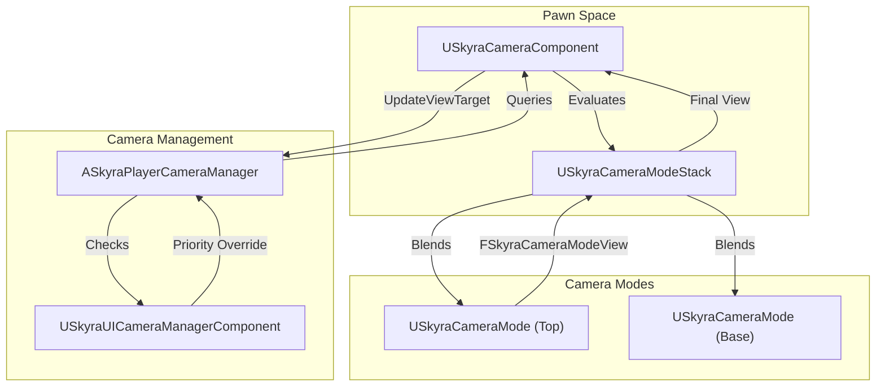

# 相机系统

Relevant source files

以下文件用作生成本 wiki 页面的上下文：

- [.gitattributes](.gitattributes)

Skyra 相机系统是一种模块化、基于堆栈的架构，旨在处理复杂的相机行为、混合和过渡。它摒弃了传统的“每个 Pawn 一个相机”模型，转而采用**相机模式堆栈**，该堆栈可以动态响应游戏状态（例如瞄准、冲刺或交互）。

### 系统概述

该系统基于四大主要支柱构建：
1.  **SkyraCameraComponent**：附加到 Pawn 的中央枢纽，管理模式堆栈。
2.  **SkyraCameraMode**：定义 FOV、偏移和约束的独立数据驱动行为（例如第三人称、轨道）。
3.  **SkyraPlayerCameraManager**：引擎级管理器，将组件的输出桥接到视口。
4.  **SkyraUICameraManagerComponent**：一个专用组件，用于在 UI 交互（例如物品栏菜单）期间处理相机覆盖。

### 架构图：相机流程

此图说明了 `SkyraCameraComponent` 如何评估其堆栈，并为 `SkyraPlayerCameraManager` 提供最终视图。

**相机评估管线**

**来源：** [Source/SkyraGame/Private/Camera/SkyraCameraComponent.cpp:32-48](), [Source/SkyraGame/Private/Camera/SkyraPlayerCameraManager.cpp:34-45]()

---

### 相机模式与组件
`USkyraCameraComponent` 负责通过评估一组 `USkyraCameraMode` 对象来计算最终相机参数（位置、旋转、视场角）[Source/SkyraGame/Private/Camera/SkyraCameraComponent.cpp:32-40]()。

*   **模式堆栈**：支持多个活动模式。最顶层的模式通常权重最高，但系统允许层级之间平滑混合（例如，从“默认”模式过渡到“ADS”模式）[Source/SkyraGame/Private/Camera/SkyraCameraMode.cpp:229-245]()。
*   **第三人称逻辑**：`USkyraCameraMode_ThirdPerson` 实现包括复杂的**穿透避免**，使用“探针”（线/扫描检测）防止相机穿透几何体 [Source/SkyraGame/Private/Camera/SkyraCameraMode_ThirdPerson.cpp:26-33]()。
*   **相机辅助**：类似 `ISkyraCameraAssistInterface` 的接口允许相机与玩家控制器或Pawn通信，以处理“手感”调整，例如自动旋转或在相机距离目标过近时报告 [Source/SkyraGame/Private/Camera/SkyraCameraMode_ThirdPerson.cpp:159-169]()。

有关模式评估和碰撞避免的详细信息，请参阅 **[相机模式与组件](#7.1)**。

**来源：** [Source/SkyraGame/Private/Camera/SkyraCameraComponent.cpp:85-99](), [Source/SkyraGame/Private/Camera/SkyraCameraMode_ThirdPerson.cpp:111-130]()

---

### 玩家相机管理器与UI相机
`ASkyraPlayerCameraManager` 充当相机视图的最终仲裁者。它会覆盖标准的 `UpdateViewTarget`，首先检查 `USkyraUICameraManagerComponent` 是否具有活跃的覆盖 [Source/SkyraGame/Private/Camera/SkyraPlayerCameraManager.cpp:34-45]()。

*   **UI集成**：当玩家打开菜单（例如英雄定制屏幕）时，`SkyraUICameraManagerComponent` 可以控制相机以聚焦特定Actor或位置，绕过Pawn的标准相机组件 [Source/SkyraGame/Private/Camera/SkyraUICameraManagerComponent.cpp:46-52]()。
*   **视图同步**：管理器确保`APlayerController`的控制旋转与相机的评估视图保持同步，尤其是在复杂的混合操作期间 [Source/SkyraGame/Private/Camera/SkyraCameraComponent.cpp:42-48]()。

有关UI覆盖和管理器生命周期的详细信息，请参阅**[玩家相机管理器和UI相机](#7.2)**。

**来源：** [Source/SkyraGame/Private/Camera/SkyraPlayerCameraManager.cpp:19-27]()、[Source/SkyraGame/Private/Camera/SkyraUICameraManagerComponent.cpp:14-25]()

---

### 关键代码实体

| 实体 | 角色 | 文件 |
| :--- | :--- | :--- |
| `USkyraCameraComponent` | 主要Pawn组件；评估模式栈。 | [Source/SkyraGame/Private/Camera/SkyraCameraComponent.cpp]() |
| `USkyraCameraMode` | 相机行为基类（视场角、混合）。 | [Source/SkyraGame/Private/Camera/SkyraCameraMode.cpp]() |
| `USkyraCameraModeStack` | 管理活动模式列表及其权重。 | [Source/SkyraGame/Private/Camera/SkyraCameraMode.cpp:229-232]() |
| `ASkyraPlayerCameraManager` | 与 `UpdateViewTarget` 和 UI 覆盖集成。 | [Source/SkyraGame/Private/Camera/SkyraPlayerCameraManager.cpp]() |
| `USkyraUICameraManagerComponent` | 处理菜单特定的相机目标。 | [Source/SkyraGame/Private/Camera/SkyraUICameraManagerComponent.cpp]() |
| `FSkyraCameraModeView` | 包含相机评估结果的结构体。 | [Source/SkyraGame/Private/Camera/SkyraCameraMode.cpp:17-23]() |

**源文件：** [Source/SkyraGame/Private/Camera/SkyraCameraComponent.h](), [Source/SkyraGame/Private/Camera/SkyraCameraMode.h](), [Source/SkyraGame/Private/Camera/SkyraPlayerCameraManager.h]()