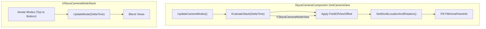
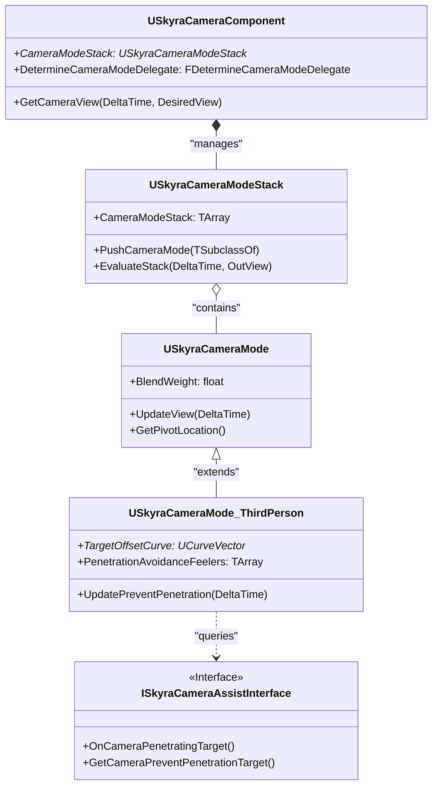

# 相机模式和组件

Relevant source files

以下文件用作生成本维基页面的上下文：

- [.gitattributes](.gitattributes)

Skyra相机系统是一种基于堆栈的架构，旨在实现模块化和不同游戏视角之间的平滑过渡。它将相机的物理位置和属性与Pawn的逻辑解耦，允许在第三人称、ADS（瞄准镜）和电影覆盖等模式之间进行复杂的混合。

## SkyraCameraComponent

`USkyraCameraComponent` 是actor上相机管理的核心枢纽。它管理一个 `USkyraCameraModeStack`，并负责将最终计算出的视图参数传递给渲染器和 `APlayerController`。

### 模式堆栈和评估
该组件本身不计算相机位置。而是将其委托给一个相机模式堆栈。在 `GetCameraView` 期间，它调用 `UpdateCameraModes()` 来确定是否应通过 `DetermineCameraModeDelegate` 推送新模式，然后评估堆栈以获取最终的 `FSkyraCameraModeView` [Source/SkyraGame/Private/Camera/SkyraCameraComponent.cpp:32-39]()。

### 关键职责
*   **堆栈管理**：在注册时自动创建一个 `USkyraCameraModeStack` [Source/SkyraGame/Private/Camera/SkyraCameraComponent.cpp:21-30]()。
*   **控制器同步**：更新 `APlayerController` 的控制旋转以匹配相机的评估旋转 [Source/SkyraGame/Private/Camera/SkyraCameraComponent.cpp:42-48]()。
*   **视野偏移**：支持临时FOV偏移（例如用于后坐力或速度效果），这些偏移会添加到模式的基础FOV上，并在每帧重置 [Source/SkyraGame/Private/Camera/SkyraCameraComponent.cpp:51-52]()。

### 数据流：组件到视图
下图展示了`USkyraCameraComponent`如何与栈协调以生成最终视图。

**相机视图计算流程**

**源文件：** [Source/SkyraGame/Private/Camera/SkyraCameraComponent.cpp:32-83](), [Source/SkyraGame/Private/Camera/SkyraCameraMode.cpp:227-260]()

---

## USkyraCameraMode

`USkyraCameraMode`是所有相机行为的抽象基类。它定义了相机如何相对于目标进行定位，以及如何与其他模式进行混合。

### 视图和混合参数
每种模式都包含一个`FSkyraCameraModeView`结构，其中包含`Location`、`Rotation`、`ControlRotation`和`FieldOfView` [Source/SkyraGame/Private/Camera/SkyraCameraMode.cpp:17-23]()。
模式通过`ESkyraCameraModeBlendFunction`支持多种混合函数：
*   **线性**：恒定变化速率。
*   **缓入 / 缓出**：使用`BlendExponent`实现平滑加速或减速 [Source/SkyraGame/Private/Camera/SkyraCameraMode.cpp:159-169]()。
*   **缓入缓出**：两端平滑过渡。

### 枢轴计算
基础类提供逻辑来确定“枢轴点”（相机注视的点）。对于角色，它会通过将当前胶囊体半高与默认半高进行比较，自动调整枢轴高度以应对蹲伏情况 [Source/SkyraGame/Private/Camera/SkyraCameraMode.cpp:82-106]()。

**来源：** [Source/SkyraGame/Private/Camera/SkyraCameraMode.cpp:52-63](), [Source/SkyraGame/Private/Camera/SkyraCameraMode.cpp:177-213]()

---

## SkyraCameraMode_ThirdPerson

`USkyraCameraMode_ThirdPerson` 扩展了基础模式以提供常见的第三人称功能，具体包括偏移曲线和穿透避免。

### 目标偏移
此模式不使用静态距离，而是使用曲线（可以是 `UCurveVector` 或运行时的浮点曲线）来根据当前的**俯仰角**定义相机的偏移量。这使得相机在玩家上下观察时可以移近或移远 [Source/SkyraGame/Private/Camera/SkyraCameraMode_ThirdPerson.cpp:50-68]()。

### 穿透避免
该模式使用“检测探针”（`FSkyraPenetrationAvoidanceFeeler`）来检测相机与目标之间的几何体。
*   **检测探针**：一组追踪（由旋转偏移和范围定义），用于“感知”碰撞 [Source/SkyraGame/Private/Camera/SkyraCameraMode_ThirdPerson.cpp:26-33]()。
*   **安全位置**：该模式计算一个“安全位置”（通常在角色的胶囊体内部），并从该位置向期望的相机位置进行追踪 [Source/SkyraGame/Private/Camera/SkyraCameraMode_ThirdPerson.cpp:136-155]()。
*   **预测性避免**：可执行多次射线检查，防止相机在快速旋转时穿透墙壁。

**来源：** [Source/SkyraGame/Private/Camera/SkyraCameraMode_ThirdPerson.cpp:35-72](), [Source/SkyraGame/Private/Camera/SkyraCameraMode_ThirdPerson.cpp:111-171]()

---

## SkyraCameraAssistInterface

该 `ISkyraCameraAssistInterface` 允许 Actor 或 Controller 影响或响应相机行为，而无需与相机组件紧密耦合。

### 与第三人称模式的集成
在 `UpdatePreventPenetration` 中，相机模式会检查 `TargetActor` 或 `TargetController` 是否实现了此接口 [Source/SkyraGame/Private/Camera/SkyraCameraMode_ThirdPerson.cpp:121-128]()。
*   **OnCameraPenetratingTarget()**：当相机因碰撞被强制过于靠近目标时调用 [Source/SkyraGame/Private/Camera/SkyraCameraMode_ThirdPerson.cpp:166-168]()。
*   **GetCameraPreventPenetrationTarget()**：允许 Actor 指定一个不同的 Actor（例如玩家骑乘的载具）作为穿透计算的基础 [Source/SkyraGame/Private/Camera/SkyraCameraMode_ThirdPerson.cpp:126-127]()。

### 系统映射：代码到逻辑
此图将高层次的相机概念与 SkyraFramework 中的具体类和函数连接起来。

**实体映射图**

**来源：** [Source/SkyraGame/Private/Camera/SkyraCameraComponent.cpp:14-19]()、[Source/SkyraGame/Private/Camera/SkyraCameraMode.cpp:229-232]()、[Source/SkyraGame/Private/Camera/SkyraCameraMode_ThirdPerson.cpp:22-33]()