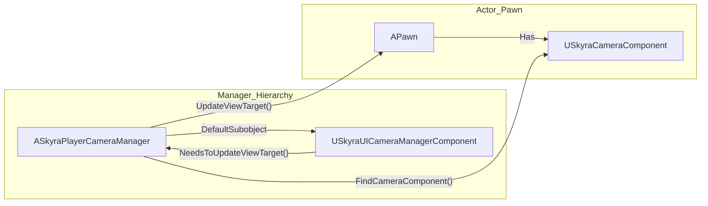

# 玩家摄像机管理器和UI摄像机

<details>
<summary>Relevant source files</summary>

以下文件被用作生成本wiki页面的上下文：

- [.gitattributes](.gitattributes)

</details>


本页面详细说明了SkyraFramework中专门的摄像机管理类。`USkyraCameraComponent`处理摄像机模式和混合逻辑，而`ASkyraPlayerCameraManager`和`USkyraUICameraManagerComponent`则管理高层次的视口覆盖，特别是用于游戏玩法与UI聚焦状态（如菜单或拍照模式）之间的转换。

## SkyraPlayerCameraManager

`ASkyraPlayerCameraManager`是游戏过程中玩家摄像机的核心控制器。它继承自标准的`APlayerCameraManager`，以便与自定义`USkyraCameraComponent`集成，并提供了UI驱动摄像机覆盖的钩子。

### 实现细节
该管理器在构造期间初始化默认的视野和俯仰约束：
*   **默认视野**：设置为`SKYRA_CAMERA_DEFAULT_FOV`。
*   **俯仰约束**：最小值/最大值由`SKYRA_CAMERA_DEFAULT_PITCH_MIN`和`SKYRA_CAMERA_DEFAULT_PITCH_MAX`定义。

该类还会创建一个`USkyraUICameraManagerComponent`作为默认子对象，以处理UI特定的摄像机逻辑。

### 视图目标流程
`UpdateViewTarget` 函数被重写，以允许 UI 摄像机优先于标准游戏摄像机逻辑。如果 UI 组件表明需要控制视图，则会拦截更新过程。

| 步骤 | 函数 | 描述 |
| :--- | :--- | :--- |
| 1 | `UICamera->NeedsToUpdateViewTarget()` | 检查 UI 驱动的覆盖是否处于活动状态。 |
| 2 | `Super::UpdateViewTarget()` | 执行标准摄像机更新。 |
| 3 | `UICamera->UpdateViewTarget()` | 对 `FTViewTarget` 应用界面特定的调整。 |

**来源：**
* `ASkyraPlayerCameraManager` 定义：`ASkyraPlayerCameraManager` 是玩家视角逻辑的主要管理器。
* 视角目标逻辑：覆盖 `UpdateViewTarget` 以优先考虑界面覆盖。

---

## 界面相机管理器组件

`USkyraUICameraManagerComponent` 为界面控件（通常通过 CommonUI）提供了一种影响相机的机制。这通常用于打开需要相机指向特定 3D 角色的菜单（例如角色定制界面或任务 NPC）。

### 系统集成
该组件在初始化时向 HUD 的调试系统注册，以支持屏幕上的相机调试。

### 关键功能
*   **GetComponent**：一个静态辅助方法，通过将 `APlayerController` 的 `PlayerCameraManager` 转换为 `ASkyraPlayerCameraManager` 来获取界面相机组件。
*   **SetViewTarget**：强制玩家相机聚焦于特定角色，并带有过渡参数。它使用 `TGuardValue` 在过渡期间管理 `bUpdatingViewTarget` 状态。

### 实体映射：相机管理
下图展示了代码实体如何交互以管理从游戏玩法到UI控制视图的过渡。

**摄像机控制流程**
```mermaid
graph TD
    subgraph "Natural_Language_Space"
        ["Player View"]
        ["UI Menu Override"]
    end

    subgraph "Code_Entity_Space"
        PC["APlayerController"]
        PCM["ASkyraPlayerCameraManager"]
        UIC["USkyraUICameraManagerComponent"]
        CC["USkyraCameraComponent"]
        
        PC -- "Owns" --> PCM
        PCM -- "Contains" --> UIC
        PCM -- "Calls" --> UIC
        
        UIC -- "SetViewTarget()" --> PCM
        PCM -- "UpdateViewTarget()" --> CC
    end

    ["Player View"] -.-> CC
    ["UI Menu Override"] -.-> UIC
```
**来源：**
* 组件获取：`USkyraUICameraManagerComponent::GetComponent`静态辅助方法。
* 视图目标覆写：`USkyraUICameraManagerComponent::SetViewTarget`逻辑。

---

## 调试与诊断

摄像机系统集成了Unreal的`showdebug`命令。当调试处于活动状态时：
1.  `ASkyraPlayerCameraManager::DisplayDebug`会绘制基本的管理器信息。
2.  它通过`USkyraCameraComponent::FindCameraComponent`在当前控制的Pawn上定位`USkyraCameraComponent`。
3.  它将详细的摄像机模式栈调试委托给`CameraComponent->DrawDebug(Canvas)`。

### 摄像机系统架构
此图展示了管理器、组件以及被观测的Actor之间的关系。

**摄像机架构桥**


**来源：**
* 调试显示逻辑：`ASkyraPlayerCameraManager::DisplayDebug`实现。
* UICamera 注册：`ASkyraPlayerCameraManager`内的组件生命周期。